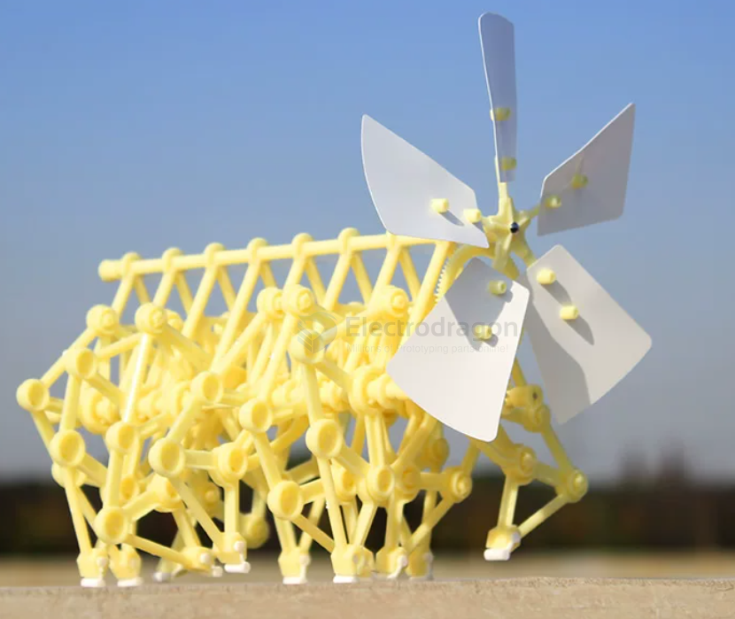
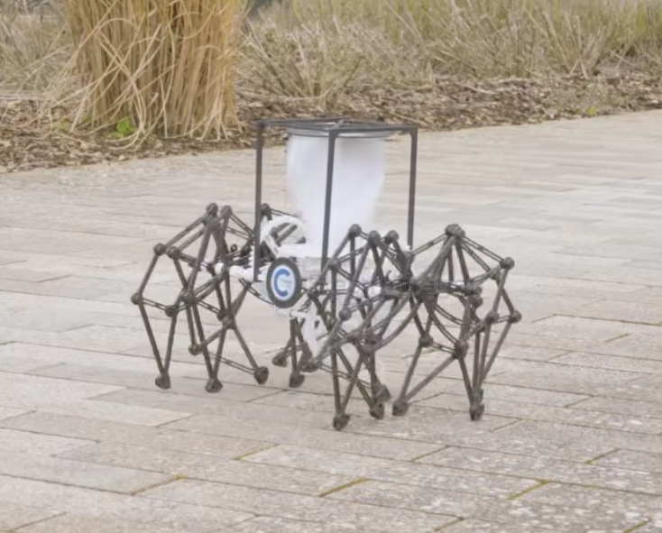

# robot-wind-powered-dat

- [[Jansen-Linkage-dat]] - [[robot-wind-powered-dat]]

1. Bionic Art and Mechanical Evolution: Strandbeests

https://www.youtube.com/watch?v=ANhA94ZqnEQ

These are the most famous modern wind-powered devices. Invented by Dutch artist Theo Jansen, these structures, known as Strandbeests ("beach beasts"), are driven entirely by wind power.

*   Core Structure: Utilizes the complex "Jansen Linkage" to convert the rotational motion of wind turbines into biological-like walking gaits.
*   Intelligent Evolution: Through decades of development, current versions can "walk" during calm weather using pressurized air storage systems and automatically change direction when sensing water or obstacles.

2. Frontier Scientific Exploration: WANDER-bot

https://www.youtube.com/watch?v=CwItHPe4HnA

In recent research (2026), scientists developed a robot called WANDER-bot, specifically designed for long-term exploration in harsh environments such as polar regions or other planets.

*   Drive Principle: Employs a Savonius vertical-axis wind turbine. This turbine does not rely on a specific wind direction and provides continuous power to the mechanical linkages at the base.
*   Advantages: It avoids the issues of traditional batteries degrading or failing in extreme cold. Additionally, the entire structure is 3D printed, making it easy to repair in the field or produce locally using in-situ resource utilization (ISRU).

## ref 

- [[robot-wind-powered]] - [[robot]]
