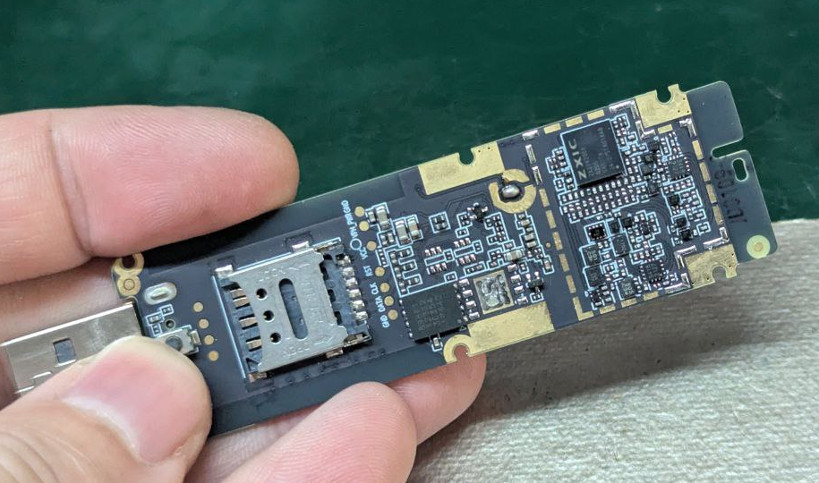
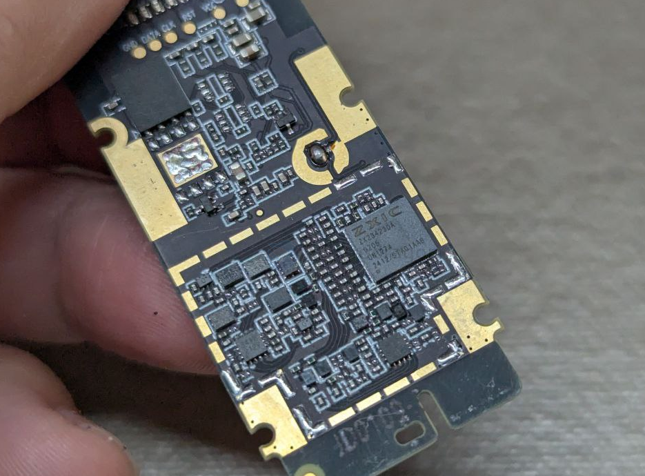
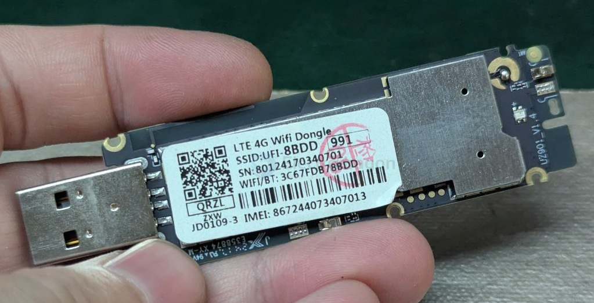

# wifi-dongle-dat

- [[WIFI-USB-pocket-dat]] - [[wifi-dat]] - [[wifi-dongle-dat]]

- [[USB-tethering-dat]] - [[USB-SDK-dat]]

## support USB tethering devices 

- [[ZTE-dat]] - [[USB-tethering-dat]] - [[USB-SDK-dat]] - [[WIFI-USB-pocket-dat]] - [[wifi-dat]] - [[wifi-dongle-dat]]

- [[ZTE-dat]] - [[vivo-dat]]

## apps 

- [[buoy-dat]] - [[buoy-network-dat]]

## tech 

**External 4G Modem (RNDIS Mode)** is, in short, a 4G dongle connected over a **USB interface** (or a 4G module with a SIM card, a phone, or a portable Wi-Fi device), running in **RNDIS (Remote Network Driver Interface Specification)** mode.

Below is a detailed breakdown of its core concepts, how it works, and its pros and cons.

---

### 1. Core Concepts

**External 4G Modem**
- A 4G internet device that does not need to be built into the mainboard; it connects via a USB cable or plugs directly into a USB port.
- Common forms include: 4G portable Wi-Fi (used as a USB network adapter when plugged into a computer), industrial 4G DTUs, or 4G modules from vendors like Quectel and SIMCom connected through a USB adapter board.

**RNDIS Mode**
- This is the key point. Traditional 4G modules or phones usually use PPP (Point-to-Point Protocol) or CDC-ACM mode when connecting to a computer. The computer recognizes the device as a "serial port" and establishes the connection through dial-up commands (AT commands).
- **RNDIS**, on the other hand, is a virtual Ethernet standard protocol introduced by Microsoft. When a 4G module/device is set to RNDIS mode and connected to a host (such as a PC, Raspberry Pi, or software router), the device presents itself to the system as a **virtual "wired network adapter"** (as if an Ethernet cable were plugged in).

---

### 2. Features and Advantages

- [[DHCP-dat]] - [[RNDIS-dat]] - [[LTE-dat]] - [[ethernet-dat]] - [[RPI-SBC-dat]]

- **Driverless or minimal drivers:** Modern operating systems (Windows, Linux / Ubuntu, OpenWrt, Raspberry Pi OS, etc.) usually include built-in RNDIS drivers. Once plugged in, the system recognizes a standard Ethernet interface (e.g., `usb0` or `ethX`).
- **Automatic DHCP networking:** The module has built-in routing and DHCP functionality. After connecting, it automatically assigns the host a LAN IP address (e.g., `192.168.8.x`), allowing the host to access the internet directly, **without the need to manually configure complex dial-up scripts or dial-up software**.
- **High compatibility:** Ideal for embedded devices, software routers (e.g., OpenWrt), Raspberry Pi, or industrial control boards that lack a PCIe slot but have a USB port, as a reliable way to obtain cellular data connectivity.

---

### 3. Common Use Cases

- **Software routers / side routers:** Many software routers (e.g., x86 software routers, NanoPi) plug a 4G module into a USB port and set it to RNDIS mode to act as an automatic failover backup network when broadband goes down.
- **Raspberry Pi / embedded field projects:** In outdoor robots and IoT gateways, a USB 4G module in RNDIS mode lets a Linux host quickly connect to the internet for data transfer or remote control.
- **Portable Wi-Fi "mod" projects:** Many people reflash inexpensive portable Wi-Fi devices (e.g., Qualcomm-based models) and enable RNDIS mode, then use them as a stable USB wired network adapter on a computer or router.

If you are configuring networking on a software router, Raspberry Pi, or embedded device and encounter this mode, simply treat it as a **USB wired network adapter** and configure the IP or bridge the network accordingly.

## build 

ZXIC 

## terminology 

Mobile Hotspot（移动热点）

适用场景： 专门指能发射 Wi-Fi 信号的便携设备。比如手机开启的热点，或者单独的便携无线路由设备，老外也经常直接叫它 Hotspot。

MiFi

适用场景： 这是一个行业专有名词（由 Novatel Wireless 创造的品牌名，后来成了这类设备的泛称），专门指代自带电池、可插 SIM 卡、能为多台设备提供无线热点的便携蜂窝路由器。

USB Wi-Fi Dongle / 4G USB Modem

适用场景： 如果你指的是那种长得像 U 盘一样、插在电脑 USB 口或充电头上、本身没有电池的上网卡（也就是我们常说的“随身 Wi-Fi / 棒子”），在英语技术圈里通常叫 USB Wi-Fi Dongle 或 4G USB Modem。

## ref 

