# battery-protector-3s-dat

- [[battery-3s-dat]] - [[battery-protector-3s-dat]] - [[battery-charger-3s-dat]] - [[battery-charger-dat]]

## wiring 

- [[DW01-dat]] - [[chip-unsort-dat]]

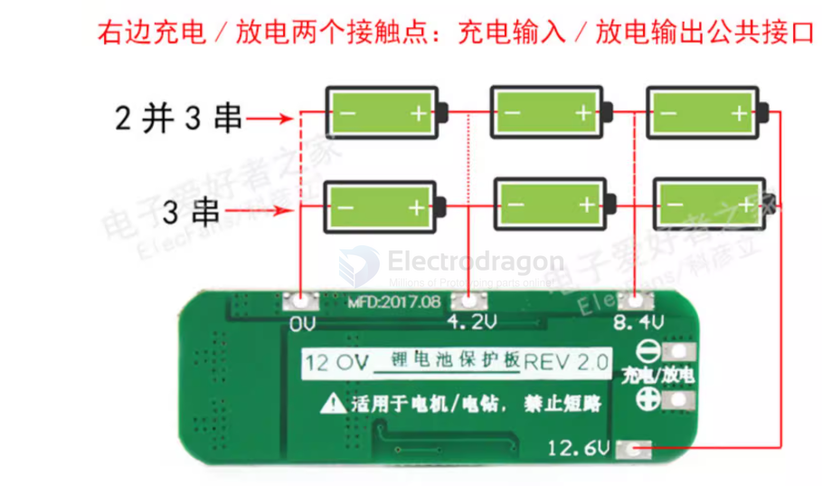

## all 3s protector researched 

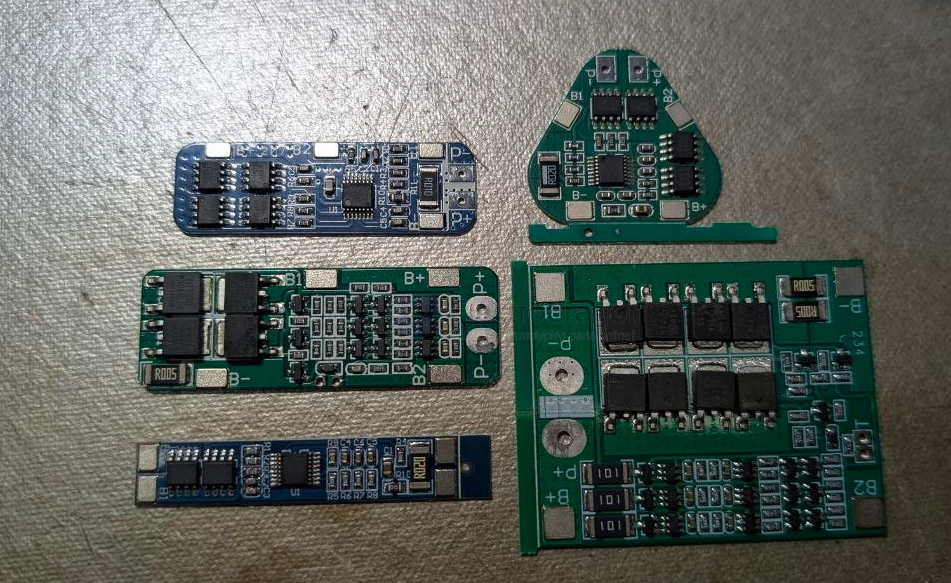

## protector version 3-1 mini 

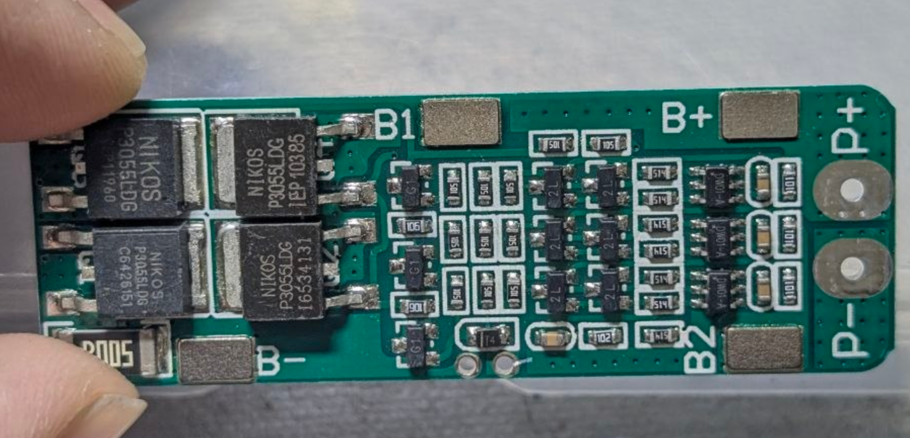

## protector version 3 

- [[onsemi-dat]] - [[mosfet-dat]] == T14

- [[mos-n-dat]] - SI2302 

- [[ABLIC-dat]] - [[battery-1s-dat]] - [[DW01-dat]]

- [[transistor-dat]]

this 25A 3S protector 

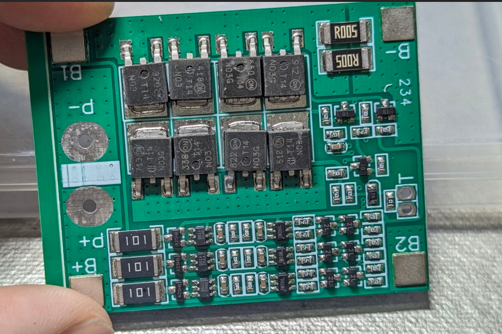

details 

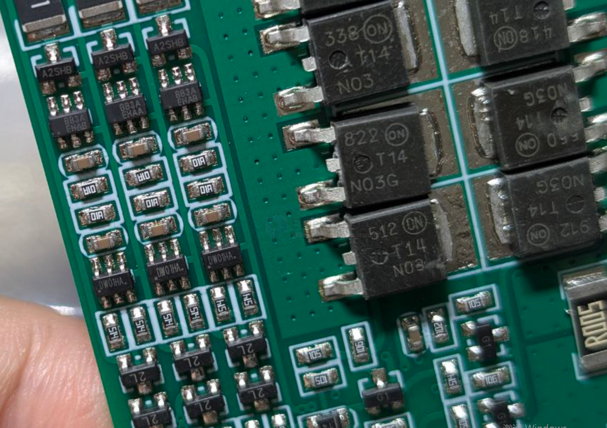

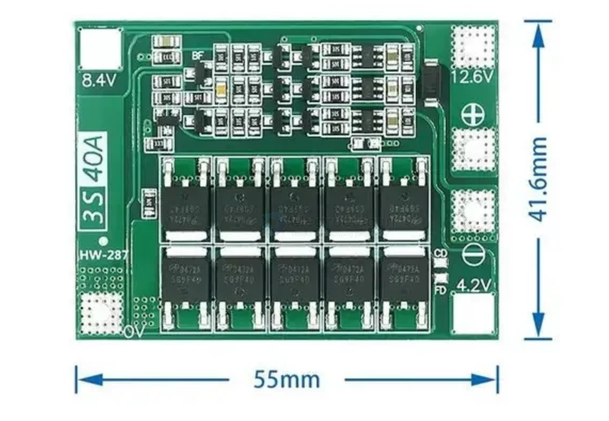

normal and balanced version

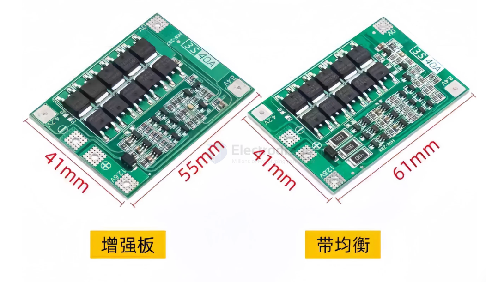

## portector version 2-1 mini 

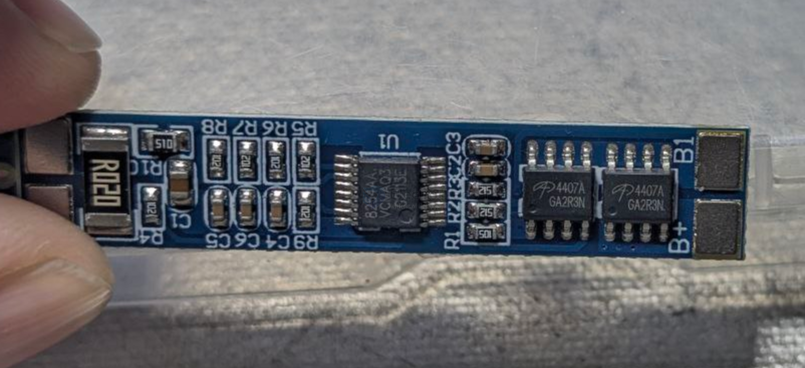

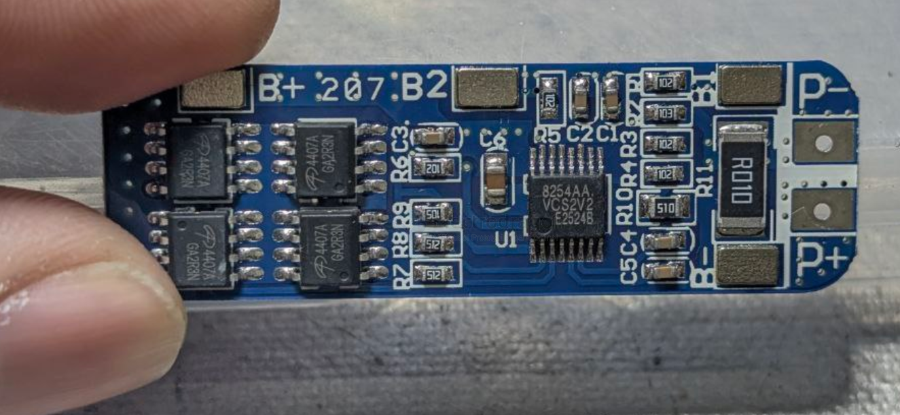
## protector version 2 

- [[mos-p-dat]] - [[ablic-dat]] == - 82544A 

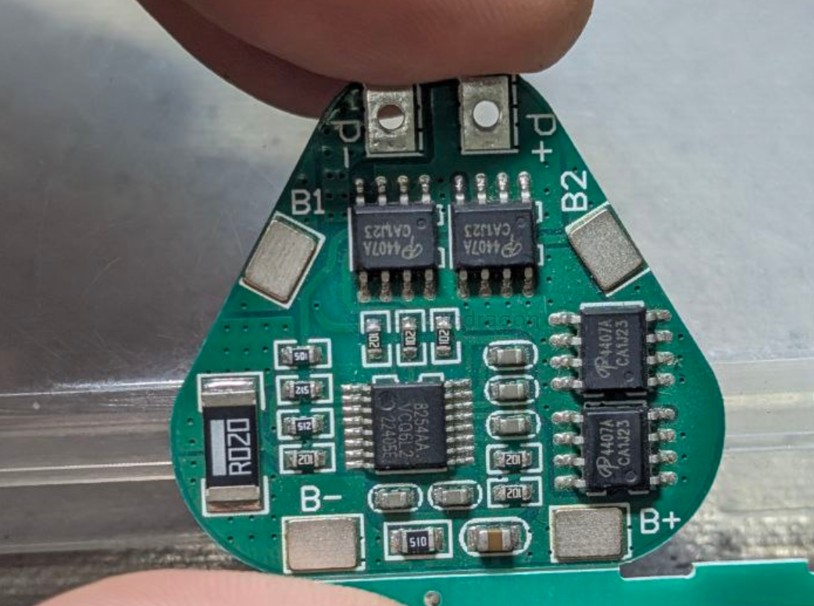

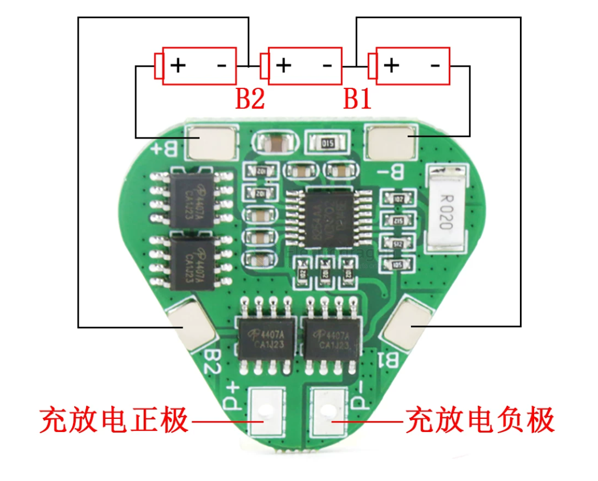

## ref

