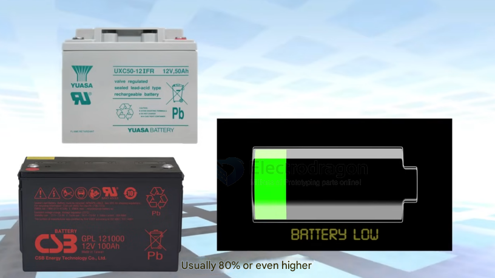
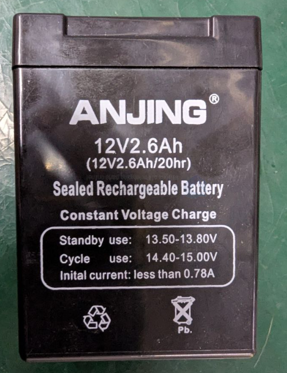

# Lead-acid-battery-dat

## charge board 

- [[OPM1181-dat]]

## advantages of lead-acid batteries

While lithium-ion batteries dominate the electronics and modern EV markets, traditional lead-acid batteries still hold strong advantages in specific applications (such as automotive starter batteries, large-scale backup systems, and heavy industrial equipment). 

Here are the key advantages of lead-acid batteries compared to lithium batteries:

---

### 1. Economics & Initial Cost
* **Lower Upfront Cost:** Lead-acid batteries are significantly cheaper to manufacture and purchase upfront. On a per-watt-hour ($Wh$) basis, lithium batteries can be **2 to 4 times more expensive** initially.
* **Matured Technology:** Having been invented in 1859, the manufacturing infrastructure is highly optimized, commoditized, and globally available.

### 2. Safety & Stability
* **No Thermal Runaway Risks:** Lead-acid chemistry is incredibly stable. Unlike lithium-ion batteries, they do not suffer from catastrophic "thermal runaway" events that cause violent, hard-to-extinguish fires if punctured, crushed, or short-circuited.
* **Overcharge Tolerance:** While overcharging damages lead-acid batteries over time (by off-gassing water), they generally handle voltage mistakes or basic charging environments without exploding or catching fire.

### 3. High Cranking Current (Surge Capabilities)
* **High Cold Cranking Amps (CCA):** Lead-acid batteries excel at delivering massive amounts of current for a fraction of a second. This makes them ideal as **Starter-Light-Ignition (SLI)** batteries for internal combustion engines, where turning over a cold engine requires hundreds of amps instantaneously.

### 4. Temperature Resilience
* **Sub-Zero Charging:** Standard lithium batteries **cannot be safely charged below freezing ($0^\circ\text{C}$)** without permanently plating the internal anode with lithium metal, which ruins the battery. Lead-acid batteries can be charged and discharged across a wider, harsher temperature range (though capacity drops in the cold, it does not permanently brick the battery chemistry during a charge).

### 5. Unparalleled Sustainability & Recycling
* **99% Recyclable:** Lead-acid batteries are the most recycled consumer product in the world. The recycling infrastructure is a closed loop—nearly 100% of the lead and plastic casing can be reclaimed and used to build brand-new batteries. 
* **Lithium Recycling Hurdles:** Recycling lithium-ion batteries is complex, expensive, and currently has a much lower global recycling rate due to the difficulty of separating the mixed rare materials (lithium, cobalt, nickel, manganese).

### 6. Simplicity (No BMS Required)
* **Passive Management:** Lead-acid cells naturally self-balance to an extent during the absorption and float phases. They do not strictly require a complex **Battery Management System (BMS)** to monitor every cell's voltage and temperature, reducing the overall complexity and points of failure in DIY or low-cost systems.

---

### Quick Comparison Summary

| Feature | Lead-Acid Battery | Lithium Battery |
| :--- | :--- | :--- |
| **Initial Cost** | Low | High |
| **Safety Profile** | Very High (Non-flammable) | Moderate (Requires BMS safeguards) |
| **Cold Charging ($<0^\circ\text{C}$)** | Yes | No (Unless equipped with internal heaters) |
| **Recyclability** | ~99% (Closed-loop) | Difficult / Developing |
| **Lifecycles** | Lower ($300 - 1,000$ cycles) | Exceptional ($2,000 - 5,000+$ cycles) |
| **Energy Density** | Heavy & Bulky | Light & Compact |

## charge cycles 

For a lead-acid battery, a proper charging profile is crucial to ensure longevity and prevent damage like sulfation or gassing. The standard and most effective way to charge a lead-acid battery is using a **3-stage (or 3-step) charging cycle**, which adapts the CC-CV principle into a specialized multi-stage process.

Here is a breakdown of the three main stages, along with an optional fourth maintenance stage:

---

### The 3-Stage Lead-Acid Charging Cycle

#### 1. Bulk Stage (Constant Current - CC)
* **What happens:** The charger provides a maximum, **constant current** ($I$) to the battery. The battery voltage ($V$) gradually rises as it accepts the charge.
* **Goal:** To safely and rapidly pump energy back into the battery, bringing it up to about **70%–80%** of its capacity.
* **Voltage limit:** The stage continues until the battery voltage reaches its "absorption voltage" limit (typically around $14.4\text{V}$ to $14.8\text{V}$ for a standard $12\text{V}$ battery, depending on temperature and specific chemistry like AGM or Gel).

#### 2. Absorption Stage (Constant Voltage - CV)
* **What happens:** The charger locks the voltage at the peak absorption level (**constant voltage**). As the battery chemical reaction nears completion and internal resistance rises, the **current naturally tapers down**.
* **Goal:** To gently top off the remaining **20%–30%** of the battery capacity without overheating it or causing excessive water loss (gassing). 
* **Transition trigger:** This stage ends when the current drops below a specific threshold (usually around $1\%\text{ to }3\%$ of the battery's Ah rating) or after a set safety timer expires.

#### 3. Float Stage (Maintenance Charging)
* **What happens:** Once fully charged, keeping the voltage at the absorption level would boil off the electrolyte. Instead, the charger drops the voltage to a lower, safe level (typically around $13.2\text{V}$ to $13.8\text{V}$ for a $12\text{V}$ battery) and supplies a tiny trickle current.
* **Goal:** To counteract the battery’s natural **self-discharge**. This keeps the battery at 100% state-of-charge (SoC) indefinitely without overcharging it, making it ideal for backup systems or standby storage.

---

### Optional 4th Stage: Equalization

Some advanced smart chargers include a periodic **Equalization Stage**, which is essentially a deliberate, controlled overcharge performed every few weeks or months (only for flooded/wet lead-acid batteries).

* **How it works:** The charger spikes the voltage higher (around $15.5\text{V}$ to $16\text{V}$) at a very low current for a few hours.
* **Why it's done:** It violently agitates the electrolyte to reverse **acid stratification** (where heavy acid settles at the bottom) and dissolves hard **sulfation crystals** that grow on the lead plates over time, effectively balancing and rejuvenating the cells.

## use 

Batteries store the energy produced by your solar panels for later use.

##  Types:

### General Lead-Acid Batteries:
 
Common in automotive applications. They are relatively inexpensive and the technology is mature. However, they are heavy, have a shorter lifespan (approx. 3 years), require maintenance, and are not suitable for frequent deep discharge (recommended depth of discharge is ~20%).

### Deep Cycle Lead-Acid Batteries:

Designed for deep discharge (up to 80% or more) without significantly affecting lifespan. They have thicker plates and durable materials, making them well-suited for solar power systems, electric vehicles, and campers requiring continuous, stable power.
 

**Capacity:** Measured in Amp-hours (Ah). A 12V 100Ah battery stores 12V * 100Ah = 1200 Watt-hours (Wh) of energy.

## lead-acid-battery-dat

- LAB: Lead-Acid Battery
- 蓄电池 (xù diàn chí) is the Chinese term for "rechargeable battery." It is a type of electrical battery that can be recharged multiple times. It is commonly used in various electronic devices such as mobile phones, laptops, electric vehicles, and many other portable devices.

- Here are some links where you can find more information about 蓄电池:

- Wikipedia: Rechargeable Battery - https://zh.wikipedia.org/wiki/%E8%93%84%E7%94%B5%E6%B1%A0
- China Battery Industry Association - http://www.cbia.com.cn/
- Battery University: Rechargeable Batteries - https://batteryuniversity.com/learn/article/types_of_rechargeable_batteries

## voltage 

- 12V == [[solar-power-dat]]
- 72V == [[motor-dat]]

## LAB Example 

2.6 Ah = 2.6 × 1000 = **2600 mAh**

*   **Brand:** ANJING
*   **Type:** Sealed Rechargeable Battery (Likely SLA/VRLA) Sealed Lead-Acid (a specific type, but often used generally)
*   **Nominal Voltage:** 12V
*   **Capacity:** 2.6Ah (Rated at 20-hour discharge rate - 12V 2.6Ah/20hr)
    *   This implies a discharge current of 0.13A (2.6Ah / 20h) for 20 hours.
*   **Charging Method:** Constant Voltage Charge
    *   **Standby Use (Float):** 13.50V - 13.80V
    *   **Cycle Use:** 14.40V - 15.00V
    *   **Initial Charging Current:** Less than 0.78A (0.3C)
*   **Chemistry:** Lead-acid (Pb symbol present)
*   **Markings:**
    *   Recycling symbol
    *   Do not dispose symbol (crossed-out bin)

As noted on the battery (12V2.6Ah/20hr), this specific 2.6Ah rating was determined using a 20-hour discharge period. This means it was likely discharged at a current of 0.13A (2.6Ah / 20h = 0.13A) for 20 hours.

### Estimated Runtime Calculation

This calculation estimates how long the ANJING 12V 2.6Ah battery can power a 5V 1A load using a DC-DC converter.

**1. Calculate Load Power:**
   - Load Voltage (V_load) = 5V
   - Load Current (I_load) = 1A
   - Load Power (P_load) = V_load × I_load = 5V × 1A = 5 Watts

**2. Account for DC-DC Converter Efficiency:**
   - Assume a typical converter efficiency (η) = 85% (or 0.85). Real-world efficiency may vary.
   - Power drawn from the battery (P_batt) = P_load / η
   - P_batt = 5W / 0.85 ≈ 5.88 Watts

**3. Calculate Current Drawn from Battery:**
   - Battery Nominal Voltage (V_batt) = 12V
   - Current drawn from battery (I_batt) = P_batt / V_batt
   - I_batt = 5.88W / 12V ≈ 0.49 Amps

**4. Compare to Rated Discharge:**
   - The battery's capacity (2.6Ah) is rated for a 20-hour discharge (as noted in the file: `12V2.6Ah/20hr`).
   - Rated Discharge Current (I_rated) = 2.6Ah / 20h = 0.13 Amps
   - The calculated draw (0.49A) is significantly higher than the rated discharge current (0.13A).

**5. Calculate Ideal Runtime (Ignoring Peukert's Effect):**
   - Battery Capacity (C) = 2.6Ah
   - Ideal Runtime (T_ideal) = C / I_batt
   - T_ideal = 2.6Ah / 0.49A ≈ 5.3 hours

**6. Consider Peukert's Effect:**
   - Lead-acid batteries deliver less total capacity when discharged at rates higher than their rating (Peukert's Law).
   - Since 0.49A is much higher than the 0.13A rating, the *effective* capacity will be lower than 2.6Ah.

**Conclusion:**

The **ideal calculated runtime is approximately 5.3 hours**. However, due to the higher discharge current (0.49A vs. the 0.13A rating), the actual runtime will be **noticeably less than 5.3 hours**. The exact reduction depends on the specific Peukert exponent of this battery model, which is not provided.

## app 

- [[power-storage-dat]]

## ref 

- [[Lead-acid-battery]] - [[battery-rechargerable]] - [[power]]