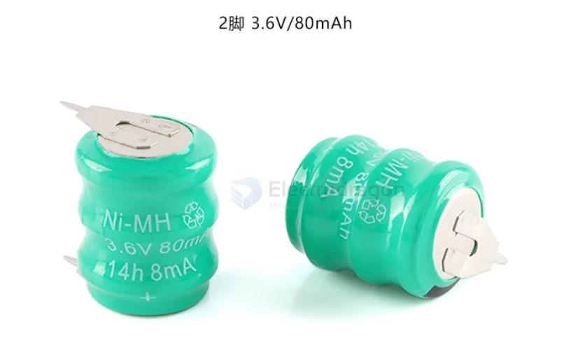

# battery-NiMH-dat

- [[battery-rechargeable-dat]] - [[battery-li-dat]] - [[battery-liHV-dat]] - [[battery-li-LFP-dat]] - [[battery-NiMH-dat]] - [[battery-lead-acid-dat]]

2脚 3.6V/80mAh 镍氢电池/可充电镍氢电池

## ref 

