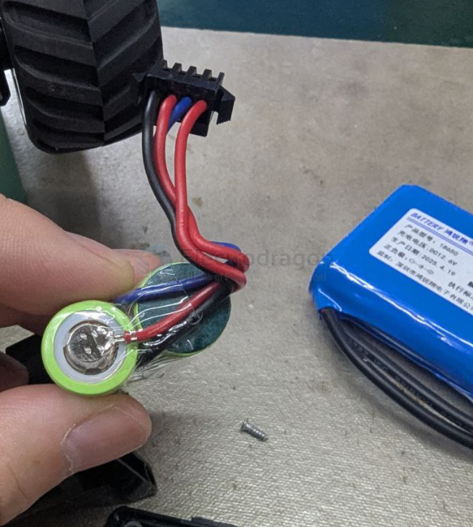
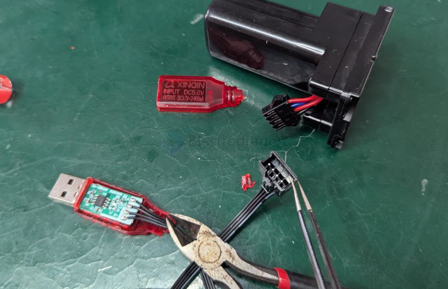
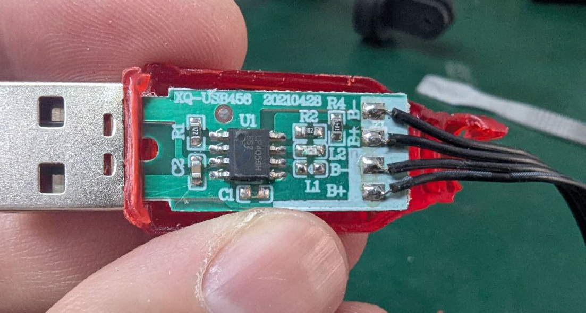

# battery-balancer-dat

- [[battery-balance-charger-dat]] - [[battery-balancer-dat]] - [[battery-charger-dat]]

## 3S 

If your measurement sequence (keeping your black probe on the leftmost reference pin and moving the red probe rightward) is 1000% correct, then the physical pinout sequence of your **LK-1008D** charger is natively configured in reverse relative to standard battery logic wiring:

* **Your Battery:** Standard step-up logic ($4.2\text{V} \rightarrow 8.4\text{V} \rightarrow 12.6\text{V}$)
* **The LK-1008D Port:** Reversed sequence wiring ($8.4\text{V} \rightarrow 4.2\text{V} \rightarrow 13.7\text{V}$)

Here is the technical breakdown of what this means for your setup:

---

## 1. Why is the Charger Wired This Way?
*(为什么充电器的线序是反的？)*

Budget analog chargers like the `LK-1008D` are designed around internal trace simplification on the PCB rather than universal wire color conventions. 

Instead of stepping forward chronologically from Cell 1 to Cell 3, the `LK-1008D` layout maps its three independent internal charging channels onto the physical 4-pin port backwards or in a multi-tiered array. Because it is an isolated, ungrounded standalone wall unit powered by an external adapter, its internal charging loops are fully floating relative to each other, allowing it to handle scrambled node assignments internally.

---

## 2. Does it Matter When You Plug it In?
*(插上充电时会有问题吗？)*

**No, they are still safe to connect because the physical connector forces proper alignment.**

Because the XH2.54 plastic socket and plug are **keyed/keyed-mating** (they feature physical plastic guide ridges on one side), you cannot physically force the battery into the charger backwards. 

When you insert the battery plug into the LK-1008D:
1. The plastic guide slots ensure that **Pin 1 of the battery aligns perfectly with Pin 1 of the charger**, Pin 2 with Pin 2, and so on.
2. The electrochemical cells of your battery will completely dominate the analog circuit once connected. The battery's huge charge capacity forces the charger's traces to instantly snap into alignment with the physical voltages of the battery cells (collapsing that empty $13.7\text{V}$ reading down to your pack's exact total level).

---

## 3. Summary Chart of the Cross-Connection
*(两端接口映射对比)*

When mated together, your connections lock into this functional matrix:

| Physical Slot Pin | Your Probed Sequence (Battery) | Charger Hardware Output | Mated Result |
| :--- | :--- | :--- | :--- |
| **Pin 1** (Far Left) | **$0\text{V}$ Base** | **Common Return** | Ground Baseline Established |
| **Pin 2** | **$4.2\text{V}$** (Cell 1) | **$8.4\text{V}$ Node Channel** | Channel balances Cell 1 |
| **Pin 3** | **$8.4\text{V}$** (Cell 1+2) | **$4.2\text{V}$ Node Channel** | Channel balances Cell 2 |
| **Pin 4** (Far Right) | **$12.6\text{V}$** (Total Pack) | **$13.7\text{V}$ (Open Circuit)** | Collapses to charge Cell 3 |

As long as the plastic plug clicks cleanly into the 3S charging port without being forced upside down, the hardware tracks are aligned exactly how the manufacturer engineered them, and you can proceed with charging normally!

## 2S 

## Method 1. 

How to use single [[TP4056-dat]] to charge 2S lithium battery pack?

The battery should be built with all pins out: 

parallel charging by [[TP4056-dat]] directly 

Board looks like: 

## Method 2.

If building your own charger or pack, include a BMS, and use a charger with current limit and CV/CC behavior.

如果你自己DIY电池组或充电系统，务必使用保护板（BMS），并选择支持恒流恒压输出的充电器。

## ref 

- [[battery-charger-dat]]