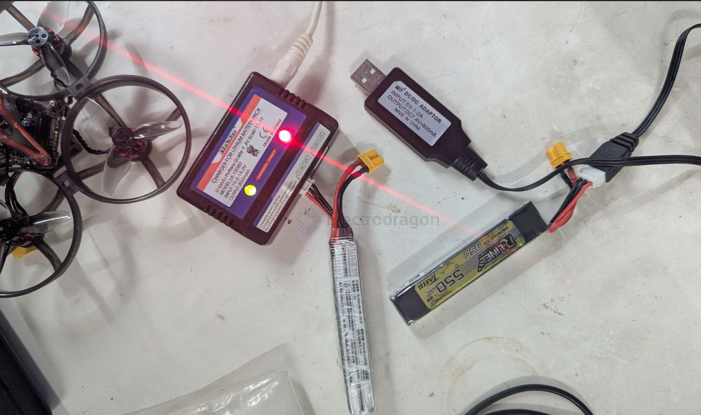

# battery-charge-dat

- [[battery-protector-1s-dat]] - [[battery-charger-1s-dat]] - [[battery-1s-dat]]

- [[battery-protector-dat]] - [[battery-charger-dat]] - [[battery-packs-dat]]

## info 

[[battery-protector-dat]] + all-S [[battery-charger-dat]] - [[injoinic-dat]]

https://w.electrodragon.com/w/Category:Battery_Charge

The most following charger options are for the lithium-ion battery

- [[2S-lithium-battery-charger-dat]]

- [[battery-1S-dat]] - [[battery-2S-dat]] - [[battery-3S-dat]] - [[battery-4S-dat]] - [[battery-5S-dat]] - [[battery-packs-dat]]

- [[battery-BMS-dat]] - [[BMS-passive-dat]]

- [[battery-pack-dat]]

- [[fast-charge-methods-dat]]

- 1S common option == [[TP4056-dat]]

- [[usb-sniffer-dat]]

[[Coulomb-Counter-dat]] - [[battery-charger-dat]] - Coulomb Counter/Battery Gas Gauge - [[LTC4150-dat]] - [[linear-technology-dat]]

## Board

- [[OPM1193-dat]] - [[OPM1156-dat]]

- [[OPM1093-dat]]

## Compare

| Type             | Feature                           | charge-current |
| ---------------- | --------------------------------- | -------------- |
| TP5000           | Li-MnO2, LiFePO4(LFP) charger IC, | 0.5A           |
| [[MCP73831-dat]] | 0LED indicator                    | 0.5A           |
| TP4056           | Linear charging                   | ~1A            |
| TP4054           |

- [[MCP73831-dat]] - [[MCP73871-dat]] - [[microchip-power-dat]]

## Quick-Charge QC Options 

* FP6719 / FP6717 / FP6291 DC-DC Boost
* PSC5415 
* ME2149
* Solution - FP6601 + TPS61088
QC Protocol Identify:
* FM5888
* LI4001 - LI4001是一款面向5V交流适配器的2A锂离子电池充电芯片。采用700KHz开关降压型转换器拓扑结构工作。LI4001包括完整的涓流充电、恒流充电、恒压充电、充电自动终止电路、自动再充电以及过流保护、短路保护电路。最大2A的可编程充电电流与简单的外围电路造就了一种能被嵌入在各种手持式应用中的小型化充电器。由于集成了温度保护、输入欠压闭锁，提高了芯片的应用可靠性。
* BQ24170	
* TP5100 - 2A开关降压 8.4V/4.2V锂电池充电器芯片

## Module LDO RTC
request 
* MT2503 ED20 -> 1.1V RTC LDO
* SIM800 -> 2.8V RTC LDO

## voltage map

| volt | composite | sum   |
| ---- | --------- | ----- |
| 4.2  | 2         | 8.4V  |
| 4.2  | 3         | 12.6V |
| 4.2  | 4         | 16.8V |
| 4.2  | 5         | 21V   |

## battery cables 

- [[SM2.54-dat]] - [[JST-dat]] - [[15EDGRKP-3.81mm-dat]] - [[XT-dat]] - [[cable-dat]]

## 2S charger 

- [[battery-pack-dat]]

## test tools 

- [[internal-resistance-meter]] - [[capacity-meter-dat]]

## lower current 

当BOOST连接时，充电电流从100ma增加到300ma，只有当电容容量大于500mAh时才可以连接（避免爆炸💥）。

## chips 

- [[battery-charger-dat]] - [[natlinear-dat]]

- [[tp-dat]]

- [[MCP73831-dat]] - [[MCP73871-dat]] - [[microchip-power-dat]]

- [[XL-dat]]

## Chip Info

- [[LTC4054-dat]] - [[MCP73831-dat]]

[[TP-dat]] - [[TP4056-dat]] - [[TP5000-dat]] - [[TP4054-dat]] - [[TP4067-dat]]

[[injoinic-dat]] - [[IP5306-dat]]

- [[CN3722-dat]] - [[CN3768-dat]]

- [[battery-charger-dat]] - [[BT24075-dat]] - [[TI-power-dat]]

- [[TI-power-dat]]

- [[battery-charger-dat]] - [[ETA-solutions-dat]]

- [[CD42-dat]]

- [[XL-dat]]

- [[ismartware-dat]] - [[SW6124-dat]]

## ref

- [[battery-dat]]

- [[battery-charger]]
