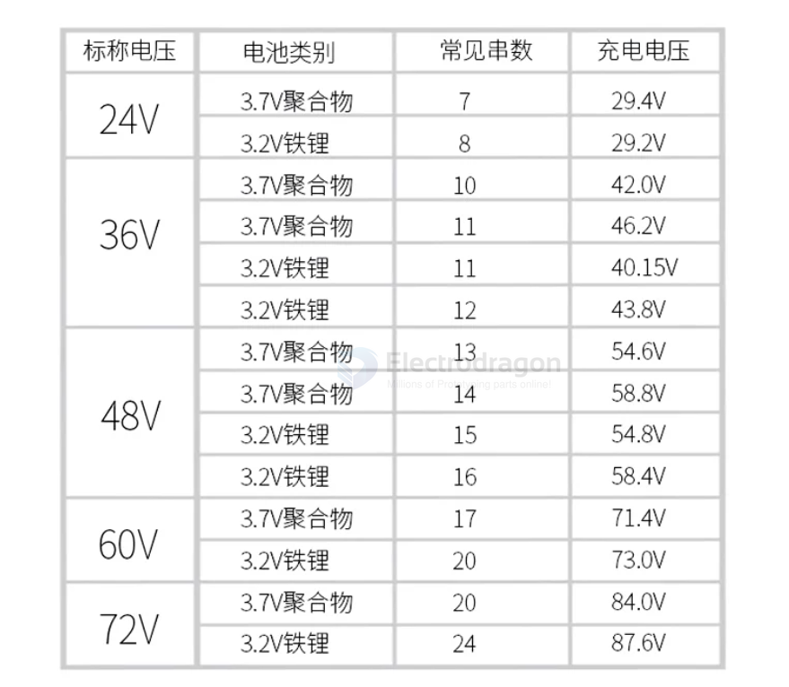
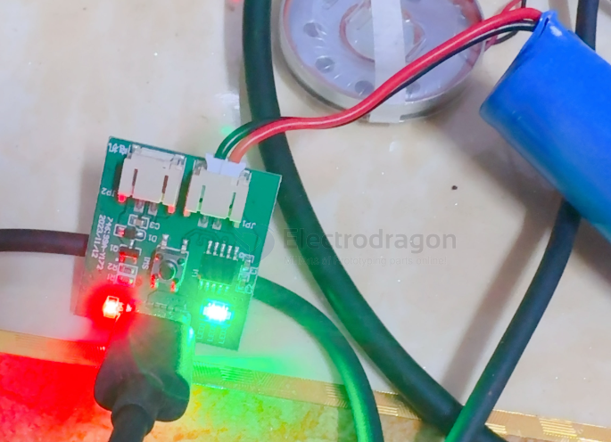

# battery-charge-dat

- [[battery-balance-charger-dat]] - [[battery-balancer-dat]] - [[battery-charger-dat]]

- [[battery-protector-1s-dat]] - [[battery-charger-1s-dat]] - [[battery-1s-dat]]

- [[battery-protector-dat]] - [[battery-charger-dat]] - [[battery-pack-dat]]

- [[battery-charge-boost-dat]] - [[battery-charger-dat]]

- [[battery-charger-2s-dat]] - [[battery-charger-3s-dat]] - [[battery-charger-1s-dat]]

- [[battery-dat]] - [[battery-1s-dat]] - [[battery-2s-dat]] - [[battery-3s-dat]]

- [[conn-power-dat]]

## info 

[[battery-protector-dat]] + all-S [[battery-charger-dat]] - [[injoinic-dat]]

https://w.electrodragon.com/w/Category:Battery_Charge

The most following charger options are for the lithium-ion battery

- [[battery-charger-2s-dat]] 

- [[battery-1S-dat]] - [[battery-2S-dat]] - [[battery-3S-dat]] - [[battery-4S-dat]] - [[battery-5S-dat]] - [[battery-pack-dat]]

- [[battery-BMS-dat]] - [[BMS-passive-dat]] - [[BMS-active-dat]]

- [[battery-pack-dat]]

- [[fast-charge-protocols-dat]]

- 1S common option == [[TP4056-dat]]

- [[usb-sniffer-dat]]

[[Coulomb-Counter-dat]] - [[battery-charger-dat]] - Coulomb Counter/Battery Gas Gauge - [[LTC4150-dat]] - [[linear-technology-dat]]

## Board

- [[OPM1193-dat]] - [[OPM1156-dat]]

- [[OPM1093-dat]]

## Compare

| Type             | Feature                           | charge-current |
| ---------------- | --------------------------------- | -------------- |
| TP5000           | Li-MnO2, LiFePO4(LFP) charger IC, | 0.5A           |
| [[MCP73831-dat]] | 0LED indicator                    | 0.5A           |
| TP4056           | Linear charging                   | ~1A            |
| TP4054           |

- [[MCP73831-dat]] - [[MCP73871-dat]] - [[microchip-power-dat]]

## Quick-Charge QC Options 

* FP6719 / FP6717 / FP6291 DC-DC Boost
* PSC5415 
* ME2149
* Solution - FP6601 + TPS61088
QC Protocol Identify:
* FM5888
* LI4001 - LI4001是一款面向5V交流适配器的2A锂离子电池充电芯片。采用700KHz开关降压型转换器拓扑结构工作。LI4001包括完整的涓流充电、恒流充电、恒压充电、充电自动终止电路、自动再充电以及过流保护、短路保护电路。最大2A的可编程充电电流与简单的外围电路造就了一种能被嵌入在各种手持式应用中的小型化充电器。由于集成了温度保护、输入欠压闭锁，提高了芯片的应用可靠性。
* BQ24170	
* TP5100 - 2A开关降压 8.4V/4.2V锂电池充电器芯片

## Module LDO RTC
request 
* MT2503 ED20 -> 1.1V RTC LDO
* SIM800 -> 2.8V RTC LDO

## voltage map

| volt | composite | sum   |
| ---- | --------- | ----- |
| 4.2  | 2         | 8.4V  |
| 4.2  | 3         | 12.6V |
| 4.2  | 4         | 16.8V |
| 4.2  | 5         | 21V   |

## battery cables 

- [[SM2.54-dat]] - [[CONN-cable-JST-dat]] - [[15EDGRKP-3.81mm-dat]] - [[XT-dat]] - [[cable-dat]]

## 2S charger 

- [[battery-pack-dat]]

## test tools 

- [[internal-resistance-meter]] - [[capacity-meter-dat]]

## lower current 

当BOOST连接时，充电电流从100ma增加到300ma，只有当电容容量大于500mAh时才可以连接（避免爆炸💥）。

## chips 

- [[natlinear-dat]] - [[LN2054-dat]] - [[battery-charger-dat]]

- [[tp-dat]]

- [[MCP73831-dat]] - [[MCP73871-dat]] - [[microchip-power-dat]]

- [[XL-dat]]

- [[LTC4054-dat]] - [[MCP73831-dat]]

[[TP-dat]] - [[TP4056-dat]] - [[TP5000-dat]] - [[TP4054-dat]] - [[TP4067-dat]]

[[injoinic-dat]] - [[IP5306-dat]]

- [[CN3722-dat]] - [[CN3768-dat]]

- [[battery-charger-dat]] - [[BT24075-dat]] - [[TI-power-dat]]

- [[TI-power-dat]]

- [[battery-charger-dat]] - [[ETA-solutions-dat]]

- [[CD42-dat]]

- [[ismartware-dat]] - [[SW6124-dat]]

- [[linear-technology-dat]] 

- [[xysemi-dat]]

- [[shouding-dat]] - [[SD8001-dat]] - [[TP4054-dat]] - [[battery-charger-dat]]

- [[silinktek-dat]] - [[XT2052-dat]] - [[battery-charger-dat]]

## battery charger for multiple series 

- [[conn-power-dat]]

## apps 

- [[power-bank-dat]]

## balance charger 

Based on your description, this is a highly standardized **RC/Hobby Power Battery Pack** configuration. It consists of two essential interfaces: the **T-Connector (Deans)** for high-current delivery, and the **4-Pin XH2.54 Balance Connector** for cell monitoring and maintenance. 

Here is a professional breakdown of your battery's layout:

---

### 1. 4-Pin XH2.54 Balance Connector (平衡头)
*(3 Black Wires, 1 Red Wire / 3黑1红)*

This is a **4-Pin JST-XH Balance Plug** (spaced at a $2.54\text{mm}$ pitch). Because a **3S** (3 Cells in Series) pack consists of three individual cells stacked back-to-back, it requires exactly 4 wires to tap into every connection node within the series string.

#### Pinout & Voltage Distribution (线序与电压分布)
The "3 Black, 1 Red" color coding ensures proper orientation and visually identifies the total positive terminal. Looking at the plug from left to right (assuming the Red wire is on the far right):

* **Pin 1 (Black):** **Main Ground / Pack Negative** ($0\text{V}$). Connected to the negative terminal of Cell 1. *(电池总负极)*
* **Pin 2 (Black):** **Cell 1 / Cell 2 Node** ($\approx 4.2\text{V}$ when fully charged). The junction between cell 1 and cell 2. *(第1、2节电芯串联点)*
* **Pin 3 (Black):** **Cell 2 / Cell 3 Node** ($\approx 8.4\text{V}$ when fully charged). The junction between cell 2 and cell 3. *(第2、3节电芯串联点)*
* **Pin 4 (Red):** **Main VCC / Pack Positive** ($\approx 12.6\text{V}$ when fully charged). Connected to the positive terminal of Cell 3. *(电池总正极)*

> 💡 **Primary Roles (核心作用):**
> 1. **Balance Charging (平衡充电):** It allows a dedicated RC hobby charger to independentally measure and redirect/bleed charging current for each individual cell, ensuring all three reach exactly $4.2\text{V}$ safely.
> 2. **Low Voltage Telemetry / LiPo Alarms (低压报警/电压监控):** You can plug a cheap pocket LiPo alarm ("BB响") into this port while operating your hardware (e.g., your DIY rover or boat) to monitor real-time individual cell health and prevent dangerous over-discharge ($<3.6\text{V}$ per cell).

---

### 2. T-Connector / Deans Plug (主放电/大电流接口)
*(The Red Plastic "T" Shaped Plug / T口)*

* **Role:** This is the **Main Discharge / Power Delivery Interface**. It uses heavy-gauge wire and large, spring-loaded flat mating surfaces engineered to handle high continuous currents (typically $30\text{A} \text{--} 50\text{A}$ continuously, with much higher burst peaks). 
* **Connection:** It plugs directly into your Electronic Speed Controller (ESC), heavy DC motor, or main system power distribution board during operation. It also serves as the primary route for bulk current intake during charging.

---

### 3. Practical Charging Scenarios for Your Layout

Connecting back to your query about charging directly at a target voltage of **12.6V**, here is how your exact wiring layout must be handled:

### Scenario A: The Standard RC Method (Recommended)
You use a dedicated multi-chemistry balance charger (e.g., ISDT, HOTA, SkyRC).
1. **Physical Hookup:** **Both plugs must be connected simultaneously.** 
   * Connect the **T-Connector** to the charger's main output ports (often using a T-to-XT60 or T-to-Banana adapter cable).
   * Plug the **4-pin XH2.54 balance connector** directly into the charger's native 3S balance slot.
2. **Settings:** Select `LiPo Balance Charge`. Set your charging current based on battery capacity (e.g., $2.2\text{A}$ for a $2200\text{mAh}$ pack). The charger automatically targets the peak $12.6\text{V}$ constraint while actively managing individual cell variances via the balance plug.

### Scenario B: The Embedded DIY Project Method (On-Board Charging)
If this battery is buried deep inside a custom machine (like a robotic arm, quadruped, or automated rover) and you want to plug a simple power adapter directly into the machine without removing the battery:
1. **Integrate a 3S BMS Board (加装3S保护板):** You must source a **3S Lithium Battery Management System (BMS) Board with balancing functionality**.
2. **Wiring Configuration:** 
   * Solder the battery's **T-Connector wires** (Pack Negative and Pack Positive) to the `B-` and `B+` pads on the BMS board.
   * Solder/splice wires from your **XH2.54 balance plug** (the intermediate nodes) directly to the `B1` and `B2` balancing pads on the BMS.
3. **The Charger:** The BMS will break out a combined charge/discharge port (`P+` / `P-`). You can then safely feed a generic **12.6V CC-CV Wall Power Adapter** directly into that single port. The BMS will use your "3 black, 1 red" balance leads to shunt excess voltage internally, keeping the cells perfectly uniform.

## Charger Selection for 3S Battery 

**It must meet one critical prerequisite: the 12.6V charging equipment must have "Constant Current - Constant Voltage (CC-CV)" limiting control capability, and you absolutely cannot omit the balance leads.**

For a **3S** power battery (where the standard fully charged voltage is $3 \times 4.2\text{V} = 12.6\text{V}$), directly charging it with a 12.6V source can lead to drastically different outcomes depending on your hardware setup and the type of power source used:

### Scenario 1: Using a Professional RC Balance Charger (Safest & Recommended)
If you are setting the target voltage to 12.6V (or 4.2V per cell) on a dedicated RC balance charger (such as ISDT, HOTA, SkyRC, etc.) and selecting the **Balance Charge** mode:
* **Conclusion:** **Perfectly fine. This is the standard, correct procedure.**
* **How it works:** The charger connects to both the main power leads and the balance plug. During the process, the charger not only regulates the total pack voltage to 12.6V but also **actively monitors and adjusts each individual cell**. If one cell reaches 4.2V earlier than the others, the charger uses internal resistors to bleed/shunt current away from that cell, allowing the other cells to catch up until all three are precisely at 4.2V.

---

### Scenario 2: Using a Basic 12.6V "Li-ion/LiPo Wall Charger"
If you are using a simple, cheap brick-style charger (like a laptop power adapter) that has a red/green status LED and is explicitly labeled with an output of `12.6V 1A` or `12.6V 2A`:
* **Conclusion:** **It works, but ONLY if the battery pack has a 3S Protection Circuit Board (BMS) installed, or you connect an external active/passive balance board.**
* **How it works:** These brick chargers do have a built-in CC-CV charging profile, meaning they output the correct lithium cutoff voltage. However, because they only connect via two wires (positive and negative), **they cannot detect individual cell voltages**.
* **The Risk:** RC power batteries experience high-current discharges, which frequently causes cell internal resistance to become mismatched. Without a BMS or balance board to intervene, you might end up in a dangerous situation where Cell A is at $4.35\text{V}$ (severely overcharged), Cell B is at $4.15\text{V}$, and Cell C is at $4.10\text{V}$. The total voltage still equals 12.6V, so the charger keeps pumping in power, causing the overcharged cell to **swell, overheat, or catch fire**.

---

### Scenario 3: Using a Generic 12V / 12.6V DC Power Supply (e.g., Router Adapter, Bench Switching Power Supply)
If you are trying to use a generic, non-lithium-specific `12.6V` fixed-voltage power supply connected directly to the battery's main leads:
* **Conclusion:** **Absolutely not! This is extremely dangerous.**
* **Why:**
  1. **Lack of Constant Current (CC) Phase:** A standard power adapter lacks a current-limiting charge profile. Connecting a depleted 3S battery (around 11.1V) directly to a 12.6V voltage source causes an **instantaneous, massive spike in charging current** that far exceeds what the battery or the supply can handle. This will either instantly burn out the power supply or cause the battery to catastrophically fail.
  2. **No Balance Management:** It completely lacks the ability to monitor individual cells, leading to severe overcharge hazards.

---

### 💡 Summary and Best Practices
Since your power battery **supports balance charging** (it has that standard 4-pin JST-XH balance connector), always take advantage of it:
1. **For RC field use:** Stick to an RC balance charger selecting **Balance Charge**. The total target voltage defaults to 12.6V safely.
2. **For DIY embedded projects (e.g., inside a Rover, Quadruped robot, or RC Boat):** If you want a "plug-and-forget" setup without removing the battery every time, you must wire a **3S BMS (with balancing functionality)** between the battery pack and your charging port. Once installed, you can safely use a basic 12.6V lithium wall charger adapter to charge the device directly.

## charge methods 

When charging lithium-ion or lithium-polymer battery packs connected in series (often denoted as **$X$S**, where $X$ is the number of cells), individual cell variations can lead to imbalances. Over time, some cells will have higher voltages than others, risking dangerous overcharging or premature capacity loss. 

To handle this, several charging methods, techniques, and configurations are used. Here is a breakdown of the primary approaches:

---

## 1. Balance Charging (The Standard)
This is the most critical method for multi-cell series packs. It ensures that every individual cell in the series string reaches the exact same target voltage. There are two primary ways this is executed:

### Passive Balancing (Bypass/Bleeding)
* **How it works:** The charger or Battery Management System (BMS) monitors each cell via balance leads. When a cell reaches the target voltage (e.g., $4.2\text{V}$) faster than the others, a small internal resistor is switched on parallel to that cell. This "bleeds off" excess current as heat, allowing the slower, lower-voltage cells to catch up.
* **Pros:** Simple, inexpensive, highly reliable.
* **Cons:** Wastes energy as heat; balancing current is usually small (e.g., $50\text{mA}$ to $200\text{mA}$), so heavily imbalanced packs take a long time to finish.

### Active Balancing (Charge Redistribution)
* **How it works:** Instead of wasting energy as heat, an active balancer uses capacitors or inductors to dynamically transfer energy from the highest-voltage cells to the lowest-voltage cells within the pack.
* **Pros:** Highly efficient, generates very little heat, can balance at much higher currents.
* **Cons:** More complex and expensive electronics.

---

## 2. Target Voltage / Profile-Based Charging
These methods refer to *how* the voltage goals are handled during the charging cycle.

### Standard CC/CV (Constant Current / Constant Voltage)
The gold standard for lithium chemistry. It consists of two main phases:
1. **Constant Current (CC) Phase:** The charger supplies a fixed current (e.g., $1\text{C}$ rate) while the pack voltage steadily rises. This pumps in about $70\% \text{--} 80\%$ of the capacity.
2. **Constant Voltage (CV) Phase:** Once the pack reaches its maximum safe threshold (e.g., $4.2\text{V}$ per cell), the charger holds the voltage constant. The current naturally tapers down. Charging stops when the current drops to a set minimum threshold (usually $3\% \text{--} 10\%$ of the initial current).

### Storage Charging (Target Voltage Control)
* **How it works:** Lithium batteries degrade quickly if stored fully charged ($4.2\text{V}$) or fully depleted ($< 3.0\text{V}$). Storage mode targets a specific nominal voltage—typically **$3.80\text{V} \text{--} 3.85\text{V}$ per cell**. The charger will automatically either charge up to or discharge down to this precise target voltage. 

### Fast Charging
* **How it works:** Pushes a much higher constant current during the initial CC phase (often using multi-step CC blocks where the current drops in steps as voltage thresholds are crossed). 
* **Note for Series Packs:** Fast charging requires a highly capable BMS or balance charger, as cell imbalances exacerbate dramatically under high current.

---

## 3. Physical Charging Configurations

Depending on your hardware layout, series packs are physically charged using one of two hardware setups:

### Hardware Setup Comparison

| Method                       | How it Works                                                                                                                                                                                                                               | Best Used For                                                              |
| :--------------------------- | :----------------------------------------------------------------------------------------------------------------------------------------------------------------------------------------------------------------------------------------- | :------------------------------------------------------------------------- |
| **BMS-Managed Charging**     | A simple DC power supply (matching total pack voltage) connects to the main positive and negative leads. An internal **Battery Management System (BMS)** permanently wired to the pack handles individual cell balancing.                  | Consumer electronics, e-bikes, power tools, autonomous robots / rovers.    |
| **External Balance Charger** | The pack breaks out individual cell connections via a **balance plug** (like a JST-XH connector). The external hobby charger hooks up to both the main power leads and the balance plug to actively monitor and charge cells individually. | RC models (drones, aircraft, RC cars), custom DIY prototype battery packs. |

---

## Summary of Best Practices
* **Never charge a series lithium pack without balancing** (either via an integrated BMS or an external balance charger). Without it, a single degraded cell can easily be driven into dangerous over-voltage conditions while the total pack voltage looks normal.
* For long life, use **Storage Charge** targets whenever the pack will sit idle for more than a few days.

## build 

unknown chip - three level charging status 

PAB01A - REFSH7100 2325AASAE

## ref

- [[battery-dat]]

- [[battery-charger]]
