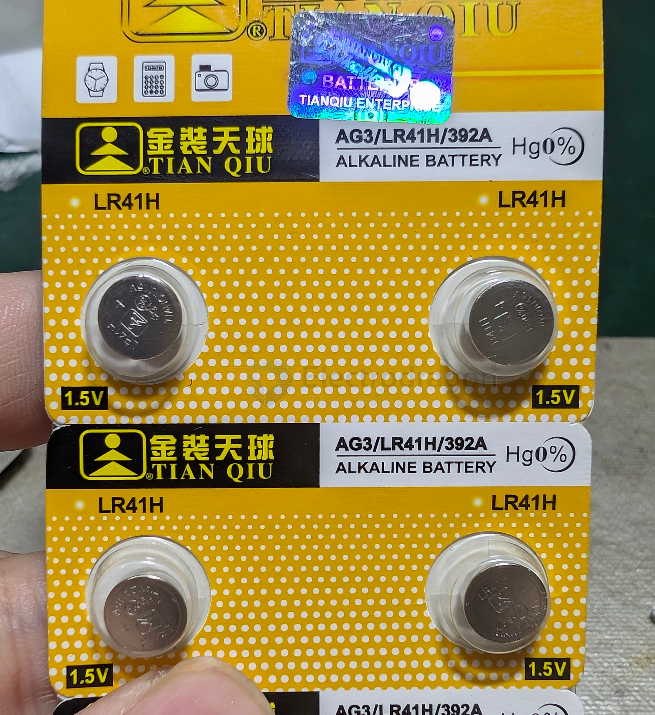

# LR41H-dat

- [[battery-alkaline-dat]] - [[LR41H-dat]] - [[AG3-dat]] - [[battery-coin-dat]] - [[LR41-dat]]

- 392A 

## apps 

- [[vibrator-dat]]

## info 

The **LR41H** (commonly referred to simply as **LR41** or **AG3**) is a standard alkaline button cell battery designed for small, low-drain electronic devices. The "H" suffix usually denotes a high-reliability or high-capacity variant from certain manufacturers, but it shares identical physical dimensions and core electrical specs with standard LR41 batteries.

---

### Key Specifications

| Specification          | Value                             | Notes                                       |
| ---------------------- | --------------------------------- | ------------------------------------------- |
| **Chemistry**          | Alkaline (Zinc–Manganese Dioxide) | Primary / Non-rechargeable                  |
| **Nominal Voltage**    | 1.5 V                             | Slopes downward as it discharges            |
| **Typical Capacity**   | 25 – 32 mAh                       | Varies slightly by manufacturer/drain rate  |
| **Diameter**           | 7.9 mm (0.31 in)                  | IEC Code 736 standard                       |
| **Height / Thickness** | 3.6 mm (0.14 in)                  |                                             |
| **Weight**             | ~0.5 grams                        | Extremely lightweight                       |
| **Shelf Life**         | 2 – 5 Years                       | Depends on storage temperature and humidity |

---

### Direct Equivalents & Cross-References

Because manufacturers use different naming conventions, the LR41H is interchangeable with:

* **Alkaline Codes (1.5V):** AG3, 192, 392A, LR736, L736, V3GA, GP192, 92A
* **Silver-Oxide Upgrades (1.55V):** SR41, SR41SW, 384, 392, SR736

> **Tip (Silver Oxide Upgrade):** If you are powering precision gear (like digital calipers, wristwatches, or medical devices), consider using an **SR41** (Silver Oxide) instead of LR41. Silver-oxide cells hold a flat 1.55V discharge curve and have a higher capacity (~40–45 mAh), making them last significantly longer and keep accurate calibration.

---

### Common Applications

* **Medical Devices:** Digital clinical thermometers, glucose meters.
* **Precision Tools:** Digital calipers, small scales.
* **Everyday Electronics:** Handheld calculators, wristwatches, key fobs, laser pointers, and LED keychain lights.

## ref 

