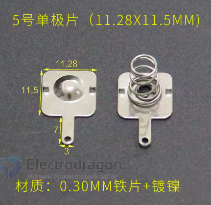
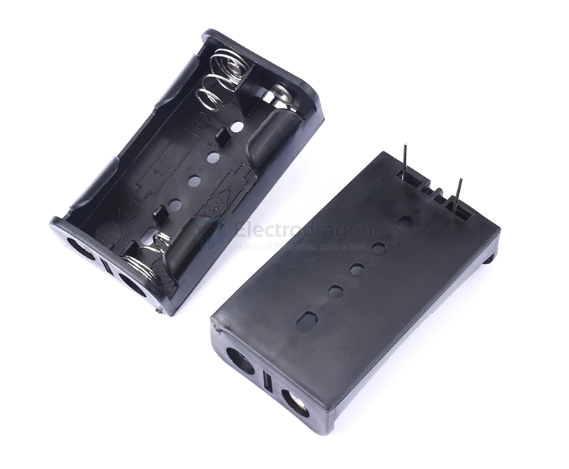
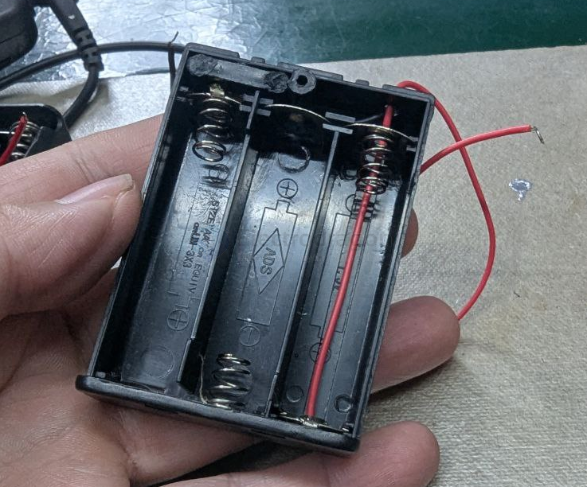
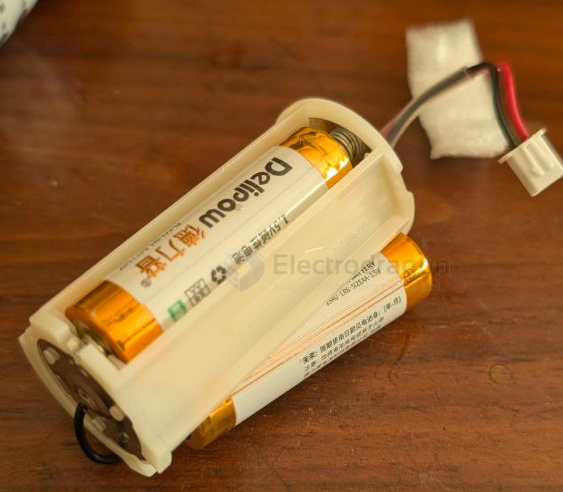

# battery-holder-AA-dat

- [[battery-AA-dat]] - [[battery-size-dat]]

- [[battery-holder-dat]] - [[18650-battery-holder-dat]] - [[AA-battery-holder-dat]]

- [[battery-pack-dat]] - [[battery-pack-kit-dat]]

## 1x battery-holder-AA-dat

### 1x PCB clip type 

## 2x battery-holder-AA-dat

### PCB PTH soldering holder 

## 3X AA battery holder 

== 1.5*3 = 4.5V 

## cylindar battery holder 

## ref 

- [[AA-battery-holder]]