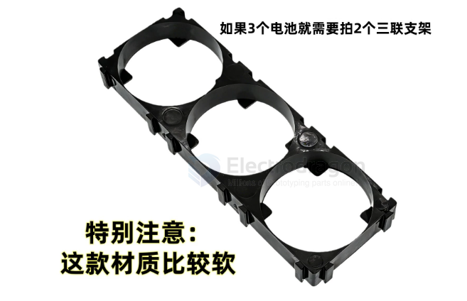

# battery-holder-pack-dat

- [[battery-pack-materials-dat]] - [[battery-holder-pack-dat]] - [[battery-strips-dat]]

- [[battery-holder-18650-dat]]

- 33.3孔 两联支架【硬料】
- 33.3孔 三联支架【硬料】== 圆孔直径：33.3毫米 // 间距：34.5毫米
- 33.3孔 两联【软料材质】
- 33.3孔 三联【软料材质】
- 33.5孔 两联【软料材质】
- 33.5孔 三联【软料材质】

## ref 

