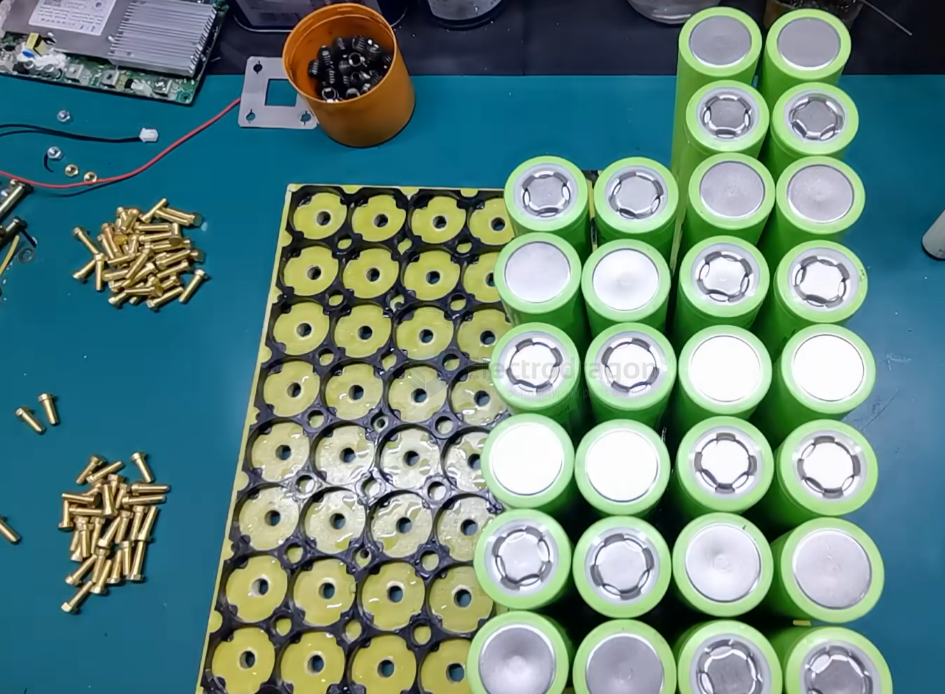
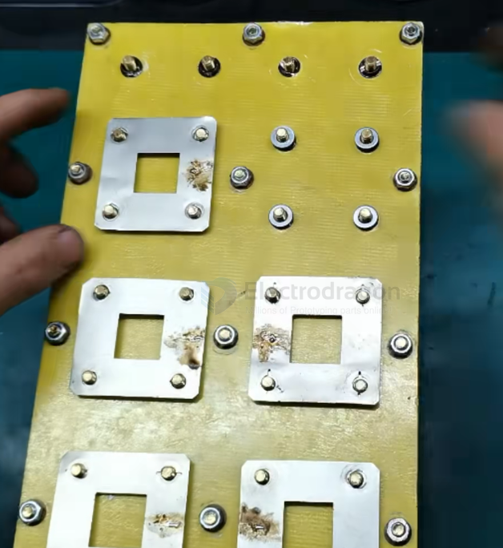
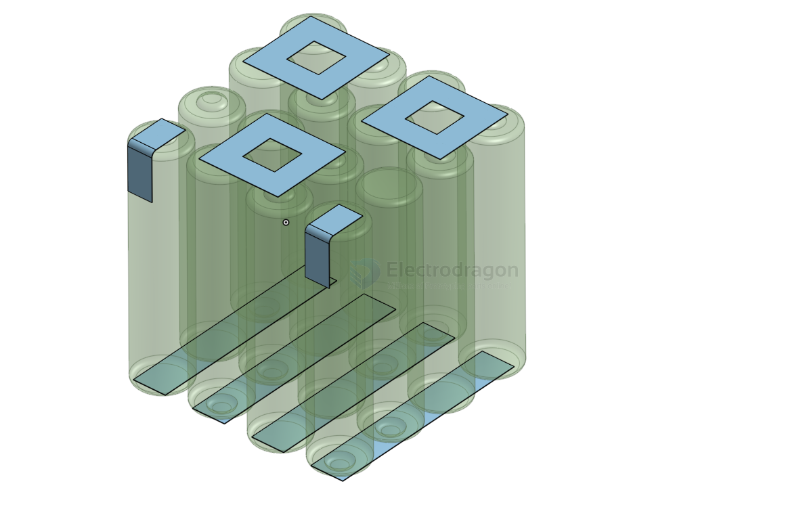
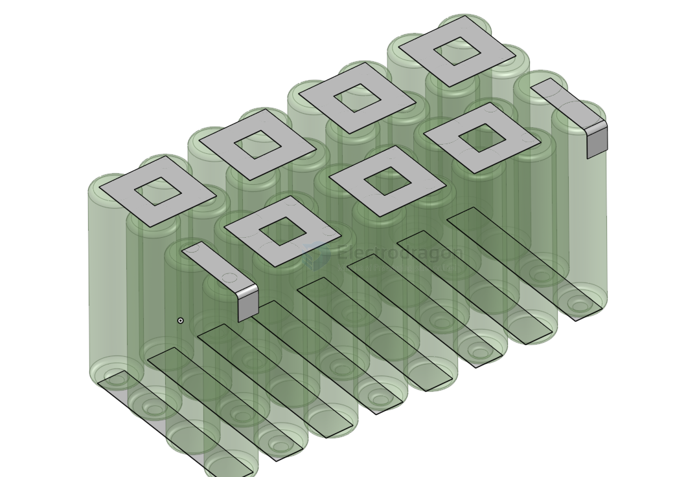

# battery-pack-LFP-dat

- [[battery-pack-dat]] - [[battery-pack-LFP-dat]]

- [[battery-li-LFP-dat]]

- [[battery-capacity-dat]]

- [[battery-pack-LFP-dat]] - [[battery-pack-dat]]

- [[battery-LFP-20S-dat]] == 64V 

- [[battery-LFP-15S-dat]] == 48V 

- [[battery-LFP-4S-dat]] == 12.8V 

## Build

| Cells | Configurations   |
| :---- | :--------------- |
| 16    | 48V 15A          |
| 20    | 60V 15A          |
| 24    | 72V 15A          |
| 32    | 48V 30A          |
| 40    | 60V 30A          |
| 48    | 72V 30A, 48V 45A |
| 60    | 60V 45A          |
| 72    | 72V 45A          |

## pack 32140 

- [[32140-dat]]

## pack design

4x4

4x8 or 4x10 

## Ref
- [[battery-LFP-pack]] - [[battery-li-lfp]]

