# battery-3s-build-dat

- [[battery-3s-build-dat]] - [[battery-3s-dat]]

- [[fab-PCB-soldering-tools-dat]] - [[soldering-tools-spot-welding-dat]] - [[fab-soldering-materials-dat]]

## build 2 == 3S2P 

- [[battery-failure-water-dat]] - [[battery-3s-build-dat]]

- CSC5113 - [[sand-tech-dat]] - [[CS5113-dat]] - [[battery-protector-dat]]
- PAN3013 == unknown

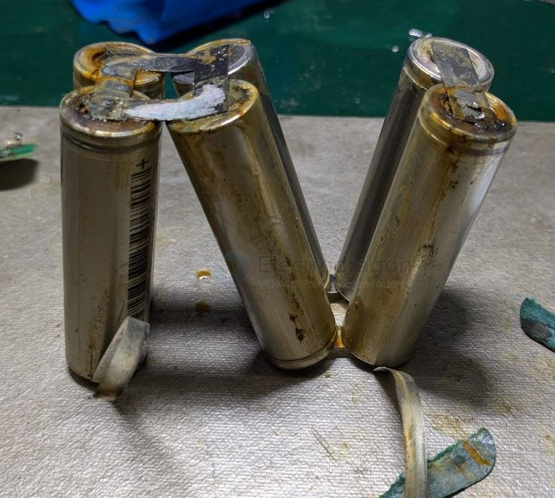

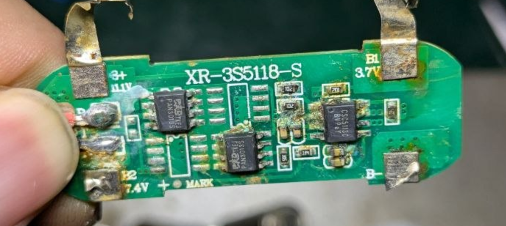

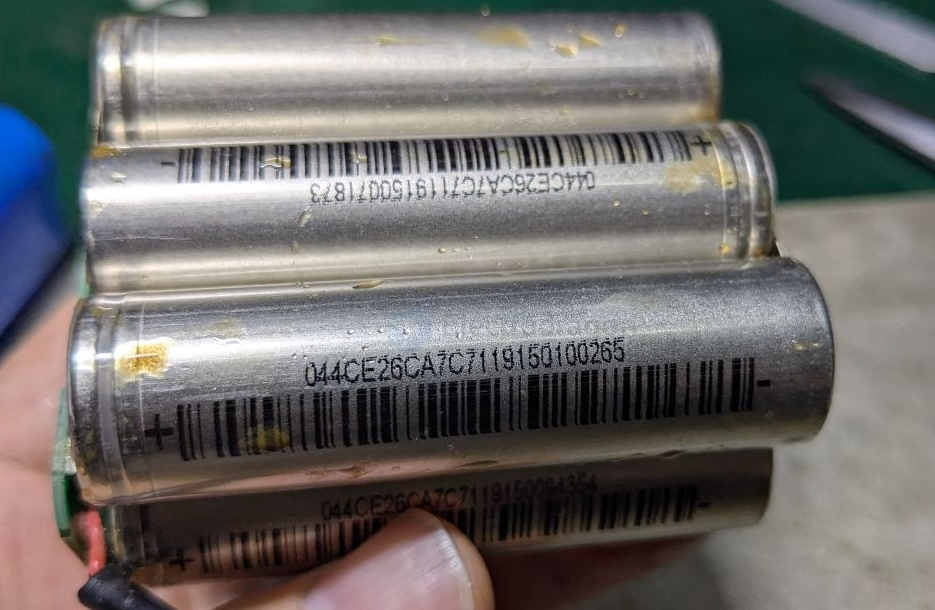

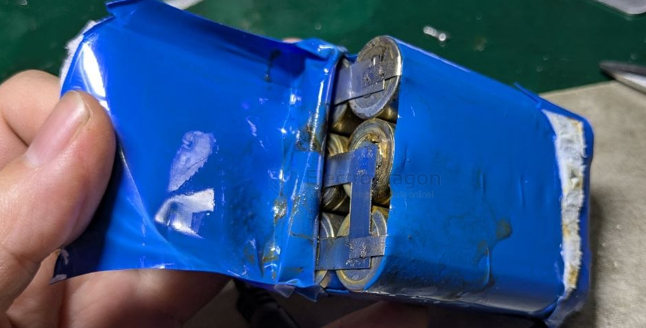

- [[heat-shrink-tube-dat]]

044CE26CA7C7119160100265

## build 1 == 3S

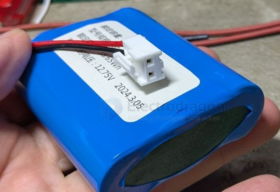

- [[conn-rc-dat]] - [[RC-dat]] - [[CONN-VH3.96-dat]]

- [[conn-power-dat]]

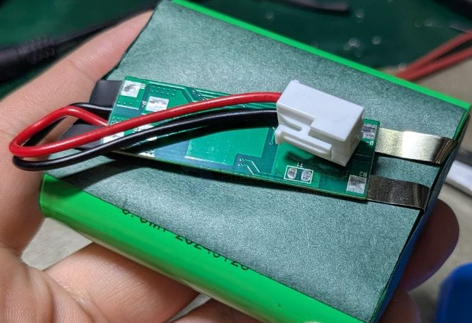

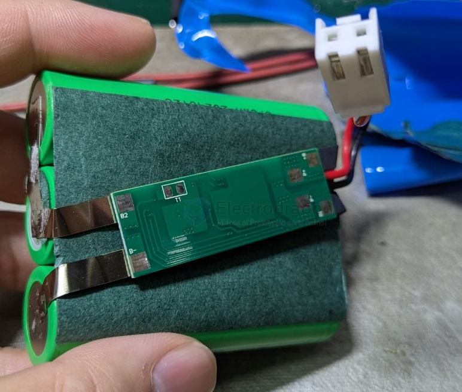

- [[battery-protector-3s-dat]] == B- B1 B2 B+ // P+ P- 

- [[JW3313-dat]] - [[joulwatt-dat]] - [[battery-3s-build-dat]]

- [[fab-soldering-materials-dat]] - [[battery-pack-materials-dat]] - [[battery-tools-dat]] 

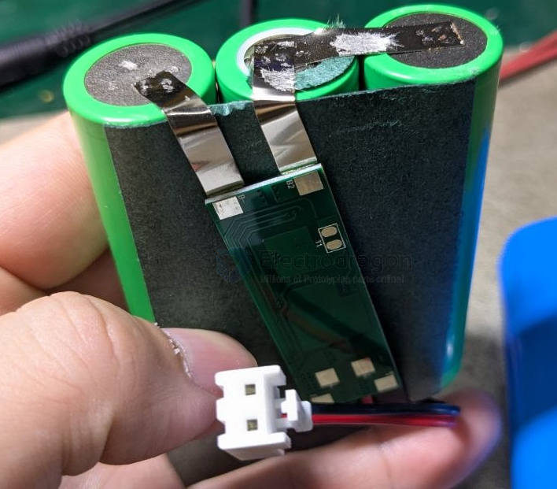

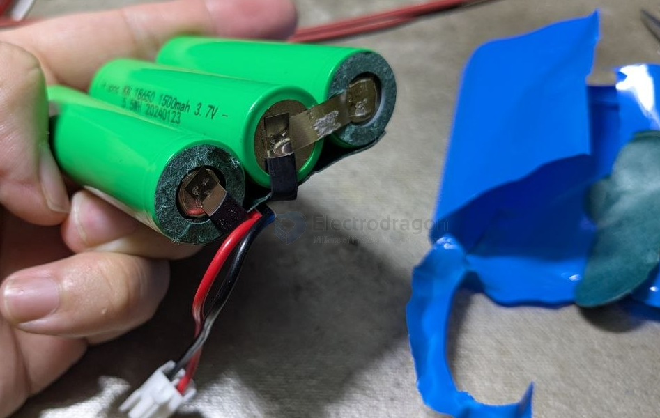

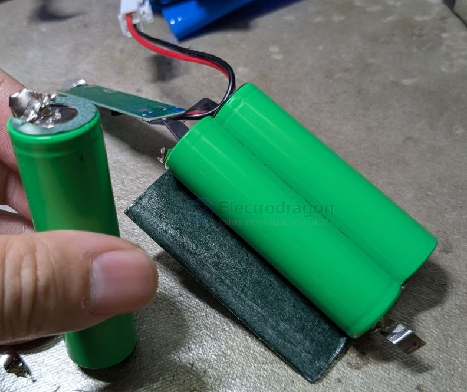

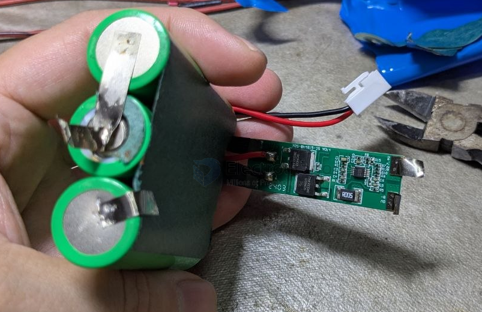

## ref 