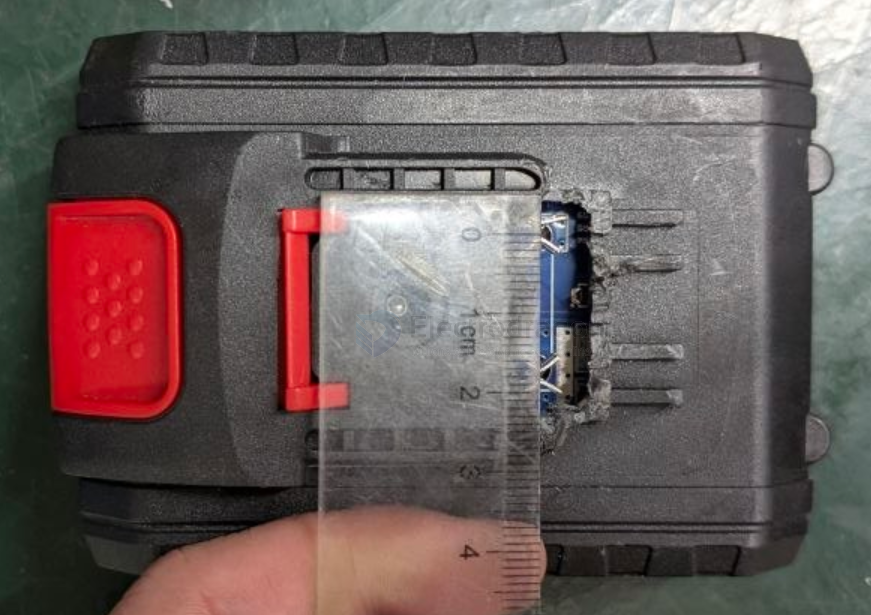
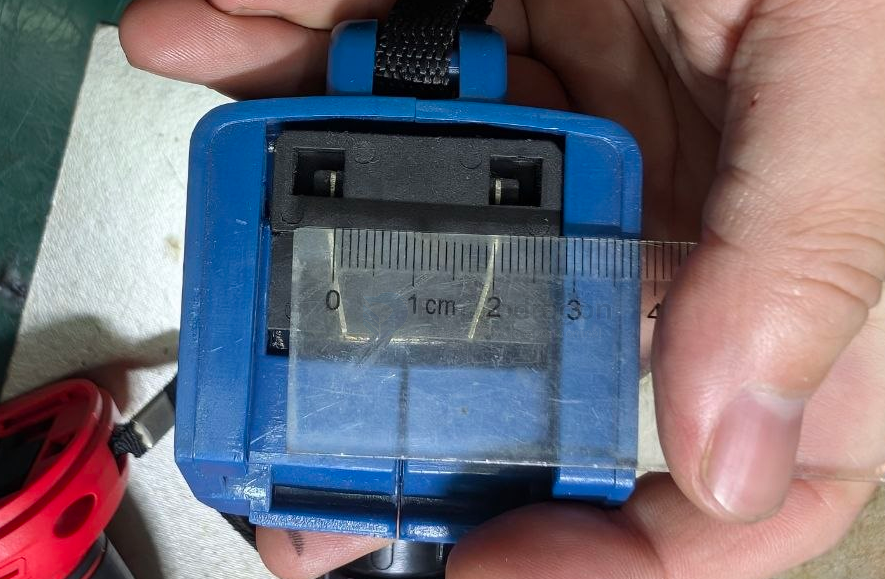

# battery-5S-dat

- [[power-tools-dat]] - [[battery-pack-dat]] - [[battery-5s-dat]] - [[battery-4s-dat]]

voltage == 4.2 * 5 = 21V 

## build 

socket pitch 18 mm 

socket pitch 38 mm 

socket pitch 21 mm

JH5S09

1500mAh * 5 JH3451D

unknown chip 

## ref 

