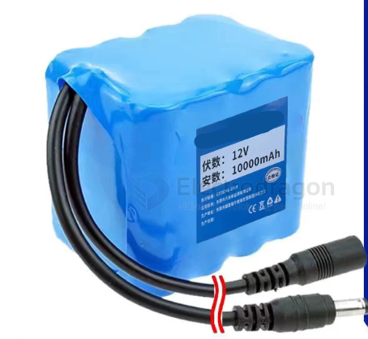
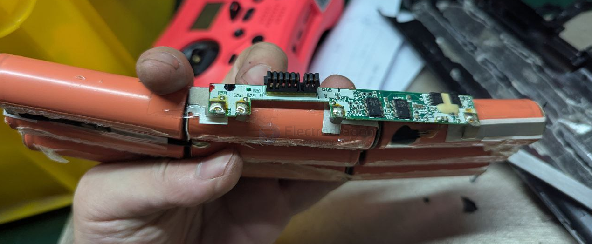
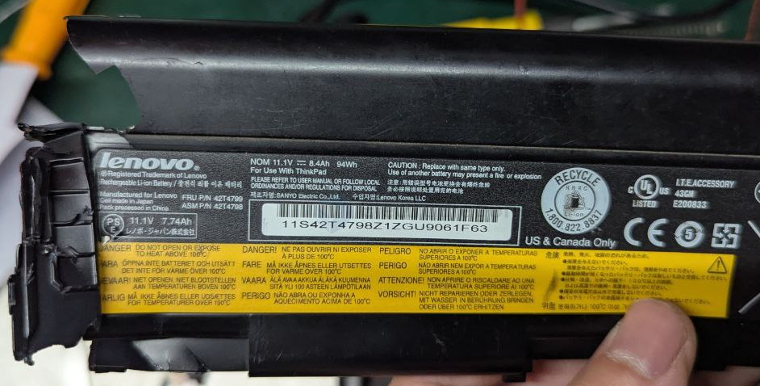
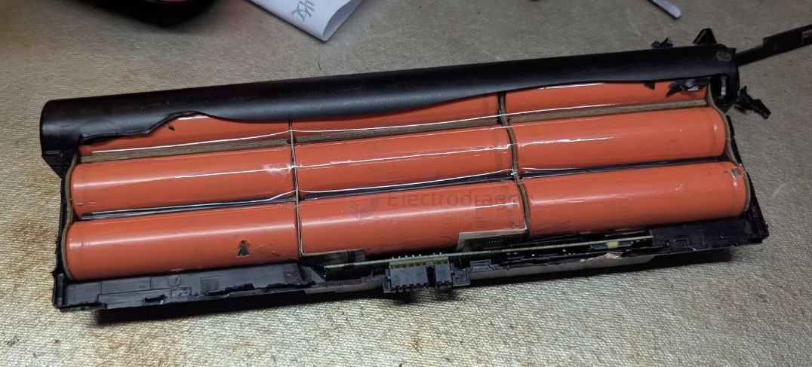
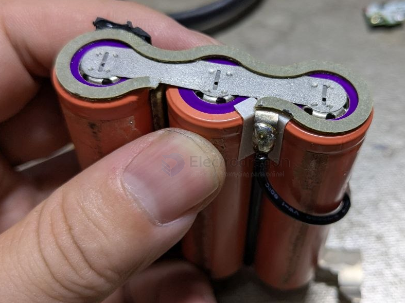
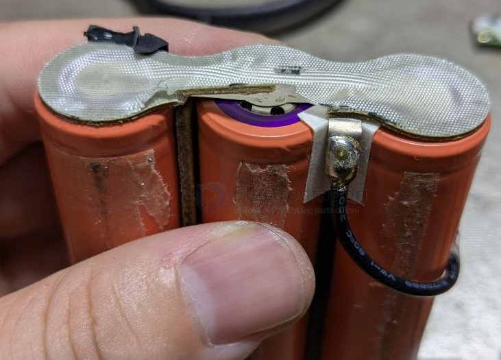
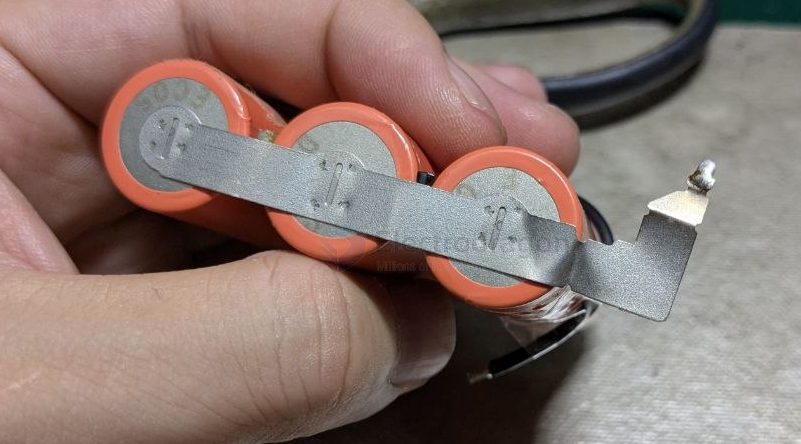
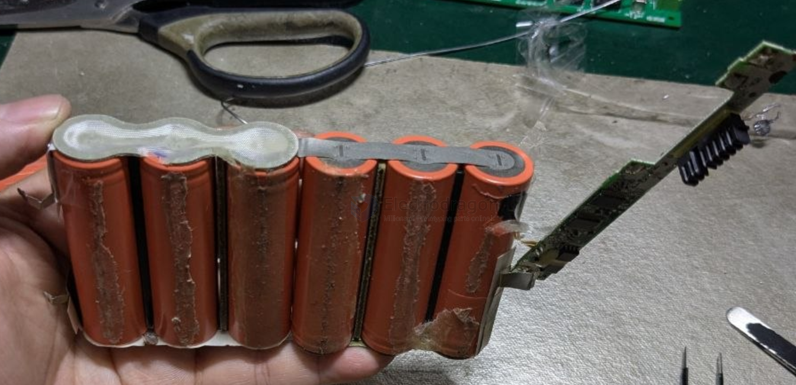
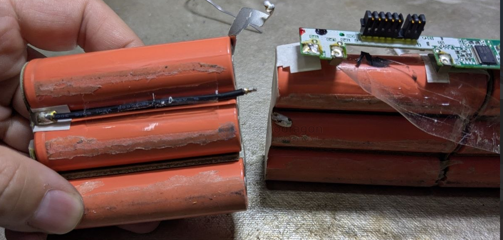

# battery-pack-build-dat

- [[battery-pack-dat]] - [[battery-pack-kit-dat]] - [[battery-pack-materials-dat]] - [[battery-pack-build-dat]]

- this build has no battery holder inside, only use - [[heat-shrink-tube-dat]] for compact and small size build 
  

- [[conn-power-dat]]

## build details 

### laptop internal battery pack

3S-3P == 11V - [[lenovo-dat]]

3x parallel 

3P + 3P == 2S

[[laptop-dat]]

## ref 

