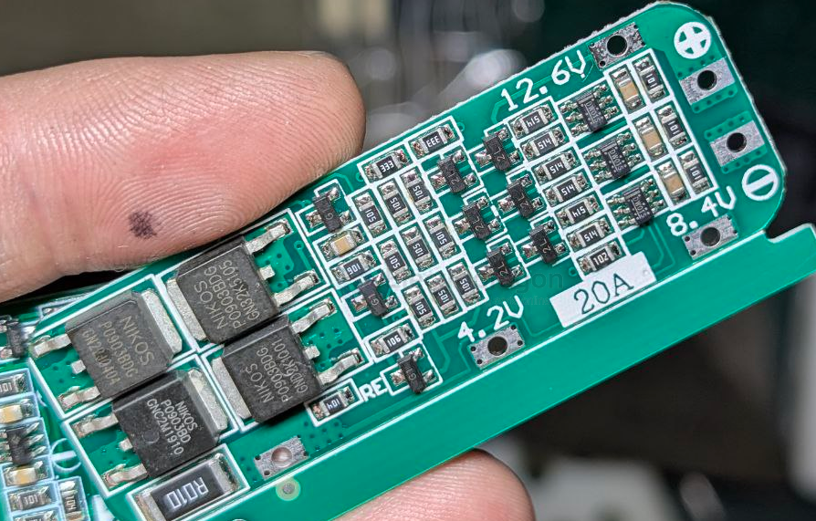

# battery-3s-dat

- [[battery-3s-dat]] - [[battery-2s-dat]] 

- [[battery-1s-dat]]

- [[battery-BMS-dat]]

## solutions 

- [[IP2326-dat]] - [[IP236x-dat]] - [[injoinic-dat]]

- [[CN3300-dat]] - [[CN3306-dat]] - [[Consonance-dat]]

## wiring 

- [[DW01-dat]] - [[chip-unsort-dat]]

## example BMS for 3S1P 18650

[[18650-dat]]

### ⚙️ What is a 3S1P Pack?

- **3S** = 3 cells in **series** → 11.1V nominal (12.6V fully charged)
- **1P** = 1 cell in **parallel** → Capacity = 1 cell's capacity
- Common cell type: **18650** or **LiPo pouch**
  - Example: 18650, 3.7V, 3000mAh, max 5A–10A discharge

---

### ✅ Recommended BMS Current Ratings

| **Battery Type**       | **Max Cell Discharge** | **Recommended BMS Current** |
| ---------------------- | ---------------------- | --------------------------- |
| Standard 18650 (3A–5A) | 5A–10A                 | 10A–15A                     |
| High-Drain 18650 (10A) | 10A–15A                | 15A–20A                     |
| LiPo Pouch (10C+)      | Varies                 | 15A+                        |

> ⚠️ Tip: Choose a BMS with a **trip current slightly above** your system's max current (about 1.2×).

---

### 🔐 Ideal Protection Settings

- **Continuous current**: 10–15A
- **Overcurrent trip**: 20–25A
- **Short-circuit protection**: Yes (fast cut-off)
- **Overvoltage cutoff**: ~4.25V/cell
- **Undervoltage cutoff**: ~2.5V/cell
- **Charge current**: ~5A or as per charger rating

## 🔧 Example

If using 3000mAh 18650 cells rated at 10A max:
- **Use BMS rated for 10A–15A continuous**
- **Trip limit around 20A–25A**

## ref 

