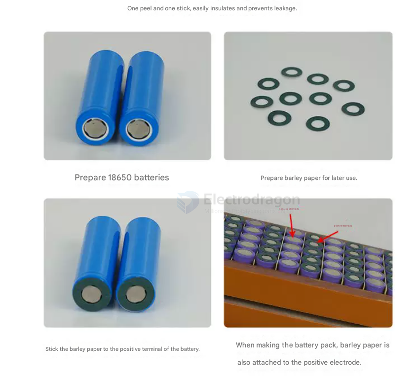

# battery-fishpaper-dat

- [[18650-dat]] - [[battery-li-size-dat]]

18650【空心】4联 1张=30个

18650【实心】4联 1张=30个

18650【空心】5联 1张=24个

18650【实心】5联 1张=24个

18650【空心】6联 1张=16个

18650【实心】6联 1张=18个

18650【空心】7联 1张=16个

18650【实心】7联 1张=16个

18650【空心】8联 1张=16个

18650【实心】8联 1张=12个

18650三角梅花实心 1张=20个

18650三角梅花空心 1张=20个

18650三角形实心 1张=20个

18650正方形实心 1张=20个

18650四角梅花空心 1张=20个

21700【空心】单联 1张=64个

21700【实心】单联 1张=56个

21700三角实心 1张=20个

21700四角梅花空心 1张=20个

21700正方形实心 1张=20个

26650【空心】单联 1张=36个

26650【实心】单联 1张=44个

32650【空心】单联 1张=30个

32650【实心】单联 1张=30个

33140【空心】单联 1张=30个

When building DIY 18650 battery packs (especially when spot-welding nickel strips for series/parallel configurations), applying **fishpaper (青稞纸) insulation rings** to the positive terminals is a vital safety step that should never be skipped.

The core reason for using fishpaper is structural: **the positive cap and the negative casing of an 18650 cell are physically extremely close to each other at the top terminal.**

Here is a detailed breakdown of the safety hazards involved and why fishpaper acts as a critical line of defense:

---

## 1. Structural Hazard: A Micro-Distance Between Plus and Minus

If you closely look at the anatomy of an 18650 battery, you will notice:
*   **The Positive Terminal (+ Top Cover):** This is only the raised center button at the very top.
*   **The Negative Terminal (Crimped Can):** The entire metal cylinder body—including the flat bottom, the sides, and **the rim wrapping right around the top positive cap**—is the negative terminal.

From the factory, these two polarities are separated only by a tiny gasket seal and wrapped over with a very thin layer of **plastic PVC heat-shrink tubing**.

## 2. Key Reasons to Apply Fishpaper Insulation

### Reason 1: Preventing Wear from Spot-Welding and Vibration (Primary Reason)
When assembling a battery pack, metal **nickel strips** are laid flat across the top of multiple batteries to be spot-welded together.
*   Nickel strips are rigid metals with relatively sharp edges.
*   During spot-welding (under physical pressure) or over long-term operation inside a moving device (like an e-scooter, DIY electric vehicle, or robot), the battery pack is subject to **vibration and shocks**. 
*   This constant friction can cause the sharp edge of the nickel strip to cut through or rub away the factory-installed fragile PVC plastic wrap on the shoulder of the cell.
*   If that PVC layer is breached, **the nickel strip bridges the positive top cap and the negative steel rim simultaneously, causing an immediate, massive short circuit**.

### Reason 2: Resisting High Thermal Loads During Welding
The standard factory PVC wrap melts at relatively low temperatures. During the instant millisecond duration of spot-welding, local heat spikes drastically. If the welding time is slightly too long, or the current is set too high, it will instantly burn through the edge of the battery's PVC plastic skin. 
Fishpaper possesses excellent **heat resistance and thermal insulation**, allowing it to easily survive the thermal shock of a spot-weld without melting away.

### Reason 3: Superior Mechanical and Puncture Strength
Fishpaper (historically known as vulcanized fibre paper) is not normal household paper. It is an industrially treated, heavy-duty electrical grade **cellulose fibre insulation material**. It offers high mechanical strength, elasticity, flexibility, and exceptional resistance to puncture or tearing from metal burs and wires.

### Reason 4: Failsafe and Redundancy Layer
Even if the original factory plastic wrap degrades, cracks due to age, or shrinks due to heat, having a dedicated adhesive-backed fishpaper gasket ring creates a resilient secondary physical barrier that keeps the nickel strip safely elevated off the negative chassis.

---

## 3. The Dangerous Consequences of Skipping It

A direct short circuit across a high-energy lithium-ion cell is catastrophic:
1.  **Amperage Spike:** The cell internal resistance drops instantly, unleashing hundreds of amperes of current within seconds.
2.  **Boiling Core:** The cell internal temperature skyrockets, causing the organic electrolyte fluid to boil rapidly and vaporize into gas.
3.  **Thermal Runaway:** The internal pressure bursts open the safe venting mechanisms, releasing toxic flames or exploding aggressively, which chain-reacts into adjacent cells, destroying the entire battery pack and environment.

---

> 💡 **Best Practice Summary:**
> Always stick a **self-adhesive fishpaper washer** directly onto the positive terminal of every single 18650 cell before laying down any nickel strips or starting the spot-welding process. This inexpensive piece of insulation is one of the most vital layers of protection in your battery system design.