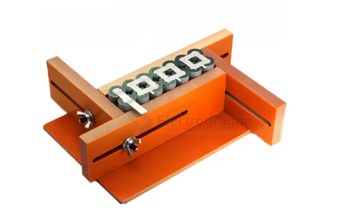

# battery-pack-materials-dat

- [[fab-soldering-materials-dat]] - [[battery-pack-materials-dat]] - [[battery-tools-dat]] 

- [[battery-strips-dat]] - [[battery-fishpaper-dat]]

- [[battery-pack-dat]] - [[battery-pack-kit-dat]]

- [[battery-pack-materials-dat]] - [[battery-holder-pack-dat]]

- [[cable-battery-dat]]

## battery tools == for battery pack build 

### tools 

holder 

- [[fab-tools-dat]] - [[soldering-tools-spot-welding-dat]]

- capacity - [[electronic-loader-dat]]
- internal resistance == discharge current - [[meter-internal-resistance-dat]]

[LittloKala M4S](https://www.liito-kala.com/page92?product_id=31)

- CHARGE: Charges the battery to full
- DISCHARGE: Discharge the battery to empty.
- TEST: Test battery capacity.
- STORAGE: Charge the battery voltage to 3.8V or discharge the battery voltage to 3.8V.

### battery pack assembly materials

- [[battery-pack-kit-dat]]

- 1. Nickel Strip / copper strip == `铝片和铜片`，电池点焊用的，铝片适合铝壳电池，铜片适合铁壳电池 - [[fab-soldering-materials-dat]] - [[battery-strips-dat]]

- 2. `青稞纸电池垫` == 使用在电池点焊前，贴在18650电池前，防止压迫导致电池塑料纸损坏，造成电池短路 - [[battery-fishpaper-dat]]

- 3. `青稞纸` == 青稞纸基本都是最后出场，作为电池绝缘和减震的重要部分 - [[Nickel-strips-dat]] 

- 4. `硅胶电线` == 链接电池用的，硅胶耐高温，相比一般电线胶皮的上锡的时候不会融化。 - [[cable-battery-dat]]

- 5. [[battery-holder-dat]]

- 6. [[battery-BMS-dat]] - [[battery-manager-dat]]

- 7. [[case-dat]] or [[heat-shrink-tube-dat]] 

## ref 

