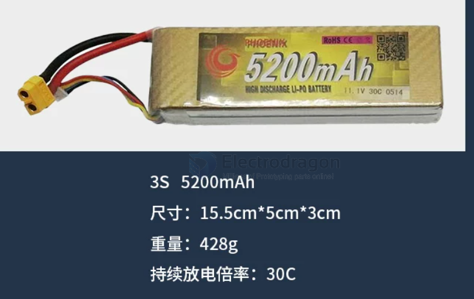
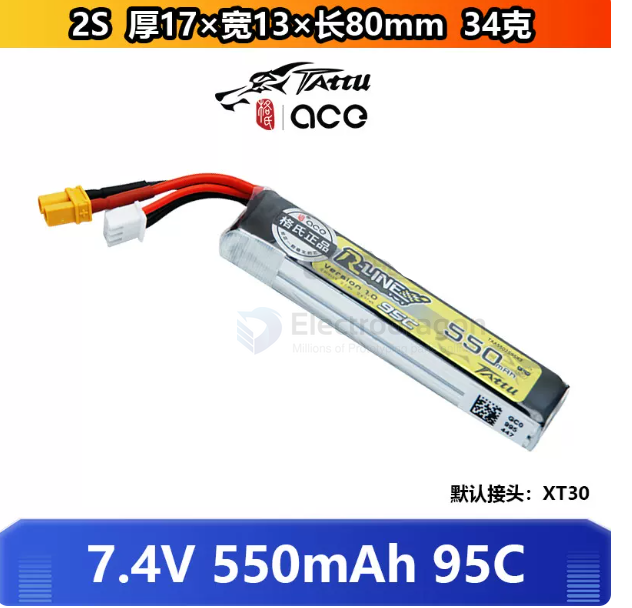

# battery-FPV-dat

- [[thrust-dat]] - [[FPV-load-dat]] - [[FPV-size-dat]] - [[battery-FPV-dat]]

- [[battery-liHV-dat]]

- [[mobula8-dat]]

- [[FPV-build-dat]]

- [[CONN-A30-dat]] - [[PH2.0-dat]] - [[CONN-power-dat]] - [[FPV-build-dat]] - [[battery-FPV-dat]] - [[battery-1S-dat]] - [[CONN-JST-dat]]

- [[cable-power-dat]]

- [[battery-FPV-dat]] - [[battery-charger-dat]] - [[battery-charger-parallel-dat]] - [[power-FPV-dat]]

## voltage from 2S to 1S

Swapping a Mobula8 from 2S to 1S won't fly better — it may barely fly at all. This is a **voltage-platform problem**, not a weight problem.

### Key specs

| Spec           | 2S 550mAh (current)        | 1S 550mAh (swap)                    |
| -------------- | -------------------------- | ----------------------------------- |
| Voltage        | 7.4V                       | 3.7V (halved)                       |
| Battery weight | 34g                        | 14g                                 |
| Total weight   | 86g                        | 64g (−22g)                          |
| Motor speed    | 8000KV × 7.4V = 59,200 RPM | 8000KV × 3.7V = 29,600 RPM (halved) |

### The catch: thrust drops with voltage²

Thrust ∝ RPM² ∝ (V × KV)²

|                  | 2S                      | 1S                          |
| ---------------- | ----------------------- | --------------------------- |
| Thrust / motor   | 60–80g                  | 15–20g (×¼)                 |
| Total thrust     | 240–320g                | 60–80g                      |
| Thrust-to-weight | 2.8–3.7:1               | ~1:1 (hover limit)          |
| Result           | 3× margin, flies easily | Full throttle just to hover |

### Why losing 22g doesn't save it

Weight loss only shrinks demand; halving voltage collapses supply (¼ thrust) — demand can't keep up with the supply crash:

|     | Supply   | Demand | Margin   |
| --- | -------- | ------ | -------- |
| 2S  | 240–320g | 86g    | Plenty ✅ |
| 1S  | 60–80g   | 64g    | ~Zero ❌  |

### When is 1S valid?

Only with a high-KV "1S-native" motor:

|           | Motor     | KV                 | 1S?          |
| --------- | --------- | ------------------ | ------------ |
| Mobula8   | 1103      | 8000KV (2S design) | ❌ Won't fly  |
| 1S-native | 1102/1103 | 15000KV+           | ✅ Flies fine |

15000KV × 3.7V = 55,500 RPM ≈ 2S 8000KV speed — high KV compensates low voltage. Your KV is too low for 1S.

### Verdict

| Battery             | Thrust-to-weight | Verdict                       |
| ------------------- | ---------------- | ----------------------------- |
| 2S 550mAh           | 2.8–3.7:1        | Floaty but flyable            |
| **2S 450mAh (25g)** | 3.2–4.3:1        | ✅ Best: lighter, same voltage |
| 1S 550mAh (14g)     | ~1:1             | ❌ Barely flies                |

**Recommendation:**
1. Use 2S 450mAh — lose 9g with no voltage loss → ~4:1 ratio, better feel
2. Skip 1S unless you swap in 15000KV motors (that's a new build, not a battery swap)
3. For max weight savings: 2S 450mAh + remove spare parts (−5–10g)

**TL;DR:** 1S halves voltage → thrust drops to ¼, and 22g of savings can't compensate — thrust-to-weight falls from 3:1 to 1:1, going from "floaty" to "won't fly." For better flight, 2S 450mAh (lighter, same voltage) is the fix.

## types 

- [[battery-liHV-dat]]

### ACE格氏

ACE格氏穿越机550mah锂电池RLINE金砖TATTU 2S 7.4V 95C 3S 11.1V

TATTU 格氏 ACE 2S 3S 4S 450 650 850 mah 75c 锂电池 == 50 cny 

`550mah 2S 7.4V 95C == 34g` / 80 x 17 x 13 mm 

### happymodel 

航模1S LIHV高压 3.8v 650mah 30C穿越机锂电池 Moblite7用 PH2.0

### GNB

GNB高能 550mAh 2S 7.6V 100C HV 穿越机FPV Mobula8用高压锂电池

高能高压锂电池 lihv 3.8V 520mah穿越机 mobula7 1S tinyhawk2/3

### 志气

志气锂电池11.1V水弹电池7.4V高放3S发射器300-1400mah聚合物XT30

### DAI WONG GAU

DAI WONG GAU大黄狗航模1350-1550mAh 6S150C竞速FPV穿越机锂电池

### 花牌

花牌 锂电池 7.4v / 11.1v 550 mah 40c 85C 超小型固定翼 穿越机

## charge current selection 0.2A / 0.6A 

Recommended Charging Current for 1S LiPo/LiHV Batteries

For typical **1S batteries (300 mAh to 500 mAh)** used in micro FPV whoops like the Mobula6, choosing between **0.2 A** and **0.6 A** depends on whether you prioritize **battery lifespan** or **charging speed**.

---

### 1. Calculating Charge Rates (C-Rating)

The charging rate is calculated using the battery's capacity ($C$):

$$\text{Charge Current (A)} = \text{Battery Capacity (Ah)} \times \text{Charge Rate (C)}$$

For a standard **300 mAh (0.3 Ah)** 1S battery:
* **0.2 A**: $\approx \mathbf{0.67\text{ C}}$ (Slow / gentle charge — takes over 60 minutes)
* **0.3 A**: $= \mathbf{1\text{ C}}$ (**Standard recommended rate** — takes 45–60 minutes)
* **0.6 A**: $= \mathbf{2\text{ C}}$ (Fast charge — takes 20–30 minutes)

---

### 2. Comparison: 0.2 A vs. 0.6 A (for a 300 mAh Battery)

| Charge Current | Rate (C) | Approx. Duration | Pros & Cons | Best Use Case |
| :--- | :--- | :--- | :--- | :--- |
| **0.2 A** | $\approx 0.67\text{ C}$ | 60–75 mins | **Pros**: Generates minimal heat, maximizes overall cycle life. **Cons**: Slower charge time. | Charging at home or preparing batteries overnight. |
| **0.6 A** | $= 2\text{ C}$ | 20–30 mins | **Pros**: Fast turnaround time. **Cons**: Slight heat generation; long-term use slightly accelerates cell aging. | Field charging or quick battery rotations. |

---

### 3. Recommended Settings by Battery Capacity

If using a smart charger with adjustable current (e.g., ViFLY WhoopStor v3):

* **300 mAh Batteries** (Mobula6 standard):
  * **Safe / Standard (1C)**: **0.3 A**
  * **Fast Charge (2C)**: **0.6 A**
* **450 mAh – 550 mAh Batteries** (Mobula7 / 75mm Whoops):
  * **Safe / Standard (1C)**: **0.5 A**
  * **Fast Charge (1.3C–1.5C)**: **0.6 A – 0.8 A**

---

### 4. Usage Advice

1. **High-Performance Folded Cells (BT2.0 / A30 connectors)**: Quality batteries from BetaFPV, GNB, or Tattu are rated for **2C or higher** charging. Using **0.6 A** on a 300 mAh cell is perfectly safe and widely practiced.
2. **Older PH2.0 Batteries**: Due to high contact resistance in PH2.0 connectors, keep the current at **0.2 A – 0.3 A** to prevent connector and wire heating.
3. **General Rule**: Use **0.2 A – 0.3 A** when time permits to prolong battery health; switch to **0.6 A** when flying in the field and needing quick turnarounds.

## ref 

- [[battery-rechargerable-dat]]