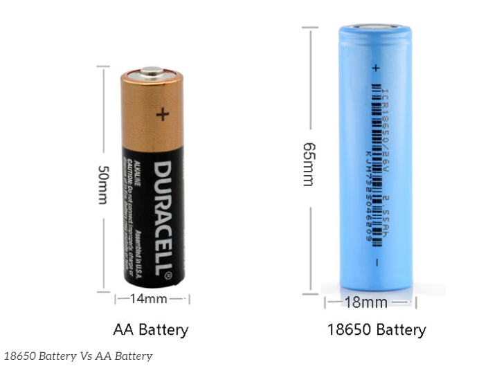
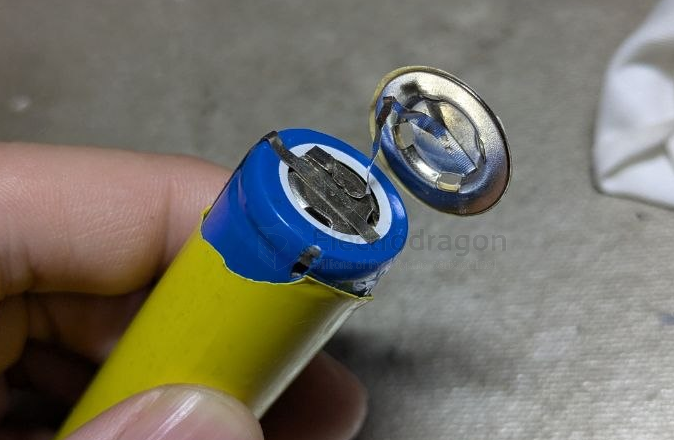
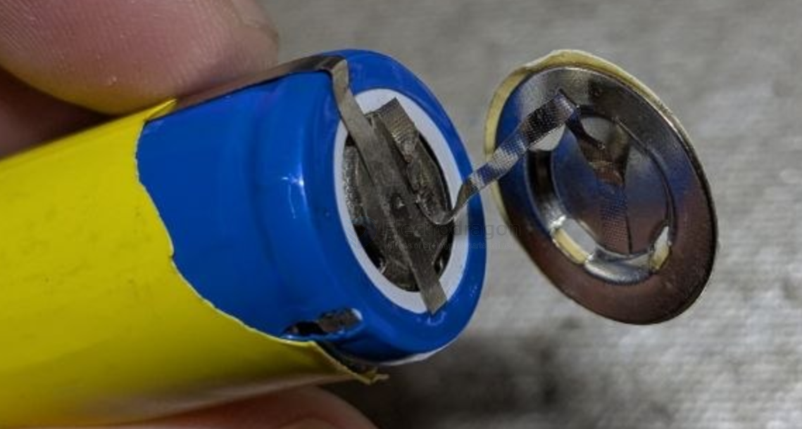
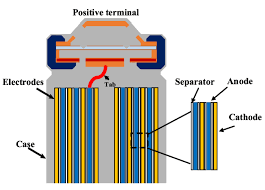

# 18650-dat

- [[battery-2s-dat]]

- [[battery-pack-dat]]

18mm x 65mm // 1200mAh - 3500mAh // 3.6V/3.7V nominal voltage // 4.2V full charge voltage

- [[18650-battery-holder-dat]]

- [[18650-0V-dat]]

- [[fab-dat]] - [[fab-tools-dat]] - [[battery-tools-dat]]

## 18650 with protector? 

- [[battery-protector-1s-dat]]

## internal 

## 18650 battery capacity test 

### Method 1: Using a Dedicated Electronic Load Tester (Most Accurate & Recommended)

This is the most precise method used by enthusiasts and professionals. It allows you to set exact parameters and often exports data to a PC to plot a discharge curve. Popular budget-friendly units include the **electrodragon** or generic digital constant-current electronic load modules.

#### 1. Hardware Required
*   **Electronic Load Tester** (supporting Constant Current / CC mode).

*   `四线制电池夹`（Kelvin夹） == **4-Wire Battery Test Fixture (Kelvin Clamp):** **Crucial!** Standard 2-wire holders introduce voltage drops due to lead and contact resistance, causing premature cut-off readings. A 4-wire fixture uses two wires for the heavy discharge current and two separate wires exclusively to measure voltage at the battery terminals accurately. - [[Kelvin-Clamp-dat]]
  

*   **PC Connection Cable** (optional, for software graphing). 

#### 2. Step-by-Step Procedure
1.  **Fully Charge:** Charge the 18650 cell to exactly **4.2V** using a standard lithium-ion charger. Let it rest for 10–20 minutes so the chemistry stabilizes and the resting voltage settles.
2.  **Connect:** Place the cell into the 4-wire fixture, ensuring strict adherence to positive (+) and negative (-) polarities, and connect it to the electronic load.
3.  **Configure Parameters:**
    *   **Discharge Mode:** Set to **CC** (Constant Current).
    *   **Discharge Current:** Base this on your cell type. For standard capacity cells, a rate of **0.2C to 0.5C** is ideal (e.g., for a 3000mAh battery, 0.5C is 1.5A). For high-drain power cells, you can test at 1A, 2A, or higher. *Note: Higher currents generate more internal heat, which slightly lowers the measured capacity.*
    *   **Cut-off Voltage:** Set between **2.5V and 2.75V** (check your specific cell's datasheet). Never set it below 2.0V, as over-discharging will permanently damage the battery.
4.  **Run the Test:** Start the discharge. The electronic load will dynamically adjust its resistance to keep the current perfectly constant while tracking the elapsed time and accumulating capacity (`mAh` or `Ah`).
5.  **Completion:** Once the cell voltage drops to your configured cut-off limit, the tester automatically disconnects the load and alerts you. The finalized `mAh` reading on the screen is your true battery capacity.

## 18650 battery capacity 

The capacity of an **18650 lithium-ion battery** depends heavily on its **brand**, **intended application (Capacity-type vs. High-drain/Power-type)**, and whether it is a genuine product. 

For authentic, reputable brands, the standard capacity range is typically between **1,200mAh and 3,500mAh**.

Here is a detailed breakdown of 18650 battery capacities:

### 1. Standard Capacity Ranges by Type
* **Capacity-Type / Regular Batteries (Low Discharge Current):** Typically range from **2,600mAh to 3,500mAh**. These are designed for devices that require long runtime but low current draw, such as high-powered flashlights, power banks, and laptop battery packs.
* **High-Drain / Power-Type Batteries (High Discharge Current):** Typically range from **1,500mAh to 2,500mAh**. To safely output massive currents (e.g., 10A, 20A, or up to 30A) for power tools, vacuum cleaners, and e-bikes, these batteries sacrifice overall energy density/capacity.

---

### 2. The Physical and Technical Limits
As of current chemical engineering limits, the maximum physical capacity for a genuine, tier-1 manufactured 18650 battery is around **3,500mAh to 3,600mAh** (such as the famous *Panasonic NCR18650GA* or *Samsung 35E*).

> ⚠️ **Beware of Fakes and Counterfeits:** If you see 18650 batteries online claiming capacities like **4,000mAh, 5,000mAh, or 9,900mAh**, they are **100% fake**. These are usually produced by counterfeit workshops that wrap recycled, low-quality cells in misleading labels. Given the fixed physical dimensions of an 18650 cell (18mm diameter, 65mm length), it is scientifically impossible to fit that much capacity using current lithium-ion technology.

---

### 3. Popular Models from Top-Tier Manufacturers

| Brand                 | Model        | Nominal Capacity | Battery Type                  | Common Applications                   |
| :-------------------- | :----------- | :--------------- | :---------------------------- | :------------------------------------ |
| **Panasonic / Sanyo** | NCR18650B    | **3400mAh**      | Capacity-Type                 | Flashlights, laptops, energy storage  |
| **Panasonic / Sanyo** | NCR18650GA   | **3500mAh**      | Capacity-Type (High-capacity) | Premium flashlights, electric bikes   |
| **Samsung**           | INR18650-35E | **3500mAh**      | Capacity-Type                 | Power banks, long-runtime electronics |
| **Samsung**           | INR18650-25R | **2500mAh**      | High-Drain (20A)              | Power tools, cordless vacuums         |
| **Murata / Sony**     | US18650VTC6  | **3000mAh**      | High-Drain (30A)              | High-performance tools, drones        |
| **LG**                | INR18650-HG2 | **3000mAh**      | High-Drain (20A)              | High-power appliances ("LG Choc")     |

---

### 4. Factors Affecting Real-World Usable Capacity
The capacity labeled on the battery isn't always the exact amount of energy you will get in real-world usage:
* **Discharge Cut-off Voltage:** A typical 18650 has a nominal voltage of 3.6V/3.7V and a full charge of 4.2V. If your device automatically shuts off when the battery drops to 3.0V, you won't be able to access the remaining energy stored down to the absolute safe limit (usually 2.5V).
* **Discharge Current Draw:** Drawing a massive current from a standard capacity-type cell will cause high internal resistance and heat. This causes the voltage to drop prematurely, significantly reducing the actual capacity delivered.
* **Operating Temperature:** Lithium-ion performance drops drastically in cold environments. In sub-zero temperatures (below 0°C/32°F), internal chemical activity slows down, causing a temporary but significant reduction in usable capacity.

## discharge current 

### 🔧 Typical Discharge Ratings by Category

| **Category**             | **Examples**            | **Max Continuous Discharge** | **Notes**                                 |
|--------------------------|--------------------------|-------------------------------|-------------------------------------------|
| **Standard Energy Cells** | Panasonic NCR18650B     | 2A–3A                         | High capacity (up to 3400mAh), low drain  |
|                          | LG MJ1, Samsung 35E      | 5A                            | Up to ~3500mAh                            |
| **Balanced Cells**        | Samsung 30Q, LG HG2      | 10A–15A                       | Good mix of capacity (3000mAh) and power  |
| **High-Drain Cells**      | Sony VTC6, Molicel P26A  | 20A                           | Often 2600–3000mAh                        |
| **Extreme High-Drain**    | Sony VTC5A, Molicel P28A | 25A–30A                       | Used in power tools, e-skates, vaping     |

---

### 📌 Notes

- **Pulse current** (short bursts) may be 1.5–2× the continuous rating.
- Always check **manufacturer datasheet** for:
  - Continuous discharge current
  - Pulse current (duration & cooldown)
  - Required cooling
- Actual safe discharge also depends on:
  - Temperature
  - Battery aging
  - Internal resistance

---

### ⚠️ Warning

Using a cell above its rated discharge current may:
- Cause overheating or thermal runaway
- Reduce lifespan drastically
- Trigger BMS protection or cause fire risk

---

### ✅ Recommended Use

| **Application**       | **Recommended Cell Type**      |
|-----------------------|---------------------------------|
| Flashlights, DIY packs | Standard or balanced (5A–10A)  |
| E-bikes, e-scooters    | High-drain (15A–30A)           |
| Power tools, drones    | High to extreme high-drain     |

## 14500 vs 18650 vs 21700 batteries

| Feature                      | AA Size Lithium (14500)    | 18650 Lithium-Ion           | 21700 Lithium-Ion         |
| ---------------------------- | -------------------------- | --------------------------- | ------------------------- |
| **Typical Size (mm)**        | 14 x 50                    | 18 x 65                     | 21 x 70                   |
| **Nominal Voltage**          | 3.7V                       | 3.6V – 3.7V                 | 3.6V – 3.7V               |
| **Capacity Range**           | 500 – 800 mAh              | 1800 – 3500 mAh             | 4000 – 5000+ mAh          |
| **Max Continuous Discharge** | 1 – 3A                     | 5 – 20A                     | 10 – 35A                  |
| **Common C-Rate**            | 1C – 3C                    | 1C – 10C                    | 1C – 10C+                 |
| **Rechargeable**             | Yes                        | Yes                         | Yes                       |
| **Common Use Cases**         | Small flashlights, sensors | Laptops, power tools, vapes | EVs, e-bikes, power tools |
| **Weight (approx.)**         | ~20g                       | ~45g                        | ~70g                      |
| **Energy Density**           | Low – Medium               | Medium                      | High                      |

## **18650 Battery Types**

| **Type**                          | **Main Composition**                             | **Features**                                     | **Applications**                        |
| --------------------------------- | ------------------------------------------------ | ------------------------------------------------ | --------------------------------------- |
| **NCM/NCA**                       | Nickel-Cobalt-Manganese / Nickel-Cobalt-Aluminum | High energy density, medium safety               | EVs (Tesla Model S/X), laptop batteries |
| **LFP (Lithium Iron Phosphate)**  | Lithium Iron Phosphate                           | Long lifespan, high safety, lower energy density | Energy storage, power tools, e-bikes    |
| **LCO (Lithium Cobalt Oxide)**    | Lithium Cobalt Oxide                             | High energy density, shorter lifespan            | Laptops, battery packs                  |
| **IMR (Lithium Manganese Oxide)** | Lithium Manganese Oxide                          | High discharge rate, heat resistance             | High-power flashlights, vaping devices  |

---

## **18650 vs. 21700 Batteries**
| **Model** | **Size**   | **Energy Density** | **Common Uses**                 |
| --------- | ---------- | ------------------ | ------------------------------- |
| **18650** | 18 × 65 mm | 2000 – 3500mAh     | Laptops, EVs, tools             |
| **21700** | 21 × 70 mm | 4000 – 5000mAh     | Tesla batteries, energy storage |

Tesla originally used **18650 batteries** in **Model S/X** but later switched to **21700** for **Model 3/Y** and is now moving towards **4680** cells for higher efficiency.

The 18650 battery should fall under the Lithium-ion Battery category, as it is a specific form factor of the lithium-ion battery, commonly used in applications such as laptops, power tools, flashlights, and electric vehicles.

## safety concern 

After 30 years of development, the preparation process of 18650 battery has been very mature. In addition to the great improvement in performance, its safety is also perfect. 

To prevent the metal casing from exploding, the battery is now fitted with a safety valve at the top. The safety valve is now a standard part of every 18650 Li-ion battery and is the most important barrier. When the pressure inside the cell becomes too high, the top safety valve opens to vent and depressurize, preventing an explosion. 

However, when the safety valve is open, chemicals leaking from inside the battery can react with oxygen in the air at high temperatures and still cause a fire. 

In addition, most 18650 batteries now also come with their own protection panel with overcharge and overdischarge and short circuit protection, which has high safety performance.

- [[battery-protection-dat]]

## CID safety 

The CID (Current Interrupt Device) in an 18650 battery is a safety feature designed to prevent overheating and potential hazards. If the internal pressure of the battery gets too high (usually due to overcharging or overheating), the CID disconnects the circuit, stopping the current flow to prevent a dangerous situation, such as thermal runaway or explosion.

Each manufacturer might have slightly different specifications, but the CID is a common safety component in lithium-ion batteries, especially in high-capacity cells like the 18650.

### CID reset trick 

- https://www.youtube.com/watch?v=IhUtKvCV6fs&ab_channel=WalamusPrime

### 🔒 What is CID Safety for 18650 Batteries?

#### What is CID?

- **CID** stands for **Current Interrupt Device**.
- It is a **built-in safety mechanism** inside many 18650 lithium-ion cells.
- Designed to **prevent dangerous overpressure and overheating**.

---

#### How Does CID Work?

- The CID is a **pressure-sensitive switch** inside the cell.
- When internal gas pressure rises above a certain threshold (due to:
  - Overcharging,
  - Short circuit,
  - Thermal runaway),
  
  the CID **disconnects the internal current path**.
- This **interrupts current flow**, effectively stopping the battery from further charging or discharging.
- It **helps prevent cell rupture, fire, or explosion**.

---

#### Why Is CID Important?

- Lithium-ion cells generate gas if damaged or overcharged.
- Pressure build-up can cause catastrophic failure.
- CID acts as a **last-resort safety valve** inside the cell.
- It **works alongside external protection circuits and BMS**.

---

#### Summary Table

| Feature               | Description                                    |
|-----------------------|------------------------------------------------|
| Purpose               | Prevent overpressure and overheating            |
| Mechanism             | Pressure-activated internal switch               |
| Activation Threshold  | Specific pressure level inside the cell          |
| Effect                | Interrupts internal circuit to stop current flow |
| Role                  | Safety backup inside individual 18650 cells     |

---

#### Important Notes

- CID **does not reset** after activation; cell is permanently disabled.
- Cells with CID still **require external protection** (BMS).
- Not all lithium cells have CID — mostly found in high-quality 18650s.

### short test 

- https://www.youtube.com/watch?v=bKQzfrO6WBA&ab_channel=EngineerX
- https://www.youtube.com/watch?v=AUMiSk1D4Xg&ab_channel=DIYTech%26Repairs

## 🔋 How to Use 18650 Batteries Safely

### 1. Choose Quality Batteries

- Buy from **reputable brands** (Panasonic, Samsung, LG, Sony, Molicel)
- Avoid cheap or counterfeit cells
- Check for **safety features** like CID and PCM

---

### 2. Use Proper Chargers

- Use a charger designed for **Li-ion 18650 cells**
- Prefer chargers with **constant current / constant voltage (CC/CV)** charging profile
- Avoid using chargers designed for other chemistries

---

### 3. Never Overcharge or Overdischarge

- Do not charge above **4.2V per cell**
- Do not discharge below **2.5V per cell**
- Use a **Battery Management System (BMS)** for packs

---

### 4. Avoid Short Circuits

- Do not let battery terminals touch metal objects
- Use protective holders or cases
- Handle with care to avoid damaging the cell casing

---

### 5. Prevent Physical Damage

- Avoid dropping, crushing, or puncturing cells
- Do not expose to extreme temperatures (keep between 0°C and 45°C for charging)

---

### 6. Store Properly

- Store batteries in a **cool, dry place**
- Keep batteries at around **40-60% charge** for long-term storage
- Use battery cases to prevent accidental shorts

---

### 7. Monitor Battery Health

- Check for swelling, corrosion, or leaks
- Dispose of damaged or old batteries safely at designated recycling centers

---

### 8. Use Appropriate Protection Circuits

- For battery packs, use a **BMS** to prevent overcharge, overdischarge, overcurrent, and short circuit
- Individual protected 18650 cells include an internal **PCM (Protection Circuit Module)**

---

### Summary Table

| Safety Tip                | Description                           |
|---------------------------|-------------------------------------|
| Buy quality cells          | Avoid counterfeit or low-grade cells |
| Use correct charger        | CC/CV chargers designed for Li-ion  |
| Avoid overcharge/discharge | Charge max 4.2V, discharge min 2.5V |
| Prevent short circuits     | Use protective cases and careful handling |
| Avoid physical damage      | Do not crush, puncture, or overheat  |
| Store at partial charge    | 40–60% SOC in cool, dry place        |
| Use BMS/PCM                | Protect against electrical faults    |

## how to revive 18650 batteries at 0V

## ✅ Tools You’ll Need
- Multimeter
- Smart charger (with 0V recovery mode) *or* TP4056 / bench power supply
- Optional: Resistor (10–50Ω) for current limiting

### 🔧 Method 1: Smart Charger with 0V Recovery
Some chargers (e.g., **LiitoKala Lii-500**, **Nitecore**) can automatically revive 0V cells.

#### Steps:
1. Insert the battery into the charger.
2. If supported, it will trickle charge until voltage reaches ~3.0V.
3. Then it continues normal charging.
4. Monitor temperature and voltage during charging.

> ✅ **Low risk**  
> ✅ **Recommended method**  
> ✅ **High success rate** for mildly over-discharged cells

---

### 🔧 Method 2: Manual Trickle Charge (Bench PSU / TP4056)
Only attempt if you are **experienced with electronics**.

#### Steps:
1. Set PSU to **3.0–3.2V**, current limit to **50–100mA**.
2. Connect positive and negative terminals (double-check polarity!).
3. Charge slowly until voltage rises to **2.5–3.0V**.
4. Disconnect and let the cell rest for 10–15 minutes.
5. If voltage holds, continue charging normally to **4.2V at 500–1000mA**.
6. If voltage drops again → **discard the cell**.

> ⚠️ **Medium risk**  
> ⚠️ **Requires attention and monitoring**

---

### ✅ After Revival
Check:
- 🔋 Voltage stability: Does it stay above 3.0V after rest?
- 🌡️ Temperature: Any excessive heat during charging or discharging?
- 🔋 Capacity: Use a charger/tester to measure actual mAh.

---

### ❌ Do NOT Attempt Revival If:
- Battery is **swollen**, **leaking**, or **rusty**
- Voltage **does not rise** after 10–20 mins of trickle charge
- Cell gets **hot quickly** during charging

---

### ♻️ Safe Disposal
Dispose of dead batteries at **electronics recycling** centers.  
Do **not** throw in regular trash.

---

### 🔄 Summary Table

| Method                  | Risk Level | Tools Needed            | Notes                           |
|------------------------|------------|--------------------------|---------------------------------|
| Smart Charger (0V mode)| ✅ Low     | Li-ion charger           | Safest and easiest method       |
| Manual Trickle Charge  | ⚠️ Medium  | Bench PSU or TP4056      | Monitor voltage & temperature   |
| Force-Charge (unsafe)  | ❌ High    | Not recommended          | Risk of fire or explosion       |

## battery rack 

- [[week-4-8-dat]]

## ref 

- [[li-battery-dat]] - [[18650-dat]]

- [[18650]]
