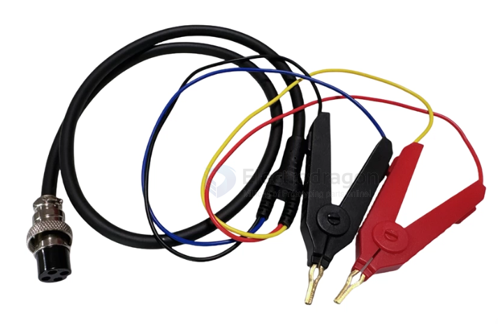
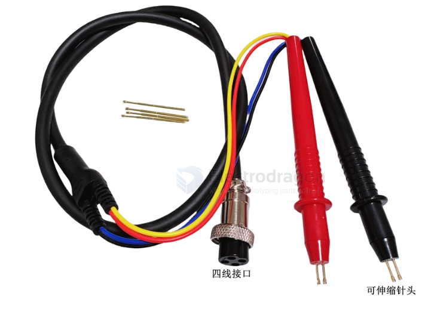
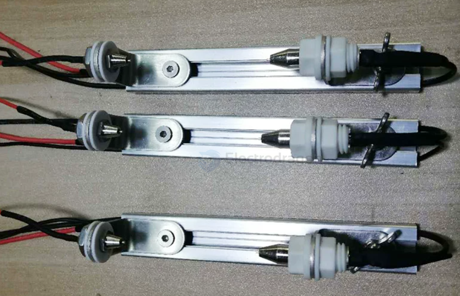
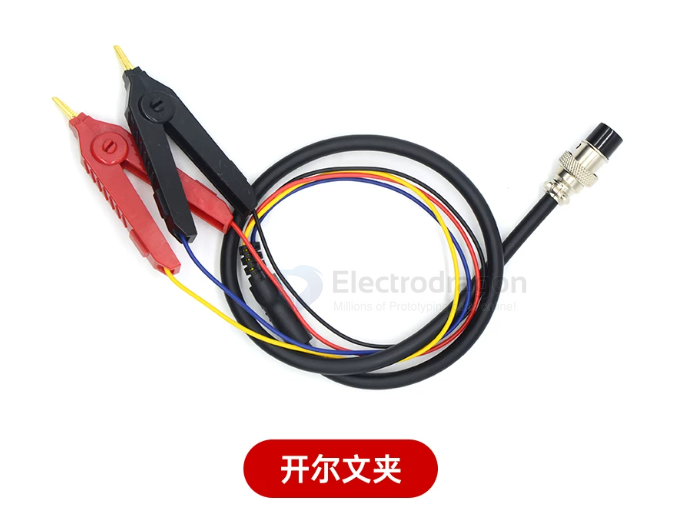
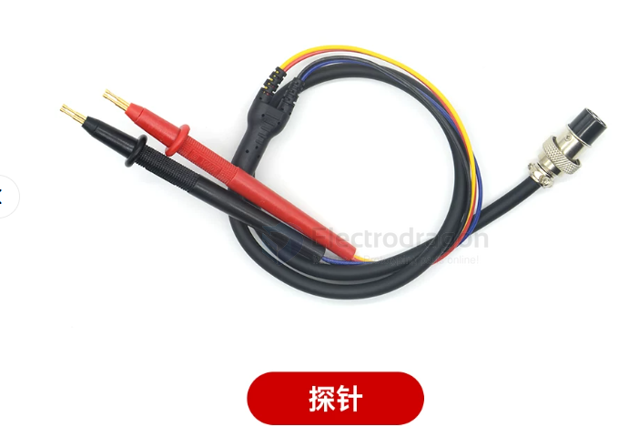

# Kelvin-Clamp-dat

- [[battery-dat]] - [[battery-tester-dat]] - [[battery-tools-dat]] - capacity - [[electronic-loader-dat]]

- [[kelvin-clamp-dat]]

- [[18650-dat]] - [[21700-dat]] - [[battery-li-size-dat]] - [[26650-dat]]

**Crucial!** Standard 2-wire holders introduce voltage drops due to lead and contact resistance, causing premature cut-off readings. 

A 4-wire fixture uses two wires for the heavy discharge current and two separate wires exclusively to measure voltage at the battery terminals accurately.

- 16MM - 4芯 - 插头 探针
- 16MM - 4芯 - 插头 开尔文夹
- 12MM - 4芯 - 插头 探针
- 12MM - 4芯 - 插头 开尔文夹

## ref 

