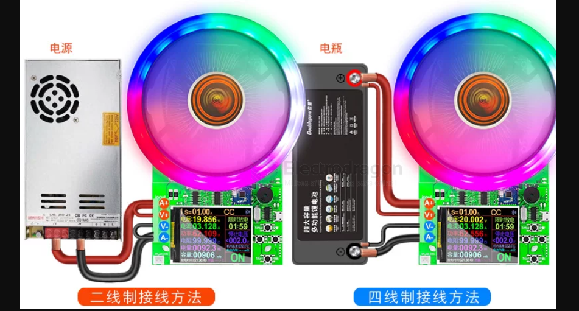

# battery-capacity-tester-dat

- [[battery-dat]] - [[battery-tester-dat]] - [[battery-tools-dat]] - capacity - [[electronic-loader-dat]]

- [[kelvin-clamp-dat]]

## test methods 

二 == 当你在测试或者老化DC电源类产品时，可以用如下图第一种的精简2线制接线方法 A+ V+ 短接，A- V- 短接。

四 == 当你需要精密测试电池容量时，可按下图第二种的4线制接线方法，这样电压测量不受电流导线压降的影响，使得电压测量更精准，并能准确判断电池电压准确停止放电而准确保护电池和容量的准确测试

## ref 

