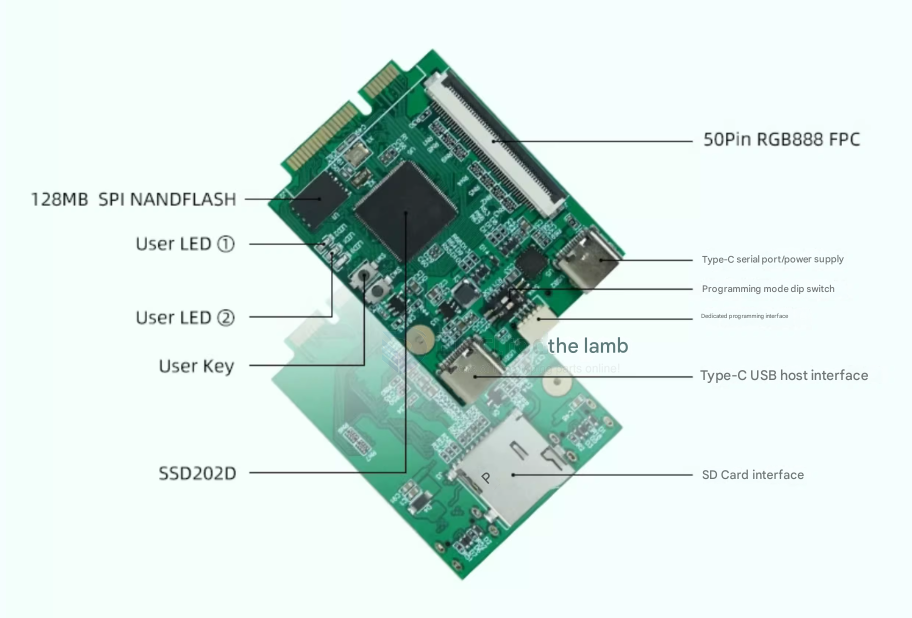

# dongshanpi-dat

## D1s == DongshanPI-D1s

- [[D1s-dat]]

## other 

- Allwinner H616 chip, 4*Cortex A53 == 柚木PI-变色龙

- D1 == 东山哪吒STU
https://linux-sunxi.org/DongshanPi_Nezha_STU

- 星辰科技 SSD202D 内置128MB DDR 支持H264/H265解码 支持MJPG编码。 == 东山Pi壹号
- SigMastar SSD210 == DongshanPI-PicoW

配套原理图： https://forums.100ask.net/uploads/short-url/jM5L1WocV3O5xZRiRpLYRlEBVNg.pdf
默认系统镜像： https://dongshanpi.cowtransfer.com/s/639100d687674c

- SOC主控: STM32MP157DAC （双核CorteX A7 800Mhz + 209Mhz M4 + 3D GPU ） == 东山Pi柒号

## dongshanpi-no.1 

## ref 

- [[dongshanpi]]