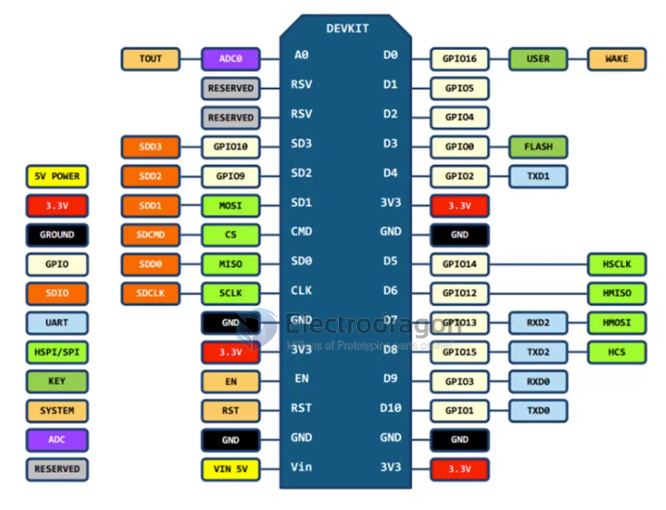
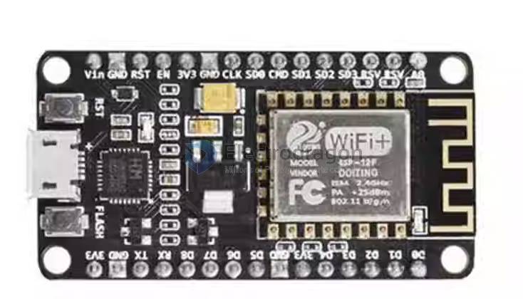

# nodemcu-dat

## Board map 

- [[AMS1117-dat]]

### pins 

| nodemcu | right | func1 | func2 |
| ------- | ----- | ----- | ----- |
| D0      | I016  | USER  | WAKE  |
| D1      | I05   |       |       |
| D2      | I04   |       |       |
| D3      | I00   | FLASH |       |
| D4      | I02   | TXD1  |       |
|         | 3.3V  |       |       |
|         | GND   |       |       |
| D5      | I014  |       | HSCLK |
| D6      | I012  |       | HMISO |
| D7      | I013  | RXD2  | HMOSI |
| D8      | I015  | TXD2  | HCS   |
| D9      | I03   | RXDe  |       |
| D10     | I01   | TXDE  |       |
|         | GND   |       |       |
|         | 3.3V  |       |       |

## Boards 

- [[NWI1044-dat]]

- [[NWI1074-dat]]