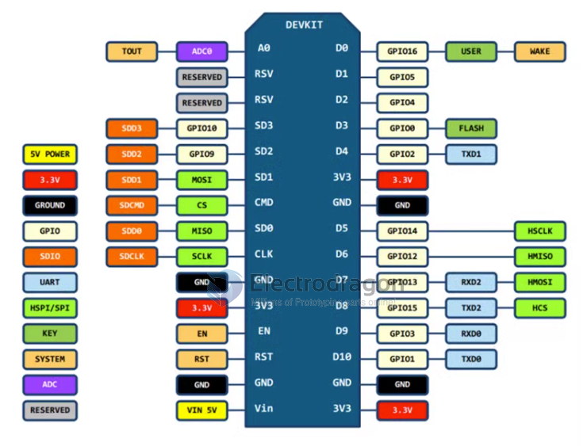
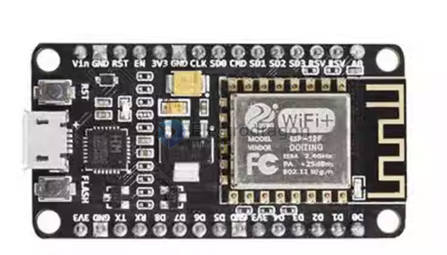
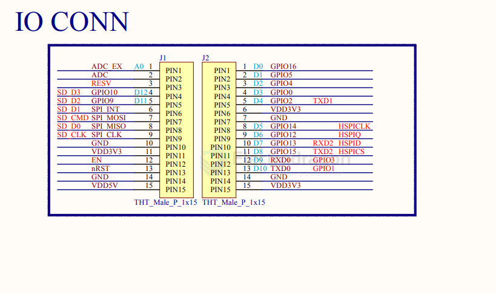
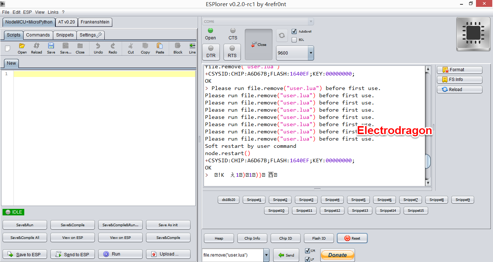

# nodemcu-dat

## Board map 

- [[AMS1117-dat]]

- [[CH9102-dat]] - [[nodemcu-dat]] - [[NWI1044-dat]]

## SCH 

https://github.com/nodemcu/nodemcu-devkit-v1.0/blob/master/NODEMCU_DEVKIT_V1.0.PDF

- [[ESP-12F-dat]] core 

- [[ESP8266-HDK-dat]] == auto serial 

- [[peripherals-dat]] - [[LDO-dat]] - [[power-dat]] - [[AMS1117-dat]]

### pins 

| custom | func  | left | right | func       | custom       |
| ------ | ----- | ---- | ----- | ---------- | ------------ |
|        |       | AO   | D0    | IO16       |              |
|        |       | RSV  | D1    | IO5        |              |
|        |       | RSV  | D2    | IO4        |              |
|        | xIO10 | SD3  | D3    | IO0        |              |
|        | xIO9  | SD2  | D4    | IO2        | on board LED |
|        |       | SD1  | 3V3   |            |              |
|        |       | CMD  | GND   |            |              |
|        |       | SDO  | D5    | IO14       |              |
|        |       | CLK  | D6    | IO12       |              |
|        |       | GND  | D7    | IO13       |              |
|        |       | 3V3  | D8    | IO15       |              |
|        |       | EN   | D9    | IO3 - RXD0 |              |
|        |       | RST  | D10   | IO1 - TXD0 |              |
|        |       | GND  | GND   |            |              |
|        |       | Vin  | 3V3   |            |              |

| pin | name      | sytem           | usage  | custom | custom2 |
| --- | --------- | --------------- | ------ | ------ | ------- |
| 1   | VDDA      | power.          |        |        |         |
| 2   | LNA       | [[Antenna-dat]] |        |        |         |
| 3   | VDD3P3    | power.          |        |        |         |
| 4   | VDD3P3    | power.          |        |        |         |
| 5   | VDD_RTC   | x               |        |        |         |
| 6   | TOUT      | [[ADC-dat]]     |        |        |         |
| 7   | CHIP_EN   |                 |        |        |         |
| 8   | XPD_DCDC  |                 | IO16   | D0     |         |
| 9   | MTMS      |                 | IO14   | D5     |         |
| 10  | MTDI      |                 | IO12   | D6     |         |
| 11  | VDDPST    | power.          |        |        |         |
| 12  | MTCK      |                 | IO13   | D7     |         |
| 13  | MTDO      | boot - L        | IO15   | D8     |         |
| 14  | GPIO2     | boot - H        | IO2    | D4     |         |
| 15  | GPIO0     | boot - H        | IO0    | D3     |         |
| 16  | GPIO4     |                 | IO4    | D2     |         |
| 17  | VDDPST    | power.          |        |        |         |
| 18  | SD_DATA_2 | flash           | x-IO9  |        |         |
| 19  | SD_DATA_3 | flash           | x-IO10 |        |         |
| 20  | SD_CMD    | flash           | x-IO11 |        |         |
| 21  | SD_CLK    | flash           | x-IO6  |        |         |
| 22  | SD_DATA_0 | flash           | x-IO7  |        |         |
| 23  | SD_DATA_1 | flash           | x-IO8  |        |         |
| 24  | GPIO5     |                 | IO5    | D1     |         |
| 25  | U0RXD     |                 | UART   |        |         |
| 26  | U0TXD     |                 | UART   |        |         |
| 27  | XTAL_OUT  | x               |        |        |         |
| 28  | XTAL_IN   | x               |        |        |         |
| 29  | VDDD      | power.          |        |        |         |
| 30  | VDDA      | power.          |        |        |         |
| 31  | RES12K    | x               |        |        |         |
| 32  | EXT_RSTB  | [[reset-dat]]   |        |        |         |
| pad | GND       | power.          |        |        |         |

| custom | nodemcu | right | func1 | func2 | custom |
| ------ | ------- | ----- | ----- | ----- | ------ |
|        | D0      | I016  | USER  | WAKE  |        |
|        | D1      | I05   |       |       |        |
|        | D2      | I04   |       |       |        |
|        | D3      | I00   | FLASH |       |        |
|        | D4      | I02   | TXD1  |       |        |
|        |         | 3.3V  |       |       |        |
|        |         | GND   |       |       |        |
|        | D5      | I014  |       | HSCLK |        |
|        | D6      | I012  |       | HMISO |        |
|        | D7      | I013  | RXD2  | HMOSI |        |
|        | D8      | I015  | TXD2  | HCS   |        |
|        | D9      | I03   | RXDe  |       |        |
|        | D10     | I01   | TXDE  |       |        |
|        |         | SD2   |       |       |        |
|        |         | SD3   |       |       |        |

- [[ESP8266-dat]]

## Boards 

- [[NWI1044-dat]]

- [[NWI1074-dat]]

## IDE 

ESPlorer 

## output 

    NodeMCU custom build by frightanic.com
        branch: master
        commit: c8037568571edb5c568c2f8231e4f8ce0683b883
        SSL: false
        modules: cjson,file,gpio,net,node,pwm,tmr,uart,wifi
    build 	built on: 2016-03-14 02:10
    powered by Lua 5.1.4 on SDK 1.4.0
    lua: cannot open init.lua

## ref 

