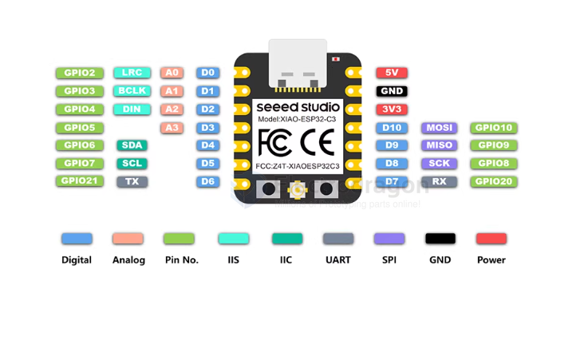

# xiao-esp32-c3-dat.md

- [[esp32-c3-dat]] - [[ESP32-C3-WROOM-02-dat]]

GPIO == 9 + TXD/RXD

- GPI02 LRC AO DO
- GPI03 BCLK A1 D1
- GPIO4 DIN A2 D2
- GPI05 A3 D3
- GPI06 SDA D4
- GPI07 SCL D5
- GPI021 TX D6

5V
GND
3V3

- D10 MOSI GPI010
- D9 MISO GPI09
- D8 SCK GPI08
- D7 RX GPI020