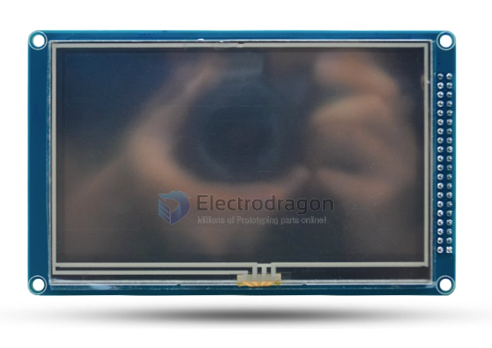
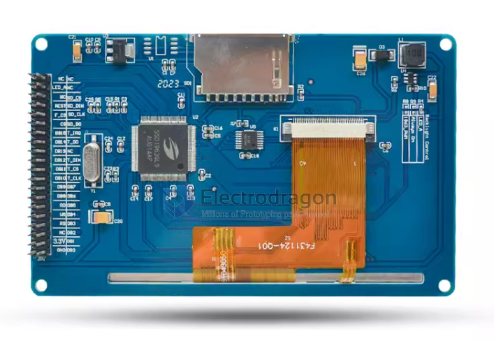
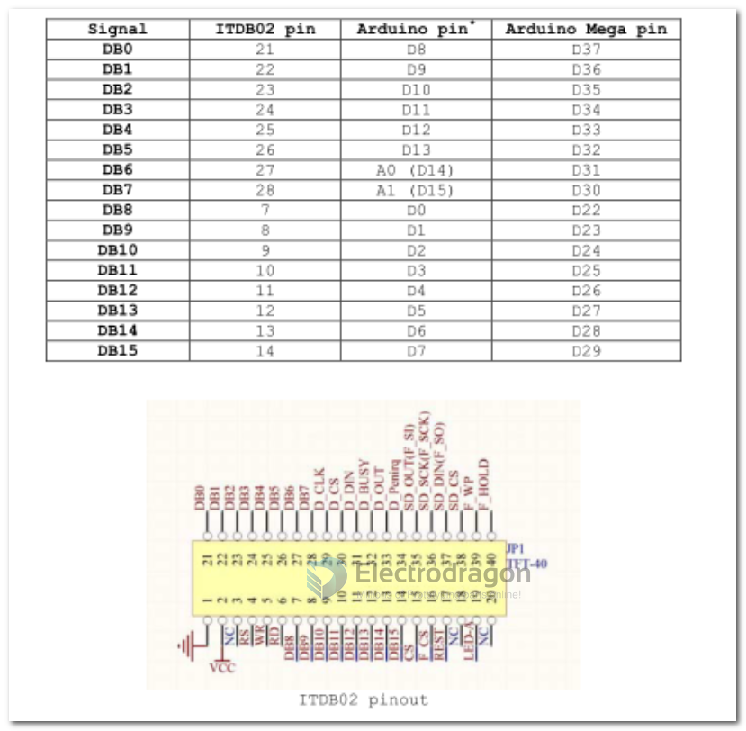
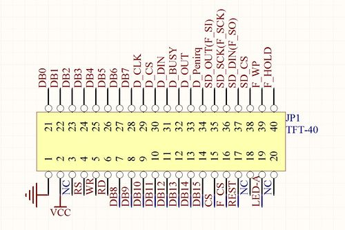
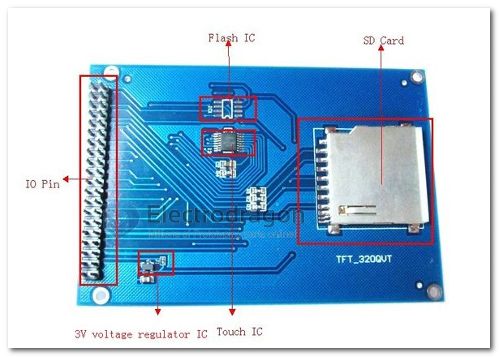

# EDL-dat

- legacy wiki page

  - https://w.electrodragon.com/w/EDL_LCD_HDK
  - https://w.electrodragon.com/w/Category:EDL_LCD

- arduino shields [[DAS1031-dat]] - [[DAS1030-dat]]

## Pin Mapping

## Size

This series include size:

| SKU             | size               | interface       | control | resolution | addons                |
| --------------- | ------------------ | --------------- | ------- | ---------- | --------------------- |
| [[ILC1027-dat]] | 2.4”               |                 | ILI9341 | 240\*320   | SD_card + touchscreen |
| [[ILC1028-dat]] | 3.2”               |                 | ILI9341 | 240\*320   | SD_card + touchscreen |
| x               | 3.2”W (Widescreen) |                 | ILI9341 |            | SD_card + touchscreen |
| [[ILC1030-dat]] | 4.3”               | parallel 16bits | SSD1963 | 480\*272   | SD_card + touchscreen |
| [[ILC1031-dat]] | 5.0”               |                 | SSD1963 | 800\*480   | SD_card + touchscreen |
| [[ILC1032-dat]] | 7.0”               |                 | SSD1963 | 800\*480   | SD_card + touchscreen |

## Code

- arduino library - UTFT

- in /08-LCD
- https://github.com/Edragon/Arduino-main/tree/master/Sketchbook/08-LCD
- https://github.com/Edragon/Arduino-main/tree/master/Sketchbook/Interactive

## demo

- touch screen - https://www.youtube.com/watch?v=iyxXIpoznUA
- https://www.youtube.com/watch?v=7wr8uLYX0T0

## ref

- [[SSD1963-dat]]

- [[XPT2046.pdf]]

- [[display-dat]]