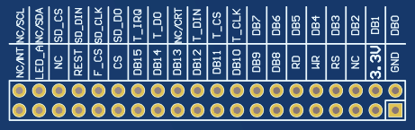

# EDL-LCD-dat

## board 

- [[arduino-dat]] - [[arduino-mega-dat]]

- [[LCD-dat]]

## HDK 

- [[XPT2046-dat]]

## Product Overview

- 5.0-inch high-definition color display, supports 16-bit RGB with 65K colors for rich visuals
- Supports 800x480 resolution for sharp and clear images
- Fast data transfer with 16-bit parallel bus switching
- Compatible with both capacitive and resistive touchscreens
- Supports SPI FLASH
- Built-in SD card slot for SD card expansion
- Three backlight control modes: always-on, GPIO control, and PWM control
- Example programs provided for STM32 and C51 platforms
- Military-grade manufacturing standards for long-term stable operation
- Technical support for low-level drivers

## Specifications

| Name                      | Value                                      |
|---------------------------|--------------------------------------------|
| Display Color             | RGB565, 65K colors                         |
| SKU                       | MRB5963                                    |
| Size                      | 5.0 inch                                   |
| Type                      | TFT                                        |
| Driver IC                 | SSD1963                                    |
| Resolution                | 800x480 pixels                             |
| Module Interface          | 16-bit parallel                            |
| Touchscreen Type          | Capacitive or resistive touchscreen        |
| Touchscreen IC            | GT911 (capacitive), XPT2046 (resistive)    |
| Active Display Area (AA)  | 108.00 x 64.80 mm                          |
| Module PCB Size           | 133.50 x 84.00 mm                          |
| Operating Temperature     | -10℃ to 60℃                                |
| Storage Temperature       | -20℃ to 70℃                                |
| Input Voltage             | 3.3V                                       |
| IO Voltage                | 3.3V                                       |
| Power Consumption         | TBD                                        |
| Weight (Net)              | TBD                                        |

## Product Images

- legacy wiki page

  - https://w.electrodragon.com/w/EDL_LCD_HDK
  - https://w.electrodragon.com/w/Category:EDL_LCD

- arduino shields [[DAS1031-dat]] - [[DAS1030-dat]]

## Pin Mapping

## Notes

- Pins starting with **T** are related to the resistive touchscreen.
- Pins starting with **SD** are related to the SD card.
- Pins starting with **F** are related to SPI FLASH.
- Pins starting with **NC/** are related to the capacitive touchscreen.
- All other pins are related to the LCD.
- SPI FLASH is not soldered by default. If you need to use it, please solder it yourself.

## Pin List

| No. | Pin Name   | Description                                                                                  |
|-----|-----------|----------------------------------------------------------------------------------------------|
| 1   | GND       | Power ground                                                                                 |
| 2   | 3.3V      | Power input pin (connect to 3.3V)                                                            |
| 3   | NC        | No definition, reserved                                                                      |
| 4   | RS        | LCD register/data select control (Low: register, High: data)                                 |
| 5   | WR        | LCD write control                                                                            |
| 6   | RD        | LCD read control                                                                             |
| 7~14| DB8~DB15  | LCD high 8-bit data bus                                                                      |
| 15  | CS        | LCD chip select control (Low: enabled)                                                       |
| 16  | F_CS      | SPI FLASH chip select control (Low: enabled)                                                 |
| 17  | REST      | LCD reset control (Low: reset)                                                               |
| 18  | NC/CRT    | No definition when using resistive touchscreen; acts as reset (Low: reset) for capacitive    |
| 19  | LED_A     | LCD backlight control (use as needed)                                                        |
| 20  | NC/INT    | No definition when using resistive touchscreen; acts as interrupt for capacitive             |
| 21~28| DB0~DB7  | LCD low 8-bit data bus                                                                       |
| 29  | T_CLK     | Resistive touchscreen SPI clock                                                              |
| 30  | T_CS      | Resistive touchscreen chip select (Low: enabled)                                             |
| 31  | T_DIN     | Resistive touchscreen SPI write data                                                         |
| 32  | NC/CRT    | No definition when using resistive touchscreen; acts as reset (Low: reset) for capacitive    |
| 33  | T_DO      | Resistive touchscreen SPI read data                                                          |
| 34  | T_IRQ     | Resistive touchscreen interrupt detection (Low: active)                                      |
| 35  | SD_DO     | SD card SDIO read data                                                                       |
| 36  | SD_CLK    | SD card SDIO clock                                                                           |
| 37  | SD_DIN    | SD card SDIO write data                                                                      |
| 38  | SD_CS     | SD card chip select (Low: enabled)                                                           |
| 39  | NC/SDA    | No definition when using resistive touchscreen; acts as I2C data for capacitive              |
| 40  | NC/SCL    | No definition when using resistive touchscreen; acts as I2C clock for capacitive             |

## Pin Usage Reference

## Board Size

This series include size:

| SKU             | size               | interface       | control | resolution | addons                |
| --------------- | ------------------ | --------------- | ------- | ---------- | --------------------- |
| [[ILC1027-dat]] | 2.4”               |                 | ILI9341 | 240\*320   | SD_card + touchscreen |
| [[ILC1028-dat]] | 3.2”               |                 | ILI9341 | 240\*320   | SD_card + touchscreen |
| x               | 3.2”W (Widescreen) |                 | ILI9341 |            | SD_card + touchscreen |
| [[ILC1030-dat]] | 4.3”               | parallel 16bits | SSD1963 | 480\*272   | SD_card + touchscreen |
| [[ILC1031-dat]] | 5.0”               |                 | SSD1963 | 800\*480   | SD_card + touchscreen |
| [[ILC1032-dat]] | 7.0”               |                 | SSD1963 | 800\*480   | SD_card + touchscreen |

## Code

- [[code-LCD-dat]]

## demo

- touch screen - https://www.youtube.com/watch?v=iyxXIpoznUA
- https://www.youtube.com/watch?v=7wr8uLYX0T0

## repo 

##[[XPT2046.pdf]]

- [[SSD1963-dat]]

- [[XPT2046.pdf]]

- [[display-dat]]