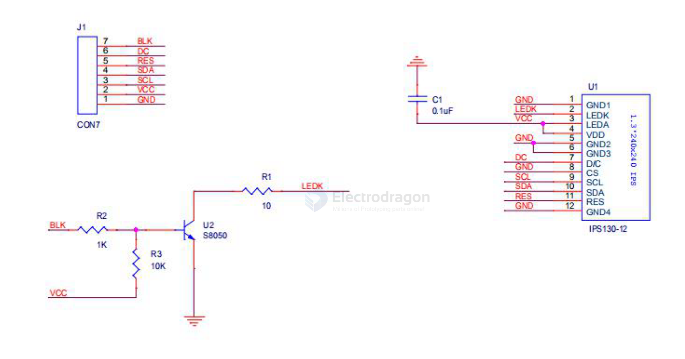
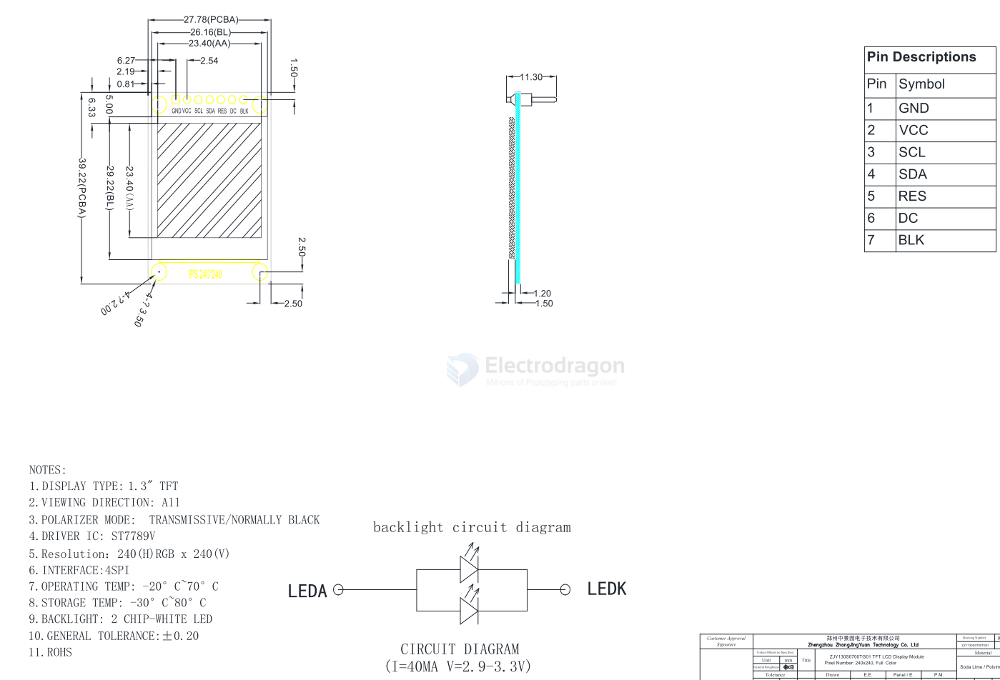

# EDS-1.3-dat

- [[ST7789-dat]]

## pin 

| Pin | Name | Function                              | Description                                                                                                                                                                                               |
| --- | ---- | ------------------------------------- | --------------------------------------------------------------------------------------------------------------------------------------------------------------------------------------------------------- |
| 1   | GND  | Ground of Logic Circuit               | This is a ground pin. It acts as a reference for the logic pins. It must be connected to external ground                                                                                                  |
| 2   | VCC  | Power Supply for Logic                | This is a voltage supply pin. It must be connected to external source                                                                                                                                     |
| 3   | SCL  | Serial Clock Input                    | SPI CLK The serial clock input                                                                                                                                                                                    |
| 4   | SDA  | Serial Data Input                     | SPI DAT The serial data input                                                                                                                                                                                     |
| 5   | RES  | Power Reset for Controller and Driver | This pin is reset signal input. When the pin is low, initialization of the chip is executed. Keep this pin pull high during normal operation                                                              |
| 6   | DC   | Data/Command Control                  | This pin is Data/Command control pin. When the pin is pulled high, the input at SDA is treated as display data. When the pin is pulled low, the input at SDA will be transferred to the command register. |
| 7   | BLK  | Backlight Control Pin                 | When the pin is pulled high turn on backlight, When the pin is pulled low turn off backlight                                                                                                              |

## esp8266 

    // pin definition for the Uno
    #define sd_cs  4
    #define lcd_cs 10
    #define dc     12
    #define rst    16

    #define dc     12
    #define rst    16

by TFT_eSPI

//#include <User_Setups/Setup24_ST7789.h>            // Setup file for DSTIKE/ESP32/ESP8266 configured for ST7789 240 x 240

    #define TFT_CS   -1      // Define as not used
    #define TFT_DC   PIN_D1  // Data Command control pin
    #define TFT_RST  PIN_D4  // TFT reset pin (could connect to NodeMCU RST, see next line)

- [[nodemcu-dat]]

## ref 

- [[ESP8266-SDK-dat]]

- [[EDS-LCD-dat]]