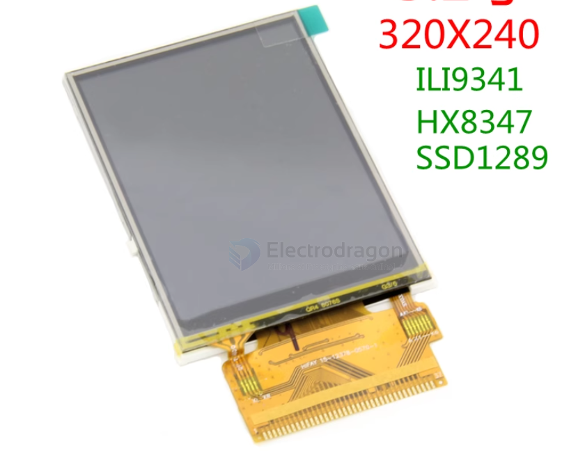
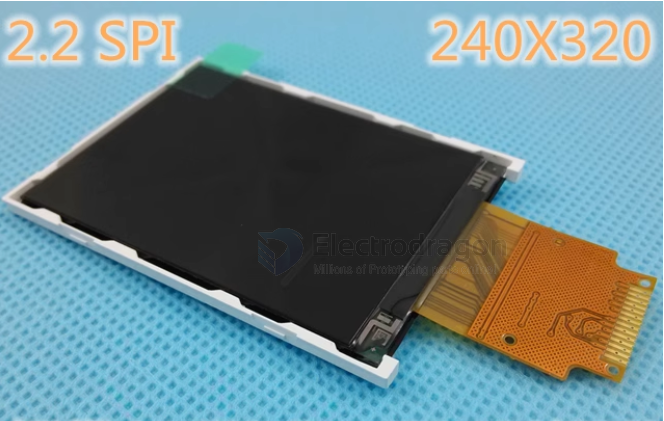
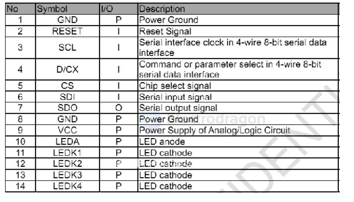
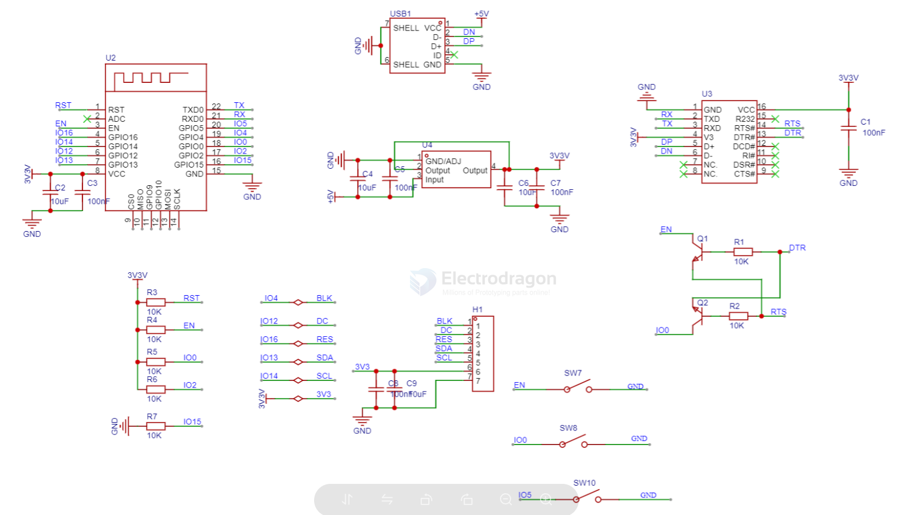
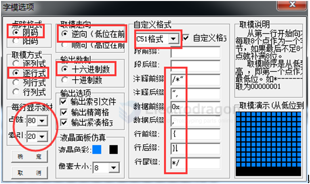
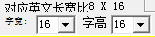
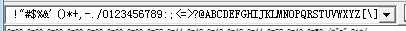
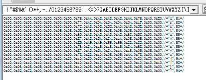
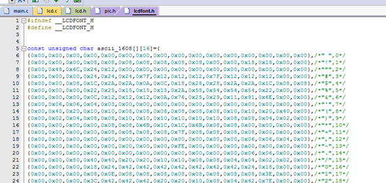

# EDS-LCD-dat

legacy wiki page 
- https://w.electrodragon.com/w/Category:TFT_LCDs

- [[display-dat]]

## Versions 

- 1.8” SPI LCD, ST7735, 128*160, with SD card slot
- 2.2” SPI LCD, ILI9341 240*320, with SD card slot
- 2.4” SPI LCD, ILI9341 240*320,  with SD card slot, with touch panel
- 2.8” SPI LCD, ILI9341 240*320, with SD card slot, with touch panel
- 3.2” SPI LCD, ILI93141 240*320, with SD card slot, with touch panel
- 4.0” SPI LCD, ST7796S 480*320, with SD card slot, with touch panel

## Pin Definitions 

| Pins | Pins Funcs | Note                                                                                            |     |
| ---- | ---------- | ----------------------------------------------------------------------------------------------- | --- |
| 1    | VCC        | 5V/3.3V power input                                                                             |
| 2    | GND        | ground                                                                                          |
| 3    | CS         | LCD chip select signal, low level enable                                                        |
| 4    | RESET      | LCD screen reset signal, low level reset                                                        |
| 5    | DC/RS      | LCD screen register/data selection signal, 0: register, 1. data                                 |
| 6    | SDI(MOSI)  | SPI bus write data signal                                                                       |
| 7    | SCK        | SPI bus clock signal                                                                            |
| 8    | LED        | Backlight control, high level lights up, if no control is needed, connect to 3.3V to keep it on |
| 9    | SDO(MISO)  | SPI Bus read data signal, if no reading function is needed, it does not need to be connected    |
| 10   | T_CLK      | Touch SPI bus clock signal                                                                      |
| 11   | T_CS       | Touch screen chip select signal, low level enable                                               |
| 12   | T_DIN      | Touch SPI bus input                                                                             |
| 13   | T_DO       | Touch SPI bus output                                                                            |
| 14   | T_IRQ      | Touch screen interrupt signal, low level when touch is detected                                 |

Note: The 2.2-inch SPI module has no touch pins and has 9 PINs. The 2.4/2.8/3.2/3.5/4.0 modules with touch have 14 PIN standard pins.

## LCD Raw 

### 3.2" ILI9341 // 37 pin or 18 pin 

### 2.2" ILI9341 14 pin 

尺寸：2.2 inch
分辨率：240(RGB) x 320 
接口： 4-Wire SPI （支持硬件SPI）
Color Depth： 262K/65K
CM (W x H x D) (mm) ：40.10x55.20x2.35
Active Area(mm) ：33.84x45.12
LED Numbers ： 4 LEDs 
Driver IC ：ILI9341V

## SCH drive by ESP8266

- [[ESP8266-HDK-dat]]

## repo 

- https://github.com/Edragon/Display-LCD-SPI

- https://github.com/Edragon/LCDWIKI_gui

Basic functionally of this library was origianlly based on the demo-code of Adafruit GFX lib and Adafruit TFTLCD lib.  

Adafruit GFX lib: https://github.com/adafruit/Adafruit-GFX-Library

Adafruit TFTLCD lib: https://github.com/adafruit/TFTLCD-Library

    // LCD controller chip identifiers
    #define ID_932X 0
    #define ID_7575 1
    #define ID_9341 2
    #define ID_HX8357D 3
    #define ID_UNKNOWN 0xFF

## PCtoLCD2002 

- [[ascii-dat]]

### How to Generate 8x16 ASCII Font Bitmaps with PCtoLCD2002

**Step 1: Set the Dot Matrix Size**

When choosing the dot matrix size, make sure the value is greater than the number of bytes each character uses. For example, an 8x16 character uses 8x16/8 = 16 bytes, so select a dot matrix size greater than 16.

**Step 2: Configure Character Width and Height**

For 8x16 ASCII, set both the character width and height to 16.

This means each ASCII character will be 8x16 pixels, and the width will be half the value you set (since each byte represents 8 pixels horizontally).

**Step 3: Input the ASCII Table**

Paste the ASCII character table into the input field.

**Step 4: Generate the Font Bitmap**

Click the button to generate the font bitmap. The result will look like this:

**Step 5: Use the Generated Font in Code**

The 8x16 font bitmap is already provided in the sample file `lcdfont.h`, as shown below:

## tools 

- [[image2Lcd-2.9.zip]] - [[PCtoLCD2002.zip]]

## ref

- [[ILC0011-dat]]

- [[display-dat]]

- [[EDS-LCD]] - [[display]]

