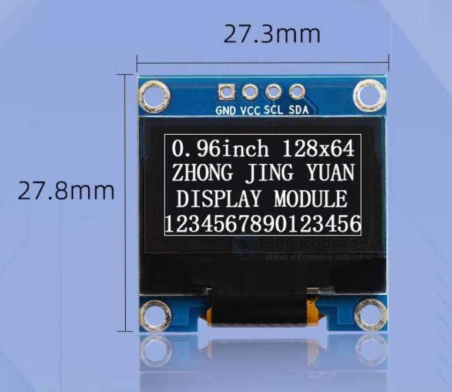
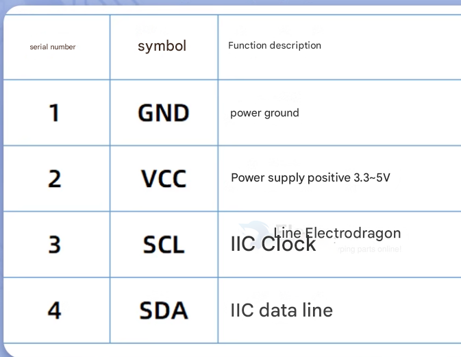
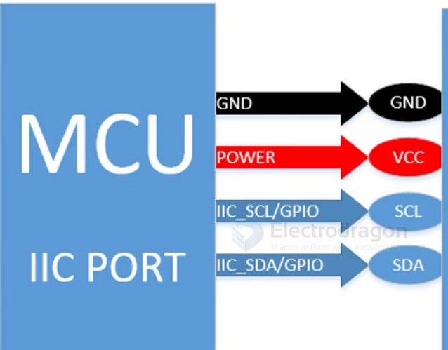
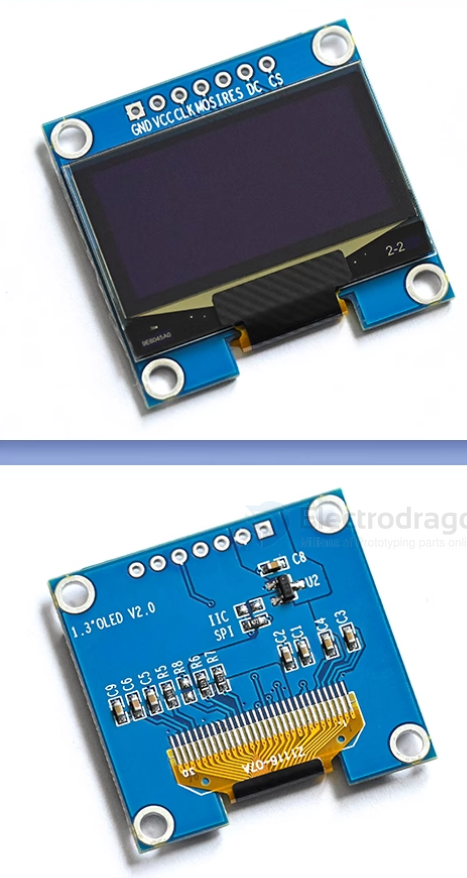

# OLED-dat

- [[IOD1003-dat]] - [[IOD1001-dat]] - [[IOD1004-dat]] - [[IOD1005-dat]]

[legacy wiki page](https://www.electrodragon.com/w/0.96%27%27_128*64_OLED_Display)

## PCB OLED 

### 0.96"

- [[IOD1003-dat]] - [[IOD1001-dat]]

https://www.electrodragon.com/product/0-96-12864-oled-display-iicspi/

#### specs 

#### Pin definitions and Wiring  

#### Dimension 

### 1.3"

- [[IOD1004-dat]] - [[IOD1005-dat]]

https://www.electrodragon.com/product/1-3-12864-blue-oled-display-iicspi/

#### specs 

#### Pin definitions and Wiring

#### Dimension 

### demo video 

- https://www.youtube.com/watch?v=-S0XRB664-M&feature=youtu.be

## RAW OLED 

### 0.96"

#### Specs

#### Pin Definitions, dimensions 

### 1.3"

#### Specs 

#### Pin Definitions, dimensions

## OLED Driver 

- [[SH1106-dat]] - [[SSD1306-dat]] - [[oled-driver-dat]] - [[SSD1315-dat]]

## ref 

- [[OLED]]