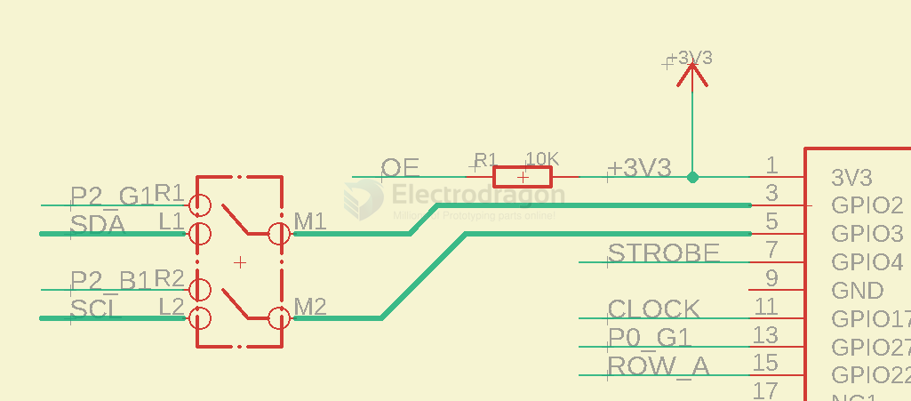

# RGB Matrix Panel Driver Board

- with raspberry pi - [[MPC1073-dat]] - [[MPC1119-dat]]
- with ESP32 - [[IDD1013-dat]] - [[IDD1016-dat]]
- with esp8266 - [[IDD1007-dat]]
- with arduino - [[DAS1087-dat]]
- Mono Color Drive with ESP32 - [[IDD1023-dat]]

- with Orange Pi - [[MPC1123-dat]]

## matrix panel

- [[led-rgb-panel-dat]] - [[RPI-pin-dat]] - [[rpi-dat]]

## knowledge 

- [[HUB75-dat]]

## Typical wiring with RPI - for MPC1073 

| Connection | Pin | Pin | Connection                      |
| ---------: | :-: | :-: | :------------------------------ |
|          - |  1  |  2  | -                               |
| **[3] G1** |  3  |  4  | -                               |
| **[3] B1** |  5  |  6  | **GND**                         |
| **strobe** |  7  |  8  | **[3] R1**                      |
|          - |  9  | 10  | **E** (for 64 row matrix, 1:32) |
|  **clock** | 11  | 12  | **OE-**                         |
| **[1] G1** | 13  | 14  | -                               |
|      **A** | 15  | 16  | **B**                           |
|          - | 17  | 18  | **C**                           |
| **[1] B2** | 19  | 20  | -                               |
| **[1] G2** | 21  | 22  | **D** (for 32 row matrix, 1:16) |
| **[1] R1** | 23  | 24  | **[1] R2**                      |
|          - | 25  | 26  | **[1] B1**                      |
|          - | 27  | 28  | -                               |
| **[2] G1** | 29  | 30  | -                               |
| **[2] B1** | 31  | 32  | **[2] R1**                      |
| **[2] G2** | 33  | 34  | -                               |
| **[2] R2** | 35  | 36  | **[3] G2**                      |
| **[3] R2** | 37  | 38  | **[2] B2**                      |
|          - | 39  | 40  | **[3] B2**                      |

corresponding pin number: 

* ROW_A = 22
* ROW_B = 23
* ROW_C = 24 
* ROW_D = 25
* ROW_E = GPIO 15
* OE = GPIO 18
* CLK = GPIO 17
* LAT (STROKE) = GPIO 4
* P0 R1/G1/B1 = 11 / 27 / 26 
* P0 R2/G2/B2 = 8 / 9 / 10

* P1 R1/G1/B1 = 12 / 5 / 6 
* P1 R2/G2/B2 = 19 / 13 / 20

* P2 R1/G1/B1 = 8 / 2 / 3 
* P2 R2/G2/B2 = 26 / 16 / 21

ref 
- reference link - https://github.com/hzeller/rpi-rgb-led-matrix/blob/a3eea997a9254b83ab2de97ae80d83588f696387/wiring.md

### Extra GPIOs for [[MPC1073-dat]]

- Toggle Switch to left side to discard using P2 chain, and use free pin GPIO2 and GPIO3 

## ref github 

[[ESP32-dat]] based 
- https://github.com/mrcodetastic/ESP32-HUB75-MatrixPanel-DMA
- [Brian Lough](https://www.tindie.com/stores/brianlough/) (youtube link) for providing code contributions, hardware and suggestions

## ref

- [[RPI-dat]] - [[RMP-driver]]

- main code repository - https://github.com/hzeller/rpi-rgb-led-matrix
- wiring - https://github.com/hzeller/rpi-rgb-led-matrix/blob/a3eea997a9254b83ab2de97ae80d83588f696387/wiring.md?plain=1#L144

- Teensy 3.1/3.2/3.5/3.6 or ESP32 chips (not supported by RGB-matrix-Panel), please look at https://github.com/marcmerlin/SmartMatrix_GFX which offers a GFX compatibility layer on top of https://github.com/pixelmatix/SmartMatrix

- [[IDD1013-dat]] - https://github.com/mrfaptastic/ESP32-HUB75-MatrixPanel-I2S-DMA
- [[IDD1007-dat]] - https://github.com/2dom/PxMatrix
- [[IDD1016-dat]] - https://github.com/2dom/PxMatrix

forum - https://rpi-rgb-led-matrix.discourse.group/t/looking-for-a-small-form-factor-3-channel-solution-smaller-than-electrodragon-active-3-board/905

- development for [[RMP-RPI-CM4-dat]] will not work

