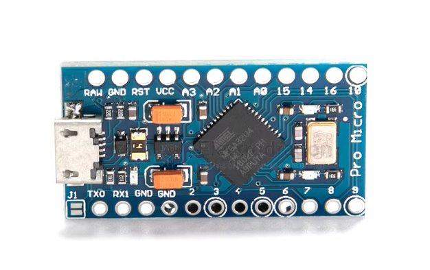

# arduino-pro-micro-dat

ATMEGA32U4-MU是8位AVR微控制器，具备内置USB控制器的特点，广泛用于嵌入式系统。基于此芯片的Pro Micro 开发板是一款小型开发板，专为嵌入式开发、DIY项目和快速原型设计而设计。

ATMEGA32U4-MU芯片简介：

- 主频：16 MHz（默认），可超频至 20 MHzFlash:32 KB (支持自编程)
- SRAM: 2.5 KB
- EEPROM: 1KB
- USB接口: USB 2.0 Full-Speed (12 Mbps） ， 内置 PHYGPIO：26个可编程I/O（支持PWM、ADC、UART、SPI、I?C等)ADC：10位精度，8通道
- 工作电压：2.7V-5.5V(适合3.3V/5V系统)
- 产品尺寸：18.5*34.5mm

特点：
ATMEGA32U4在5V/16MHz运行支持下的 IDE V1.0.1
董事会上的微型USB接口编程4个10位ADC引脚
12个数字I /O (5PWM能力)Rx和Tx硬件串行连接

说明：

这个小小的板做所有的整齐邻的技巧：4通道10位ADC，5个PWM引I脚，12的DIO以及硬件串行连接Rx和Tx你熟悉。运行在16MHz和5V，这个委员会将提醒你很多其它您喜欢的兼容的电路板，但这个小家伙可以去任何地方。在船上有一个电压调节器，所以它可以接受电压高达12VDC。如果你是供应不稳定的电源板，一定要连接到的“RAW”不VCC引I脚。这个最新版本修正丝绸错误，使弓I脚14是正确的标记。我们还增加了一个的PTC保险丝和二极管保护电源电路和纠正RX和TXLED电路

## ref 

- [[arduino-boards-dat]]