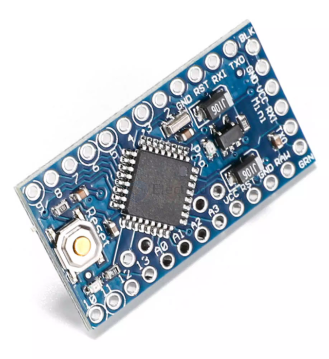

# arduino-pro-mini-dat

## pin definitions 

技术参数：
- 1. 14个数字输入/输出端口RX，TX，D2~D13,
- 2. 8个模拟输入端口A0~A7
- 3. 1对TTL电平串口收发端口RX/TX
- 4. 6个PWM端口,D3, D5, D6, D9, D10, D115．采用Atmel Atmega328P-AU单片机
- 6. 支持串口下载
- 7. 支持外接3.3V~12V直流电源供电8．支持9V电池供电
- 9. 时钟频率16MHz
- 10. 尺寸:33.3*18.0 (mm)

## boards 

- [[DAR1007-dat]] - [[DAR1010-dat]]

## ref 

- [[arduino-dat]] - [[atmega328-dat]]