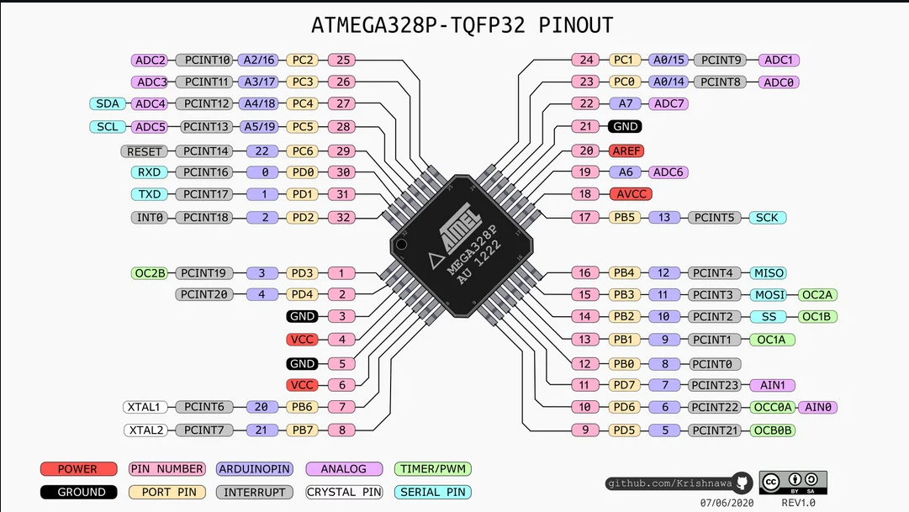

# arduino-dat 

- legacy wiki page - https://w.electrodragon.com/w/Category:Arduino

- [[arduino-uno-dat]] - [[edarduino-dat]]

- [[arduino-ide-dat]] - [[arduinoISP-dat]]

- [[arduino-esp32-dat]] - [[arduino-esp8266-dat]]

- [[arduino-code-v1-dat]]

- [[usbasp-dat]] - [[avr-dat]]

## Boards 

- [[DAR1053-dat]]

## Programmer 

- [[DPR1009-dat]] - [[DPR1088-dat]]

## Chip Map 

| arduino | pin | Funcs | Funcs2     | customize |
| ------- | --- | ----- | ---------- | --------- |
| 13      | 17  | PB5   | SCK/PCINT5 |           |
| 12      | 16  | PB4   | MISO       |           |
| 11      | 15  | PB3   | MOSI/PWM   |           |
| 10      | 14  | PB2   |            |           |
| 9       | 13  | PB1   | PWM        |           |
| 8       | 12  | PB0   |            |           |
| 7       | 11  | PD7   |            |           |
| 6       | 10  | PD6   | PWM        |           |
| 5       | 9   | PD5   | PWM        |           |
| 4       | 2   | PD4   |            |           |
| 3       | 1   | PD3   | PWM        |           |
| 2       | 32  | PD2   |            |           |
| 1       | 31  | PD1   | TX         |           |
| 0       | 30  | PD0   | RX         |           |

## Simplified = arduino pin template 

| arduino | Note | customize |
| ------- | ---- | --------- |
| 13      |      |           |
| 12      |      |           |
| 11      |      |           |
| 10      |      |           |
| 9       |      |           |
| 8       |      |           |
| 7       |      |           |
| 6       |      |           |
| 5       |      |           |
| 4       |      |           |
| 3       |      |           |
| 2       | INT0 |           |
| 1       | TXD  |           |
| 0       | RXD  |           |