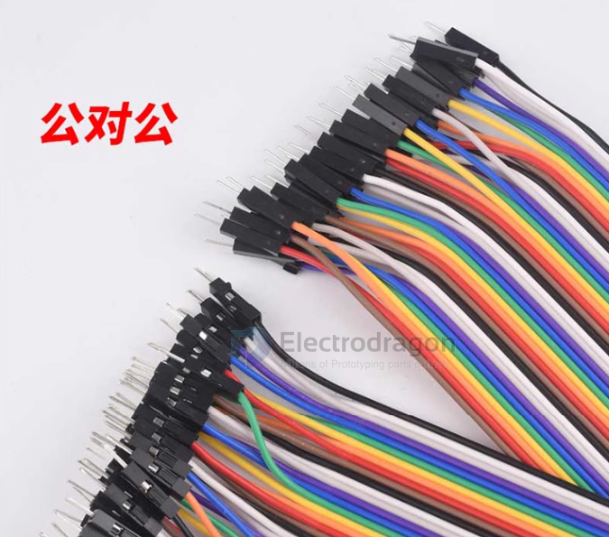
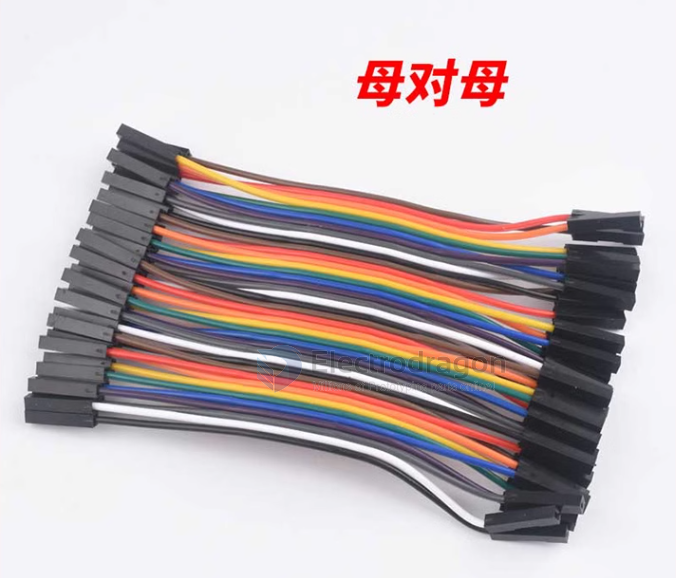
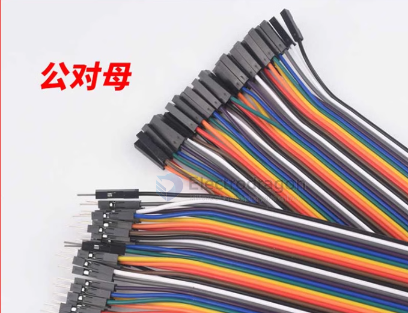

# dupont-cables-dat

- [[PCA1052-dat]] - [[PCA1056-dat]]

## M to M 

- [[PCA1052-dat]]
- https://www.electrodragon.com/product/mm-40p-dupont-prototype-cables-male-male-end/

## F to F

- [[PCA1054-dat]]
- https://www.electrodragon.com/product/ff-40p-dupont-prototype-cables-female-female-end/

## F to M 

- https://www.electrodragon.com/product/prototype-cable-female-and-male-end-40p/
- [[PCA1056-dat]]