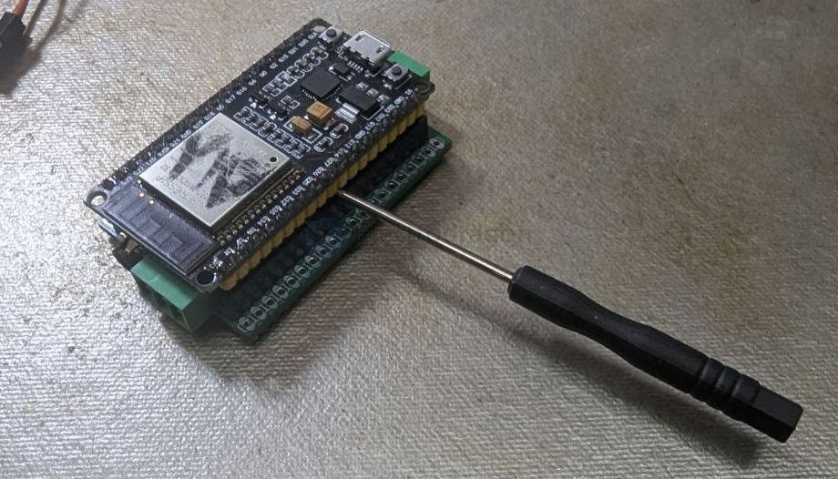

# esp32-shields-dat

## check functionalities 

- [[memory-dat]] - [[conn-cable-terminal-dat]]

## shields board 

- [[NWI1245-dat]] - [[ESP1008-dat]]

## control boards 

- [[NWI1100-dat]] - [[NWI1206-dat]]

## use guide 

use a tool to level the stack out 

## ref 

