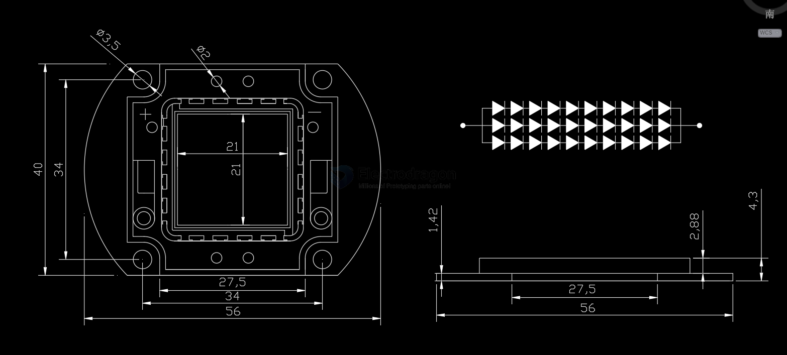
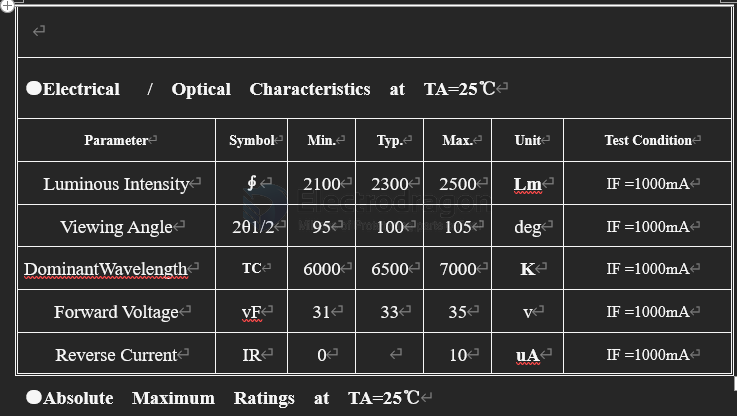

# high-power-led-dat

## Dimension 

## Electrical   /  Optical  Characteristics  at  TA=25℃

### for 30W LED 

| Parameter          | Symbol | Min. | Typ. | Max. | Unit | Test Condition |
| ------------------ | ------ | ---- | ---- | ---- | ---- | -------------- |
| Luminous Intensity | ∮      | 2100 | 2300 | 2500 | Lm   | IF =1000mA     |
| Viewing Angle      | 2θ1/2  | 95   | 100  | 105  | deg  | IF =1000mA     |
| DominantWavelength | TC     | 6000 | 6500 | 7000 | K    | IF =1000mA     |
| Forward Voltage    | vF     | 31   | 33   | 35   | v    | IF =1000mA     |
| Reverse Current    | IR     | 0    |      | 10   | uA   | IF =1000mA     |

### Absolute  Maximum  Ratings  at  TA=25℃

### for 50W led

### for 100W led 

## Boards 

- [[ILE1041-dat]] - [[ILE1042-dat]] - [[ILE1041-dat]]