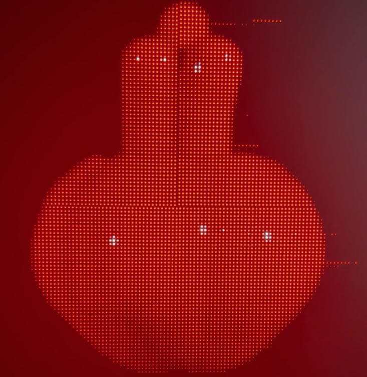

# led-rgb-panel-chip-dat

## DP5125D

In the second order #65705, the panels came with the DP5125D driver chip. These panels work fine and do not have this issue in the exact same hardware/software environment. 

## FM6124DJ driver chip

In the first order #65388, the panels had the FM6124DJ driver chip. These panels have issues with the drive board: They display glitches/artefacts around the borders of objects like the red horizontal lines next to the object on the attached photo.

### chip check

- probably NOT supported Panels: ICN2153 ICN2053 chips

- Check the chip type (FM6126A)
