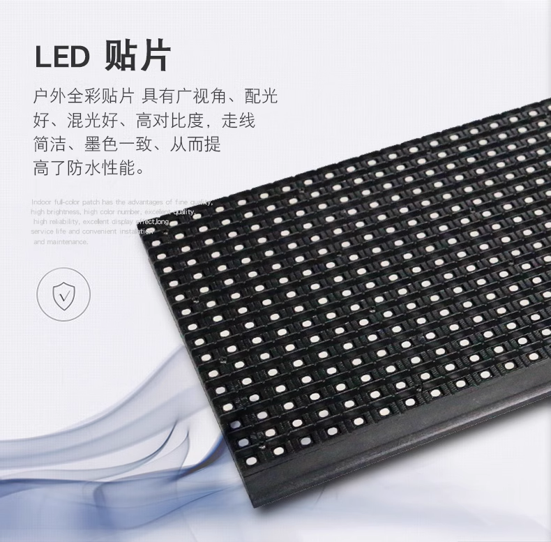

# RGB matrix panel dat

We sell the highly reliable, high quality panels. Probably the top quality from local top factory.

https://www.electrodragon.com/product/rgb-full-color-led-matrix-panel/

## Panel Specifications

| type | dots  | size CM   |
| ---- | ----- | --------- |
| P3   | 64x64 | 19x19     |
| P6   | 32x32 | 19x19     |
| P8   | 32x16 | 25.6x12.8 |

| Type | LED SPECs | XY LEDs | subtotal | Dimension      | spec         | Usage              | Scan | Power | Status  | SKU             |
| ---- | --------- | ------- | -------- | -------------- | ------------ | ------------------ | ---- | ----- | ------- | --------------- |
| P3   | 3mm       | 64 x 64 | 4096     | 19 x 19 CM     | 1919_6464_3  | Indoor Display     | 1/32 | ~20W  | selling | [[ILE1060-dat]] |
| P4   | 4mm       | 64 x 32 | 2048     | 25.6 x 12.8 CM | 2613_6432_4  | Indoor Display     |      |       | N/A     |
| P6   | 6mm 3535  | 32 x 32 | 1024     | 19 x 19 CM     | 1919_3232_6  | Outdoor, wateproof | 1/8  | ~30W  | selling | [[ILE1059-dat]] |
| P8   | 8mm 3535  | 32 x 16 | 512      | 25.6 x 12.8 CM | 2613_3216_8  | Outdoor, wateproof | 1/4  | ~30W  | selling | [[ILE1058-dat]] |
| P10  | 10mm 3535 | 32 x 16 | 512      | 32 x 16 CM     | 3216_3216_10 |                    |      |       |         |                 |

- type = LED pitch

* Life time 1000,000,000 hours.
* Drive constant current, dynamic
* Flash rate 2000Hz

## Code Documentation

- Demo code supported for Raspberry Pi, code revised from here https://github.com/hzeller/rpi-rgb-led-matrix, compatible and mostly same except transfomer part, original code can not well support our this type.
- https://www.electrodragon.com/w/RPI_Matrix
- Demo video available here. - https://www.youtube.com/watch?v=wN-cqQ_2kNs
- Raspberry Pi adapter board is available here. https://www.electrodragon.com/product/rgb-matrix-panel-drive-board-raspberry-pi/

## Accessories Included

- power cable --> 2-to-2,  4pin 3.96mm to "Y" connector power cable.
- data cable [[HUB75]] --> Include 16P ribbon cable for HUB75 connector to drive board.

for outdoor ONLY P6 and P8

- 4pcs magnetic snap screw, can be snapped on you metal frame. Screw specs is M3, Dia. 13mm, L 12mm.
- waterproof rubber seal ring

## read more

- [[magnetic-screw-dat]] - [[led-full-panel-installation]]

## Links

- [[ILE1058-dat]] - [[ILE1059-dat]] - [[ILE1060-dat]] - [[led-rgb-panel-dat]]
  
- [[mono-matrix-panel-dat]] 

- [[led-rgb-panel]]

## ref 

- [[HUB75-dat]]