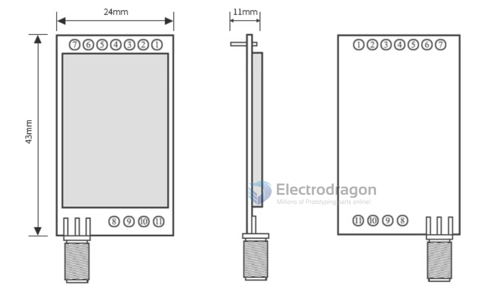

# EE2-dat

- SX1278 / SX1276

## Pin Definitions

| Serial number | Pin          | Pin direction             | Remarks                                                                                                                                             |
| ------------- | ------------ | ------------------------- | --------------------------------------------------------------------------------------------------------------------------------------------------- |
| 1             | MO           | Input (very weak pull-up) | Cooperate with Ml to determine the working mode of the module (cannot be suspended, if not used, it can be grounded)                                |
| 2             | MI           | Input (very weak pull-up) | Cooperate with MO to determine the working mode of the module (cannot be suspended, ground if not used)                                         |
| 3             | RXD          | Input                     | TTL serial port input, connected to the external TXD pin (can be configured as an open-drain or pull-up input)                                      |
| 4             | TXD          | Output                    | TTL serial output, connected to the external RXD pin (can be configured as open-drain or push-pull output)                                          |
| 5             | AUX          | Output (can be suspended) | Indicates the working status of the module, the user wakes up the MCU externally, and outputs low level during automatic initialization at power-on |
| 6             | VCC          | Input                     | Module power supply test, voltage range: 3.3V ~5.2VDC                                                                                               |
| 7             | GND          | Input                     | Module ground                                                                                                                                       |
| 8             | Fixed hole   |                           | Fixing hole                                                                                                                                         |
| 9             | Fixed hole   |                           | Fixing hole                                                                                                                                         |
| 10            | Fixing holes |                           | Fixing holes                                                                                                                                        |
| 11            | Fixed hole   |                           | Fixing hole                                                                                                                                         |

## EE2 Specs

| Product Model                | EE2-433           | EE2-868           | EE2-915           | EE2-170           |
| ---------------------------- | ----------------- | ----------------- | ----------------- | ----------------- |
| Working frequency band       | 410 ~ 441 MHz     | 862 ~ 893 MHz     | 900 ~ 931 MHz     | 160 ~ 173.5 MHz   |
| RF chip                      | SX1278            | SX1276            | SX1276            | 8                 |
| Transmission power           | 30dBm(1W)         | 30dBm(1W)         | 30dBm(1W)         | 30dBm(1W)         |
| Communication distance       | 8000m             | 8000m             | 8000m             | 8000m             |
| Communication                | UART Serial       | UART Serial       | UART Serial       | UART Serial       |
| Closing form                 | DIP PTH           | DIP PTH           | DIP PTH           | DIP PTH           |
| Product size                 | 43 x 24mm         | 43 x 24mm         | 43 x 24mm         | 43 x 24mm         |
| Emission current             | 610 mA            | 680 mA            | 700 mA            | 680 mA            |
| Supply voltage               | 3.3 ~ 5.2 VDC     | 3.3 ~ 5.2 VDC     | 3.3 ~ 5.2 VDC     | 3.3 ~ 5.2 VDC     |
| Operating temperature        | -40℃ ~ +85℃       | -40℃ ~ +85℃       | -40℃ ~ +85℃       | -40℃ ~ +85℃       |
| Baud rate                    | 1200 ~ 115200     | 1200 ~ 115200     | 1200 ~ 115200     | 1200 ~ 115200     |
| Medium speed                 | 0.3k ~ 19.2k bps  | 0.3k ~ 19.2k bps  | 0.3k ~ 19.2k bps  | 0.3k ~ 19.2k bps  |
| Sending and receiving length | 512 bytes         | 512 bytes         | 512 bytes         | 512 bytes         |
| Receive sensitivity          | -147dbm @ O.3kbps | -147dbm @ O.3kbps | -147dbm @ O.3kbps | -147dbm @ O.3kbps |

## ref 

- [[lora-dat]] - high power lora series [[EE2-dat]]

- [[antenna-dat]]