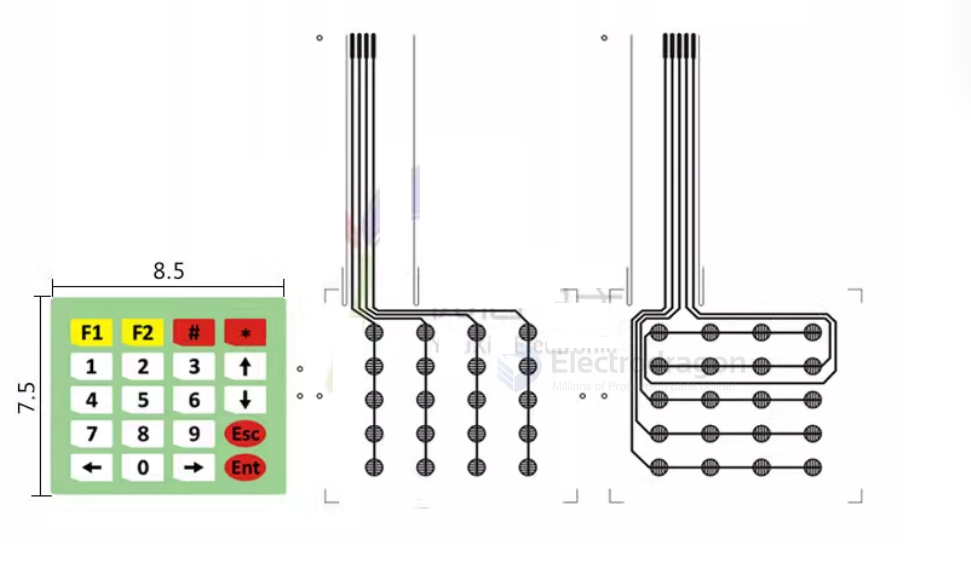
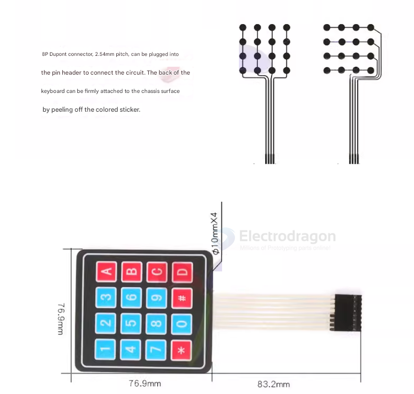
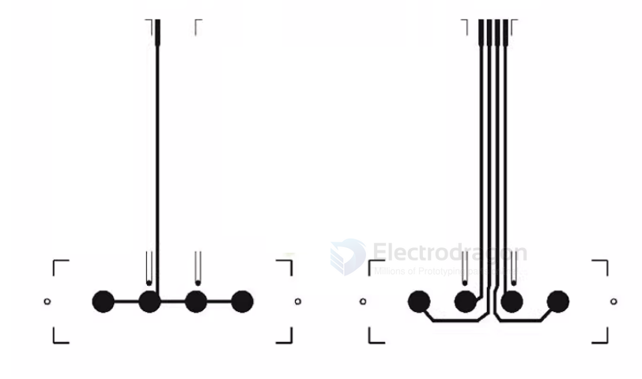

# membrane-keyboard-dat

- [[IKE1007-dat]] - [[IKE1009-dat]] - [[IKE1011-dat]] - [[IKE1013-dat]] 

[legacy wiki page](https://www.electrodragon.com/w/index.php?title=Membrane_Switch_Keypad)

8-pin DuPont connector, 2.54mm pitch, can be plugged into pin headers for circuit connection. The white adhesive backing on the keyboard can be peeled off for firm attachment to a chassis surface. Suitable for microcontroller external expansion, and beneficial for learning about MCU peripheral keyboard expansion, etc.

## specs

Category: PET silver paste printed circuit
Circuit Rating: 35V(DC), 100mA, 1W
Standard Sheet Resistance: ≤50mΩ/sq/mil

**Electronic Characteristics**

Contact Resistance: 10-500Ω (varies with lead wire length and material)
Insulation Resistance: 100MΩ 100V
Dielectric Withstand: 250VRms (50-60Hz 1min)
Contact Bounce Time: ≤5ms

**Mechanical Characteristics**

Operating Force: Metal dome type 220-350g
Switch Travel: Metal dome type 0.6-0.8mm
Storage Temperature: +15°C to +35°C

**Environmental Parameters**

Storage Humidity: 70%-90%
Test Temperature: 0°C to +60°C 16H
Test Humidity: 70%-90%
Vibration: 20G'smsx (10-200Hz, MIL-STD-202, M204, Condition B)

**Material Characteristics**

Circuit Thickness: ≤0.13mm
Lifespan: Film key type < 500,000 cycles

## schematic 

