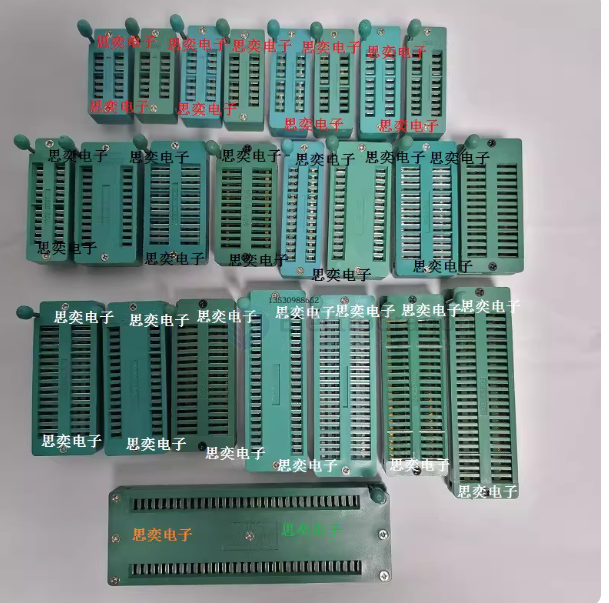
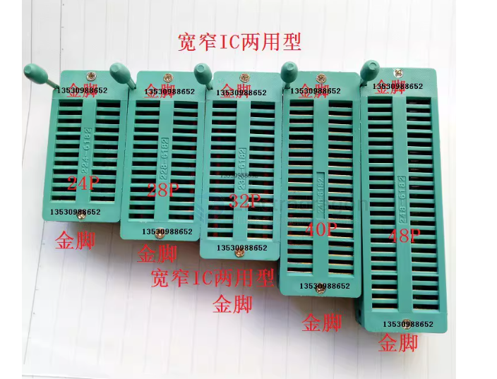

# programmer-socket-dat

- [[CCO3626-dat]] - [[CCO3627-dat]] - [[CCO3628-dat]] - [[CCO3629-dat]] - [[DPR1016-dat]] - [[programmer-socket-dat]]

https://www.electrodragon.com/product-category/modules/programmer/ic-socket-programmer/

- [[ISP-dat]] - [[footprint-dat]]

## lock socket 

- 14P
- 16P
- 18P
- 20P
- 24P
- 28P
- 32P
- 40P
- 42P
- 48P
- 56P
- 64P

脚距
- 2点54MM
- 2点0MM
- 1点778MM

材料
- 普通
- 普通宽度窄体
- 万用型金脚
- 其它
- 万用型白脚

## ref 

- [[CCO3527-dat]]