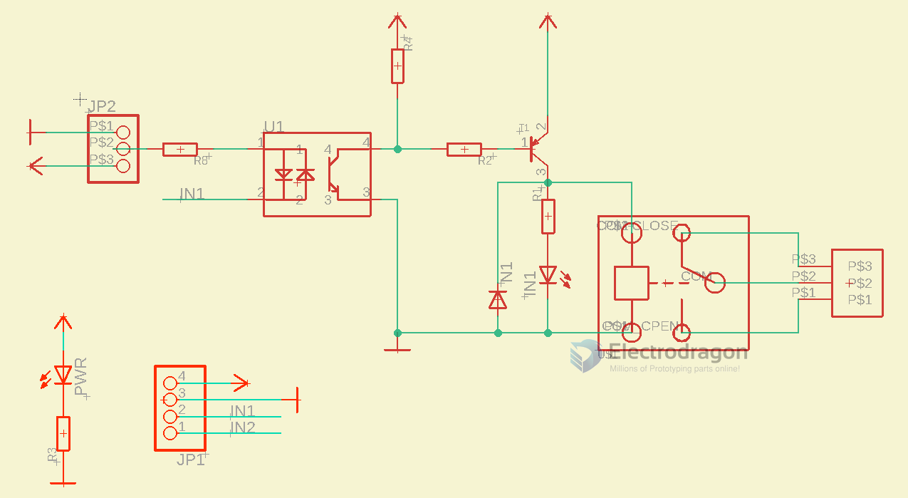

# relay-modules-dat

[legacy wiki page](https://w.electrodragon.com/w/Category:Relay)

- [[relay-dat]]

## Boards 

- [[OPM1046-dat]] - [[OPM1047-dat]] - [[OPM1048-dat]] - [[OPM1049-dat]]

## SCH 

## supported RF module

- https://www.electrodragon.com/product/rf-switch-receiver-433315mhz-wdecoder/

## Customized:
- Relays can be replaced to 12V or 24V version, and same voltage power supply.
- Minimium order quantity for this customized is 50pcs.

## ref 

- [[relay-dat]] - [[optical-coupler-dat]]

- [[relay]] - [[opto]]