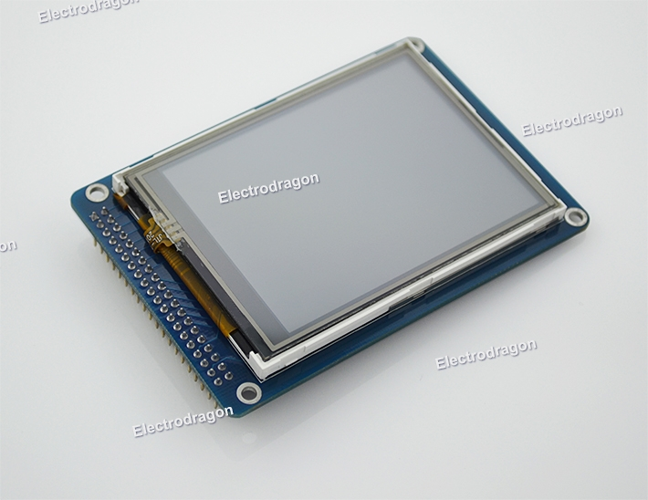
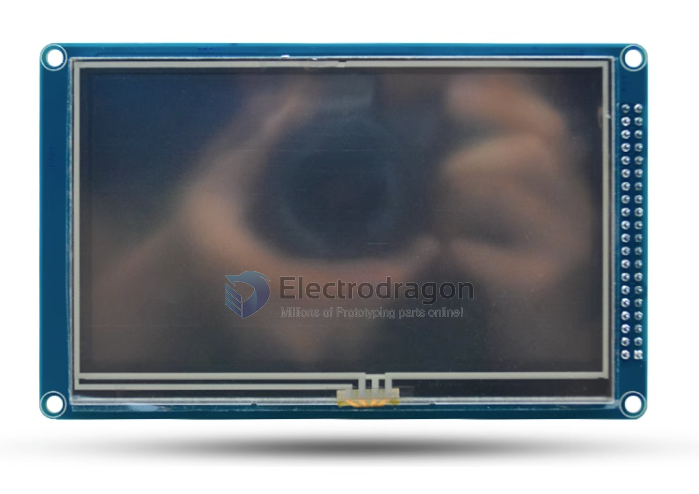
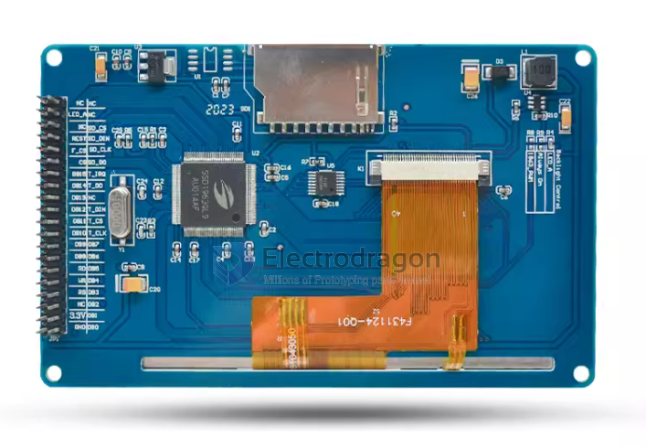

# EDL-dat

- legacy wiki page

  - https://w.electrodragon.com/w/EDL_LCD_HDK
  - https://w.electrodragon.com/w/Category:EDL_LCD

- arduino shields [[DAS1031-dat]] - [[DAS1030-dat]]

## Pin Mapping

## Size

This series include size:

| SKU             | size               | interface       | control | resolution | addons                |
| --------------- | ------------------ | --------------- | ------- | ---------- | --------------------- |
| [[ILC1027-dat]] | 2.4”               |                 | ILI9341 | 240\*320   | SD_card + touchscreen |
| [[ILC1028-dat]] | 3.2”               |                 | ILI9341 | 240\*320   | SD_card + touchscreen |
| x               | 3.2”W (Widescreen) |                 | ILI9341 |            | SD_card + touchscreen |
| [[ILC1030-dat]] | 4.3”               | parallel 16bits | SSD1963 | 480\*272   | SD_card + touchscreen |
| [[ILC1031-dat]] | 5.0”               |                 | SSD1963 | 800\*480   | SD_card + touchscreen |
| [[ILC1032-dat]] | 7.0”               |                 | SSD1963 | 800\*480   | SD_card + touchscreen |

## Code

- arduino library - UTFT

- in /08-LCD
- https://github.com/Edragon/Arduino-main/tree/master/Sketchbook/08-LCD
- https://github.com/Edragon/Arduino-main/tree/master/Sketchbook/Interactive

## demo

- touch screen - https://www.youtube.com/watch?v=iyxXIpoznUA
- https://www.youtube.com/watch?v=7wr8uLYX0T0

## Special Note:

4.3-inch and larger TFT backlight current consumption is relatively large (4.3-inch has more than 200 ma at its brightest, 5-inch has more than 300 ma at its brightest, and 7-inch has 500ma at its brightest).

If USB power supply is used, some computer motherboards may not be able to supply current, or the module may not work due to severe voltage division due to poor USB connection quality.

Just make sure your power supply is stable enough. Thanks!

### Backlight and power supply

- TFT power supply: The screen power supply is 2.8-3.3V; remember not to use 5V, and the voltage of all pins on the module cannot exceed 3.3V, remember.
- Backlight: The module has inherited the backlight drive circuit. When the LED_A pin is supplied with a high level, the backlight will be on, and if the LED_A pin is supplied with a low level, the backlight will be off. If the LED_A pin is supplied with a PWM signal, the brightness can be controlled.

### Pins Note

- The pins starting with T\_ are touch control pins.
- The pins starting with SD\_ are SD card control pins.
- The pins starting with F\_ are flash control pins.
- Others are TFT control pins,
- The flash chip is reserved and is not soldered on the board. If the buyer needs it, please solder the FLASH chip of the SPI interface by yourself.

### Chip Note

This module uses the SSD1963 driver solution. The anti-interference performance of SSD1963 is average (it belongs to the commercial grade standard and does not meet the industrial grade standard). It has relatively high power requirements. Please pay special attention to the quality of your power supply when using this solution. The data cable is not suitable for use too much. long, otherwise there is a risk of a white screen.

If you are using it on general products and the power quality is relatively good, you can choose to use the SSD1963 solution.

If you are using it on industrial control products and have high requirements for stability, please use the industrial-grade solution module MD043SD we recommend for you.

## ref

- [[SSD1963.pdf]] - [[XPT2046.pdf]]
