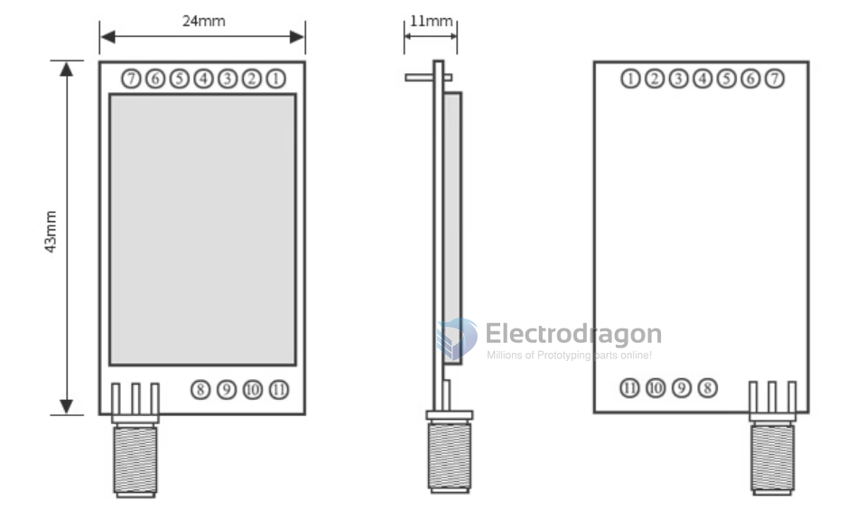
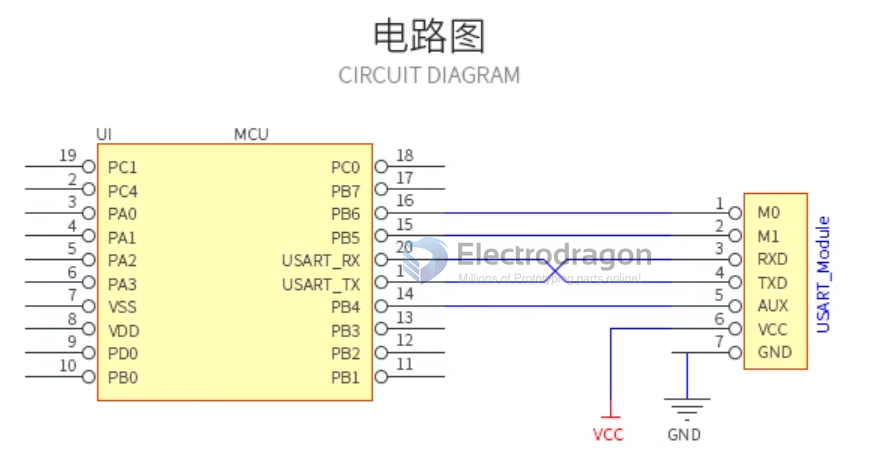

# EE2-dat

- SX1278 / SX1276

## Pin Definitions

| Serial number | Pin          | Pin direction             | Remarks                                                                                                                                             |
| ------------- | ------------ | ------------------------- | --------------------------------------------------------------------------------------------------------------------------------------------------- |
| 1             | MO           | Input (very weak pull-up) | Cooperate with Ml to determine the working mode of the module (cannot be suspended, if not used, it can be grounded)                                |
| 2             | MI           | Input (very weak pull-up) | Cooperate with MO to determine the working mode of the module (cannot be suspended, ground if not used)                                         |
| 3             | RXD          | Input                     | TTL serial port input, connected to the external TXD pin (can be configured as an open-drain or pull-up input)                                      |
| 4             | TXD          | Output                    | TTL serial output, connected to the external RXD pin (can be configured as open-drain or push-pull output)                                          |
| 5             | AUX          | Output (can be suspended) | Indicates the working status of the module, the user wakes up the MCU externally, and outputs low level during automatic initialization at power-on |
| 6             | VCC          | Input                     | Module power supply test, voltage range: 3.3V ~5.2VDC                                                                                               |
| 7             | GND          | Input                     | Module ground                                                                                                                                       |
| 8             | Fixed hole   |                           | Fixing hole                                                                                                                                         |
| 9             | Fixed hole   |                           | Fixing hole                                                                                                                                         |
| 10            | Fixing holes |                           | Fixing holes                                                                                                                                        |
| 11            | Fixed hole   |                           | Fixing hole                                                                                                                                         |

## ref 

- [[lora-dat]]

high power lora series [[EE2-dat]] - [[NWL1078-dat]] - [[NWL1081-dat]] - [[NWL1079-dat]]