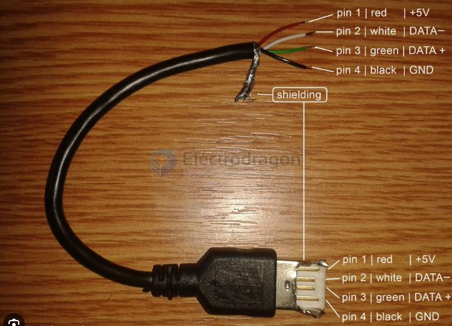

# USB-cable-dat

- [[CONN-USB-dat]] - [[USB-SDK-dat]] - [[cable-USB-dat]]

- [[cable-USB-dat]] - [[cable-USB-micro-dat]] - [[CONN-USB-micro-dat]]

- [[cable-prototyping-dat]] - [[cable-USB-dat]] - [[MPCS050-dat]] - [[MPCS051-dat]]

- [[cable-USB-dat]] - [[USB-tethering-dat]] - [[ethernet-dat]] - [[wifi-dongle-dat]]

## cable length

For a standard USB network tethering setup (such as connecting a 5G/4G hotspot or modem via USB to a computer or router), the maximum length depends on the USB protocol version and whether the cable is passive or active.

### 1. Standard (Passive) Cable Limits

- [[USB-SDK-dat]] - [[USB-2.0-dat]] - [[USB-3.0-dat]] - [[cable-USB-dat]]

* **USB 2.0:** Maximum of **5 meters (about 16 feet)**. 
  * *Note:* Most 4G/5G dongles and modems run comfortably on USB 2.0 data speeds even if they use Type-C connectors, meaning a 3 to 5-meter standard copper cable usually works reliably without signal loss.
* **USB 3.0 / 3.1 / 3.2 (High-speed data):** Maximum of **2 to 3 meters (about 6 to 10 feet)**. 
  * Higher-frequency signals suffer from attenuation over longer passive distances, making longer standard cables prone to packet loss or disconnects.

### 2. How to Go Beyond the Limit (Long-Distance Tethering)
If your hotspot or router needs to be placed far away (e.g., near a window with better cellular signal):
* **Active USB Extension Cables / Repeaters:** Using active repeater cables can push USB 2.0 tethering up to **15–30 meters**.
* **USB over Ethernet (Cat5e/Cat6) Extenders:** If you need a very long run (up to **50–100 meters**), you can use a hardware USB-to-Ethernet extender pair, which converts the USB signal to travel over a standard network cable.

- [[USB-cable-repeater-dat]]

- [[cable-ethernet-dat]]

## ref 

- [[cable-USB]]