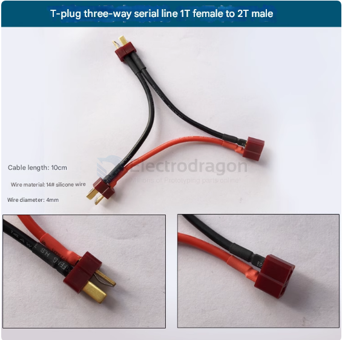

# cable-dat

- [[AWG-wires-dat]] - [[cable-warp-dat]]

- [[cable-power-dat]] 

- [[cable-data-dat]] - [[cable-FPC-dat]] - [[cable-ribbon-dat]]

- [[PTO1021-dat]] - wire cutter tool

- [[cable-ribbon-dat]]

## data cable 

## Weight Comparison

| types                  | Cable Type                                  | Approximate Weight per 100m |
| ---------------------- | ------------------------------------------- | --------------------------- |
| [[Fiber-Optic-dat]]    | **Fiber Optic Cable (Single-Mode, 2-core)** | **≈1-2 kg**                 |
| [[Ethernet-Cable-dat]] | **Ethernet Cable (Cat5e/Cat6 UTP)**         | **≈3-5 kg**                 |
| [[coaxial-cable-dat]]  | **Coaxial Cable (RG6 or RG59)**             | **≈7-10 kg**                |

- [[ribbon-cable-dat]] - [[usb-cable-dat]]

- [[flywire-dat]] - [[jumper-wire-dat]] - [[awg-wires-dat]]

## power cable 

## BVR mutiple cores cable - 0.5mm^2 

- inner area 0.5mm^2
- 7 sub-core wires 
- safety current 5A, power 1100W 

## BVR mutiple cores cable - 2.5mm^2 

- inner area 2.5mm^2
- 19 sub-core wires 
- safety current 25A, power 5500W 

## Cable to Cable 

- [[wire-2-wire-dat]]

## Cable to Board 

## Series And Parallel Connection Cable  

2P==JST-1F-to-2M

2P==SM-1M-to-2F

2P==EC2-1F-to-2M

2S==T_Socket-1F-to-2M

## categorized by pitch 

- [[SH1.0-dat]] - [[X12-dat]]: [] 3P / [x] 4P 1.0 mm pitch

- [[1.23-cable-dat]] - [[GH1.25-dat]]

- xh2.54

- ph2.0
  
- mx1.25

- sh1.0
  
- vh3.96

## apps 

- [[RC-kits-dat]]

## ref 

- [[ribbon-cable-dat]]

- BVR standard 