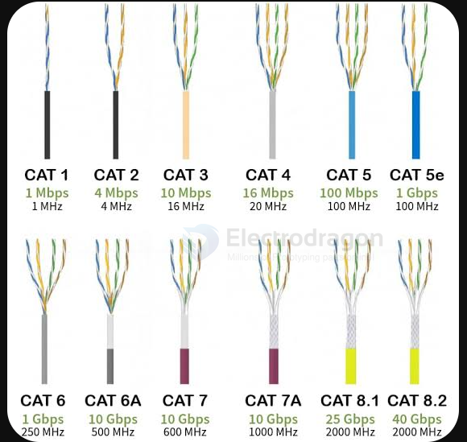

# cable-ethernet-dat

- [[cable-dat]] - [[cable-ethernet-dat]]

**By Performance Category**

| Category | Max Speed | Bandwidth | Best For / Key Features |
|---|---|---|---|
| **Cat5** | 100 Mbps | 100 MHz | Obsolete. Legacy Fast Ethernet cable. |
| **Cat5e** | 1 Gbps | 100 MHz | Budget-friendly, thin, suitable for older homes or low-cost Gigabit setups. |
| **Cat6** | 1 Gbps – 10 Gbps | 250 MHz | **Current home standard.** Features a central spine to reduce crosstalk; supports 10G up to 55 meters. |
| **Cat6A** | 10 Gbps | 500 MHz | Shielded design. Delivers full 10G speeds over the entire 100-meter limit; ideal for future-proofing. |
| **Cat7** | 10 Gbps | 600 MHz | Non-TIA/EIA standard. Stiff, heavily shielded, and rarely recommended for residential use. |
| **Cat8** | 25 Gbps / 40 Gbps | 2000 MHz | Ultra-high-speed for short distances, primarily used for data center server stacking. |

---

**By Shielding Type**

* **UTP (Unshielded Twisted Pair):** Flexible, easy to bend, and affordable. The best choice for in-wall residential wiring and standard patch cords.
* **FTP / STP / SFTP (Shielded Twisted Pair):** Uses aluminum foil or braided mesh shielding against severe electromagnetic interference (EMI). Stiffer and thicker—**requires grounded jacks and connectors** to function properly.

---

**By Conductor & Cable Design**

* **Bare Copper vs. Copper-Clad Aluminum (CCA):** Pure oxygen-free copper offers lower resistance and long lifespan. Avoid CCA, as it breaks easily and suffers high signal attenuation over time.
* **Flat Cables vs. Round Cables:** Flat cables slip easily under doors or rugs, but offer less resistance to interference compared to round cables. Best reserved for short, temporary connections.

---

**Buying Recommendations**

1. **In-Wall Installation:** Go with **Cat6 UTP (Unshielded)** or **Cat6A** to comfortably handle future 10G upgrades.
2. **Patch Cables:** For connecting routers, PCs, NAS units, or TV boxes, use short (0.5m–3m) **Cat6 pure copper patch cords**.

## ref 