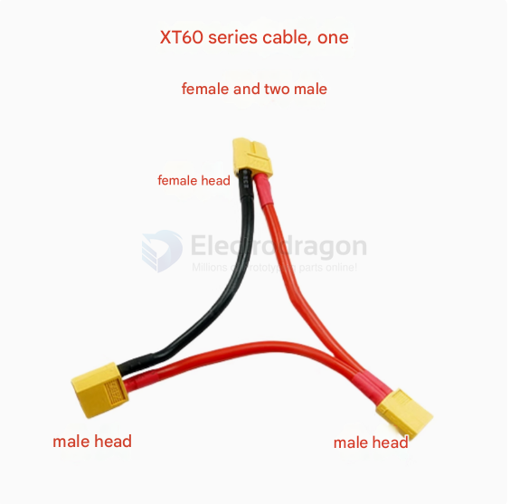
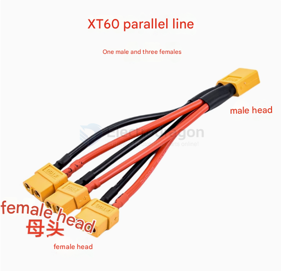
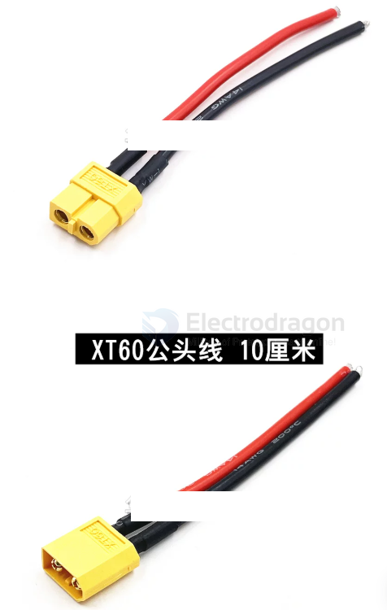

# cable-XT-dat

- [[cable-XT-dat]] - [[CONN-XT-dat]]

## connect to battery 

- XT60 - 一母头 - 转 - 2公头
- XT60 - 一母头 - 转 - 3公头
- XT60 - 一公头 - 转 - 2母头
- XT60 - 一公头 - 转 - 3母头

- 14AWG - 硅胶线（线长5CM）2.07平方
- 14AWG - 硅胶线（线长10CM）2.07平方
- 14AWG - 硅胶线（线长15CM）2.07平方
- 14AWG - 硅胶线（线长20CM）2.07平方
- 14AWG - 硅胶线（线长30CM）2.07平方
- 14AWG - 硅胶线（线长50CM）2.07平方
- 12AWG - 硅胶线（线长10CM）3.4平方
- 12AWG - 硅胶线（线长15CM）3.4平方
- 12AWG - 硅胶线（线长20CM）3.4平方
- 12AWG - 硅胶线（线长30CM）3.4平方
- 12AWG - 硅胶线（线长50CM）3.4平方

## ref 

- [[cable]] - [[cable-XT]]